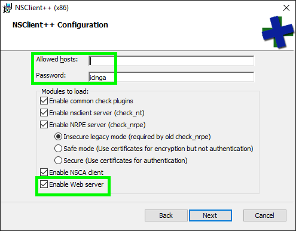
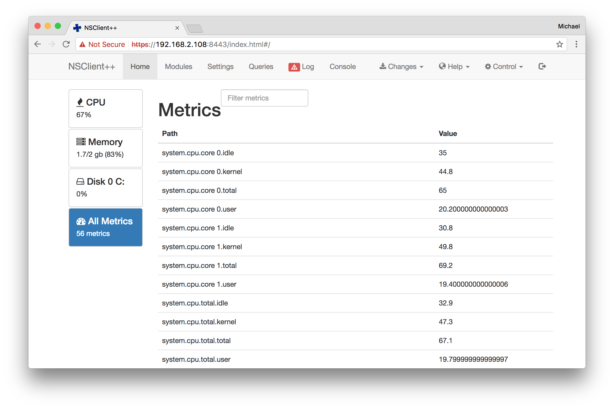
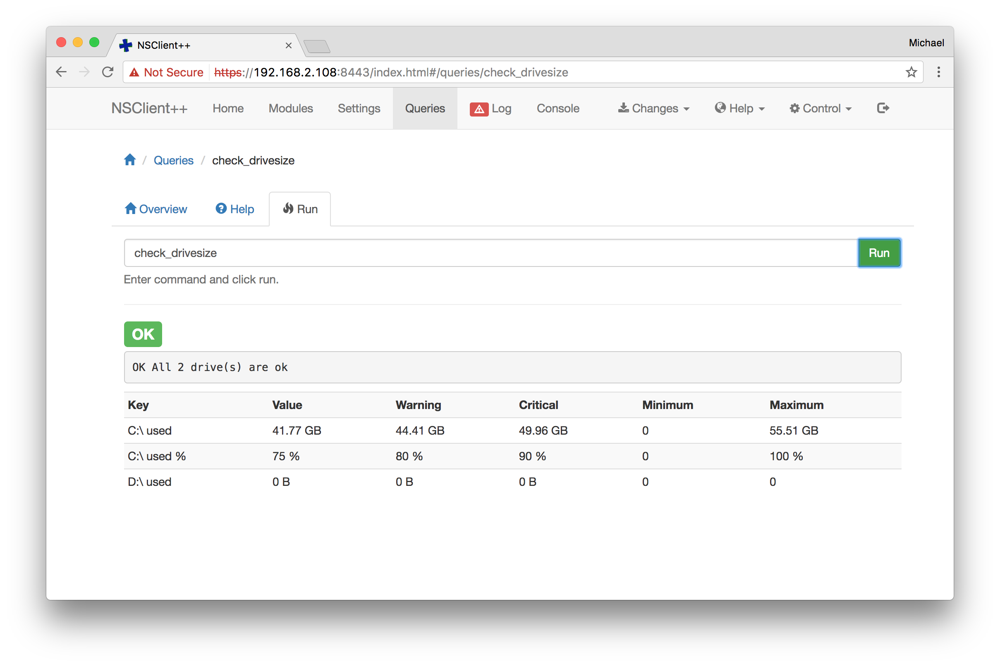
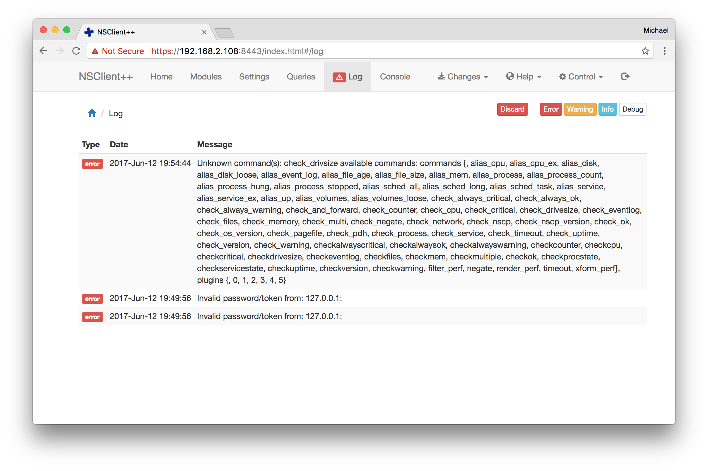

# NSClient++ API

NSClient++ provides its own HTTP API which can
be enabled with the [WEBServer module](../reference/generic/WEBServer.md#WEBServer).

The [protocol buffer API used by plugins](plugin.md) is documented separately.

## Setup

### Enable the WEBServer module

You can enable the WEBServer module during the package installation.

> **Note**
>
> Please ensure to specify a secure password (default).



Alternatively you can enable the WEBServer module on the CLI afterwards:

```
nscp web install --password <MY SECRET PASSWORD>
```

### Configuration

Edit the `/settings/WEB/server` section in the `nsclient.ini`
configuration file.
The default values `password` and `allowed hosts` (`/settings/default`) are shared by all modules (i.e. NRPEServer and NSClientServer) if you want to have separate values for the WEBServer you can override them under `/settings/WEB/server`.

```
; MODULES - A list of modules.
[/modules]

; WEBServer - A server that listens for incoming HTTP connection and processes incoming requests. It provides both a WEB UI as well as a REST API in addition to simplifying configuration of WEB Server module.
WEBServer = enabled

[/settings/default]

; PASSWORD - Password used to authenticate against server
password = <MY SECRET PASSWORD>

; ALLOWED HOSTS - A comaseparated list of allowed hosts. You can use netmasks (/ syntax) or * to create ranges. parent for this key is found under: /settings/default this is marked as advanced in favor of the parent.
allowed hosts = 127.0.0.1,192.168.2.0/24

[/settings/WEB/server]

; PORT NUMBER - Port to use for WEB server.
port = 8443s

; CERTIFICATE - Ssl certificate to use for the ssl server
certificate = ${certificate-path}/certificate.pem
```

Restart the `nscp` service afterwards.

```
net stop nscp
net start nscp
```

You can change the password from the command line using the following command:

```
nscp web password --set icinga
```

The next chapter provides a quick overview of how you can use the API.

## Introduction

### Requests

Any tool capable of making HTTP requests can communicate with
the API, for example [curl](https://curl.haxx.se/).

Requests are only allowed to use the HTTPS protocol so that
traffic remains encrypted.

By default the NSClient++ API listens on port `8443`. The port can
be changed by setting the `port` attribute in the `/settings/WEB/server`
section in the `nsclient.ini` configuration file.

```
[/settings/WEB/server]

; PORT NUMBER - Port to use for WEB server.
port = 8443s
```

Restart the `nscp` service afterwards.

```
net stop nscp
net start nscp
```

Supported request methods:

  Method | Usage
  -------|--------
  GET    | Retrieve information and execute queries.


### Responses

Successful requests will send back a response body which contains
a hash with the keys `header` and `payload`.
Depending on the query, the `payload` hash may contain different
keys.

> **Note**
>
> Some requests don't return a body, i.e. `/core/reload`.
> Ensure to check the HTTP status code at first glance.

The output will be sent back as a JSON object:

```
{
    "header": {
        "source_id": ""
    },
    "payload": [
        {
            "command": "check_drivesize",
            "lines": [
                {
                    "message": "OK All 1 drive(s) are ok",
                    "perf": [
                        {
                            "alias": "C: used",
                            "float_value": {
                                "critical": 49.95878562889993,
                                "maximum": 55.509761810302734,
                                "minimum": 0.0,
                                "unit": "GB",
                                "value": 41.377288818359375,
                                "warning": 44.40780944749713
                            }
                        },
                        {
                            "alias": "C: used %",
                            "float_value": {
                                "critical": 90.0,
                                "maximum": 100.0,
                                "minimum": 0.0,
                                "unit": "%",
                                "value": 75.0,
                                "warning": 80.0
                            }
                        }
                    ]
                }
            ],
            "result": "OK"
        }
    ]
}
```

Tip: If you are working on the CLI with curl you can also use [jq](https://stedolan.github.io/jq/)
to format the returned JSON output in a readable manner. The documentation
prefers `python -m json.tool` as Python is available nearly everywhere.

> **Note**
>
> Future versions of NSClient++ might set additional fields. Your application
> should gracefully handle fields it is not familiar with, for example by
> ignoring them.

### HTTP Statuses

The API will return standard [HTTP statuses](https://www.ietf.org/rfc/rfc2616.txt)
including error codes.

When an error occurs, the response body will contain additional information
about the problem and its source.

A status code between 200 and 299 generally means that the request was
successful.

Return codes within the 400 range indicate that there was a problem with the
request. Either you did not authenticate correctly, you are missing the authorization
for your requested action, the requested URL does not exist or the request
was malformed.

A status in the range of 500 generally means that there was a server-side problem
and NSClient++ is unable to process your request.

### Allowed Hosts

Ensure to restrict the API to local access, and only allow remote access if
necessary.

> **Note**
>
> Keep in mind that the web interface allows you to modify the
> client configuration -- use with care on remote access!

Edit the `/settings/WEB/server` section in the `nsclient.ini`
configuration file.

```
[/settings/WEB/server]

; ALLOWED HOSTS - A commaseparated list of allowed hosts. You can use netmasks (/ syntax) or * to create ranges. parent for this key is found under: /settings/default this is marked as advanced in favor of the parent.
allowed hosts = 127.0.0.1,192.168.2.0/24

```

Restart the `nscp` service afterwards.

```
net stop nscp
net start nscp
```

### Authentication

The authentication is possible via basic auth and a `password` token sent
inside the HTTP request header.

You can test authentication by sending a GET request to the API:

```
curl -k -v -H 'password: icinga' 'https://nsclient1.localdomain:8443/query/'
```

The `password` setting is specified inside the `/settings/WEB/server`
configuration section.

```
[/settings/WEB/server]

; PASSWORD - Password used to authenticate against server parent for this key is found under: /settings/default this is marked as advanced in favor of the parent.
password = icinga
```

Restart the `nscp` service afterwards.

```
net stop nscp
net start nscp
```

### Parameters

Query strings must be passed as URL parameter.

Reserved characters by the HTTP protocol must be [URL-encoded](https://en.wikipedia.org/wiki/Percent-encoding)
as query string, e.g. a space character becomes `%20`.

## Query Endpoint

Queries are mostly based on modules. You can test-drive them through
the API web interface and then add your own calls.

You can use any query available by the check modules.

> **Note**
>
> Some query URL endpoints might not be available. This will be logged and is
> available in the web interface `Log` menu.
>
> Ensure to enable the corresponding module and test-drive the query from the
> web interface.

This documentation compiles a list of the most common query URL endpoints
and their usage examples. Explore and add more from known check commands.

### Arguments

Arguments can be passed to the URL as already known from check\_nt/check\_nrpe command calls.

```
curl -k -s -H 'password: icinga' 'https://nsclient1.localdomain:8443/query/check_cpu?show-all&warning=load>1&critical=load>20' | python -m json.tool
{
    "header": {
        "source_id": ""
    },
    "payload": [
        {
            "command": "check_cpu",
            "lines": [
                {
                    "message": "WARNING: warning(5m: 2%, 1m: 2%, 5s: 2%)",
                    "perf": [
                        {
                            "alias": "total 5m",
                            "int_value": {
                                "critical": 20,
                                "unit": "%",
                                "value": 2,
                                "warning": 1
                            }
                        },
                        {
                            "alias": "total 1m",
                            "int_value": {
                                "critical": 20,
                                "unit": "%",
                                "value": 2,
                                "warning": 1
                            }
                        },
                        {
                            "alias": "total 5s",
                            "int_value": {
                                "critical": 20,
                                "unit": "%",
                                "value": 2,
                                "warning": 1
                            }
                        }
                    ]
                }
            ],
            "result": "WARNING"
        }
    ]
}
```

### CheckDisk Module

#### /query/check_drivesize

Check the disk drive on Windows.

```
curl -k -s -H 'password: icinga' 'https://nsclient1.localdomain:8443/query/check_drivesize?drive=C:' | python -m json.tool
{
    "header": {
        "source_id": ""
    },
    "payload": [
        {
            "command": "check_drivesize",
            "lines": [
                {
                    "message": "OK All 1 drive(s) are ok",
                    "perf": [
                        {
                            "alias": "C: used",
                            "float_value": {
                                "critical": 49.95878562889993,
                                "maximum": 55.509761810302734,
                                "minimum": 0.0,
                                "unit": "GB",
                                "value": 41.377288818359375,
                                "warning": 44.40780944749713
                            }
                        },
                        {
                            "alias": "C: used %",
                            "float_value": {
                                "critical": 90.0,
                                "maximum": 100.0,
                                "minimum": 0.0,
                                "unit": "%",
                                "value": 75.0,
                                "warning": 80.0
                            }
                        }
                    ]
                }
            ],
            "result": "OK"
        }
    ]
}
```

### CheckEventLog

#### /query/check_eventlog

Check for specific Windows event log entries, e.g. in the last 10 hours. Add the message to the final output. Note: You need to URL encode the parameters. `${message}` becomes `%24%7Bmessage%7D`.

```
curl -k -s -H 'password: icinga' 'https://nsclient1.localdomain:8443/query/check_eventlog?show-all&file=system&detail-syntax=%24%7Bmessage%7D&scan-range=-600m' | python -m json.tool
{
    "header": {
        "source_id": ""
    },
    "payload": [
        {
            "command": "check_eventlog",
            "lines": [
                {
                    "message": "WARNING: 5 message(s) warning(The network driver detected that its hardware has stopped responding to commands. ...."
                    "perf": [
                        {
                            "alias": "problem_count",
                            "int_value": {
                                "critical": 0,
                                "value": 5,
                                "warning": 0
                            }
                        }
                    ]
                }
            ],
            "result": "WARNING"
        }
    ]
}
```

### CheckHelpers Module

#### /query/check_version

Print the NSClient++ version.

```
$ curl -k -s -H 'password: icinga' 'https://nsclient1.localdomain:8443/query/check_version' | python -m json.tool
{
    "header": {
        "source_id": ""
    },
    "payload": [
        {
            "command": "check_version",
            "lines": [
                {
                    "message": "0.5.0.62 2016-09-14"
                }
            ],
            "result": "OK"
        }
    ]
}
```


### CheckNSCP Module

#### /query/check_nscp

Retrieve the current status and possible errors.

```
$ curl -k -s -H 'password: icinga' 'https://nsclient1.localdomain:8443/query/check_nscp' | python -m json.tool
{
    "header": {
        "source_id": ""
    },
    "payload": [
        {
            "command": "check_nscp",
            "lines": [
                {
                    "message": "0 crash(es), 5 error(s), last error: Failed to execute command on log, uptime 01:10:40.901063"
                }
            ],
            "result": "CRITICAL"
        }
    ]
}
```

### CheckSystem Module

#### /query/check_cpu

Check for CPU usage on Windows.

```
$ curl -k -s -H 'password: icinga' 'https://nsclient1.localdomain:8443/query/check_cpu?show-all&warning=load>1&critical=load>20' | python -m json.tool
{
    "header": {
        "source_id": ""
    },
    "payload": [
        {
            "command": "check_cpu",
            "lines": [
                {
                    "message": "WARNING: warning(5m: 3%, 1m: 2%, 5s: 2%)",
                    "perf": [
                        {
                            "alias": "total 5m",
                            "int_value": {
                                "critical": 20,
                                "unit": "%",
                                "value": 3,
                                "warning": 1
                            }
                        },
                        {
                            "alias": "total 1m",
                            "int_value": {
                                "critical": 20,
                                "unit": "%",
                                "value": 2,
                                "warning": 1
                            }
                        },
                        {
                            "alias": "total 5s",
                            "int_value": {
                                "critical": 20,
                                "unit": "%",
                                "value": 2,
                                "warning": 1
                            }
                        }
                    ]
                }
            ],
            "result": "WARNING"
        }
    ]
}
```

#### /query/memory

Check memory usage on Windows.

```
$ curl -k -s -H 'password: icinga' 'https://nsclient1.localdomain:8443/query/check_memory' | python -m json.tool
{
    "header": {
        "source_id": ""
    },
    "payload": [
        {
            "command": "check_memory",
            "lines": [
                {
                    "message": "WARNING: committed = 2.849GB, physical = 1.669GB",
                    "perf": [
                        {
                            "alias": "committed",
                            "float_value": {
                                "critical": 3.1644229888916016,
                                "maximum": 3.5160255432128906,
                                "minimum": 0.0,
                                "unit": "GB",
                                "value": 2.8489990234375,
                                "warning": 2.8128204345703125
                            }
                        },
                        {
                            "alias": "committed %",
                            "float_value": {
                                "critical": 90.0,
                                "maximum": 100.0,
                                "minimum": 0.0,
                                "unit": "%",
                                "value": 81.0,
                                "warning": 80.0
                            }
                        },
                        {
                            "alias": "physical",
                            "float_value": {
                                "critical": 1.799591445364058,
                                "maximum": 1.9995460510253906,
                                "minimum": 0.0,
                                "unit": "GB",
                                "value": 1.6694755554199219,
                                "warning": 1.599636840634048
                            }
                        },
                        {
                            "alias": "physical %",
                            "float_value": {
                                "critical": 90.0,
                                "maximum": 100.0,
                                "minimum": 0.0,
                                "unit": "%",
                                "value": 83.0,
                                "warning": 80.0
                            }
                        }
                    ]
                }
            ],
            "result": "WARNING"
        }
    ]
}
```

#### /query/check_network

Check network usage.

```
$ curl -k -s -H 'password: icinga' 'https://nsclient1.localdomain:8443/query/check_network' | python -m json.tool
{
    "header": {
        "source_id": ""
    },
    "payload": [
        {
            "command": "check_network",
            "lines": [
                {
                    "message": ": VirtualBox Host-Only Ethernet Adapter #2 >790273982464 <790273982464 bps, VirtualBox Host-Only Ethernet Adapter >790273982464 <790273982464 bps, Intel(R) PRO/1000 MT Network Connection >790273982464 <790273982464 bps",
                    "perf": [
                        {
                            "alias": "Intel(R) PRO/1000 MT Network Connection_total",
                            "int_value": {
                                "critical": 100000,
                                "value": 790273982464,
                                "warning": 10000
                            }
                        }
                    ]
                }
            ],
            "result": "CRITICAL"
        }
    ]
}
```

#### /query/check_os_version

Retrieve the Operating System version.

```
$ curl -k -s -H 'password: icinga' 'https://nsclient1.localdomain:8443/query/check_os_version' | python -m json.tool
{
    "header": {
        "source_id": ""
    },
    "payload": [
        {
            "command": "check_os_version",
            "lines": [
                {
                    "message": "OK: Windows 10 (10.0.10586)",
                    "perf": [
                        {
                            "alias": "version",
                            "int_value": {
                                "critical": 50,
                                "value": 100,
                                "warning": 50
                            }
                        }
                    ]
                }
            ],
            "result": "OK"
        }
    ]
}
```

#### /query/check_pdh

Check a specific performance counter. Note: `counter=\Processor(_total)\% Processor Time`
has been URL encoded to `counter%3D%5CProcessor%28_total%29%5C%25%20Processor%20Time`.

```
$ curl -k -s -H 'password: icinga' 'https://nsclient1.localdomain:8443/query/check_pdh?counter%3D%5CProcessor%28_total%29%5C%25%20Processor%20Time' | python -m json.tool
{
    "header": {
        "source_id": ""
    },
    "payload": [
        {
            "command": "check_pdh",
            "lines": [
                {
                    "message": "OK: \\Processor(_total)\\% Processor Time = 49",
                    "perf": [
                        {
                            "alias": "\\Processor(_total)\\% Processor Time_value",
                            "float_value": {
                                "critical": 0.0,
                                "value": 49.0,
                                "warning": 0.0
                            }
                        }
                    ]
                }
            ],
            "result": "OK"
        }
    ]
}
```

#### /query/check_service

Check if a specific service is started. `wscsvc` checks the Windows Security Center service.

```
$ curl -k -s -H 'password: icinga' 'https://nsclient1.localdomain:8443/query/check_service?service=wscsvc' | python -m json.tool
{
    "header": {
        "source_id": ""
    },
    "payload": [
        {
            "command": "check_service",
            "lines": [
                {
                    "message": "OK: All 1 service(s) are ok.",
                    "perf": [
                        {
                            "alias": "wscsvc",
                            "int_value": {
                                "critical": 0,
                                "value": 4,
                                "warning": 0
                            }
                        }
                    ]
                }
            ],
            "result": "OK"
        }
    ]
}
```


#### /query/check_uptime


Check the host's uptime.

```
$ curl -k -s -H 'password: icinga' 'https://nsclient1.localdomain:8443/query/check_uptime' | python -m json.tool
{
    "header": {
        "source_id": ""
    },
    "payload": [
        {
            "command": "check_uptime",
            "lines": [
                {
                    "message": "CRITICAL: uptime: 10:6h, boot: 2017-06-14 10:56:38 (UTC)",
                    "perf": [
                        {
                            "alias": "uptime",
                            "int_value": {
                                "critical": 86400,
                                "unit": "s",
                                "value": 36370,
                                "warning": 172800
                            }
                        }
                    ]
                }
            ],
            "result": "CRITICAL"
        }
    ]
}
```


## Settings Endpoint

### /settings/status

Determine whether settings need to be stored.

```
curl -k -s -H 'password: icinga' 'https://nsclient1.localdomain:8443/settings/status' | python -m json.tool
{
    "header": {},
    "payload": [
        {
            "result": {
                "code": "STATUS_OK"
            },
            "status": {
                "context": "ini://${shared-path}/nsclient.ini",
                "has_changed": false,
                "type": "ini"
            }
        }
    ]
}
```

## Core Endpoint

### /core/reload

Reload the NSClient++ service.

```
curl -k -s -H 'password: icinga' 'https://nsclient1.localdomain:8443/core/reload'
```


## Web Interface

You can also access the web interface by using your favorite browser.

The `Home` screen greets you with a metrics overview.




### Modules

You can list all (enabled) modules.


Each module provides an overview, settings, templates and queries.


You can list and select queries provided by this module.


Selecting the query jumps to the `Queries` tab and allows you to run the query immediately.


### Settings

Navigate into the settings tree and modify specific attributes. You need
to save changes and reload the service afterwards.


### Queries

Navigate into the queries tree and execute specific commands.




### Log

This is helpful in case you have trouble with executing checks, or
denied remote access.



### Changes

Save changes after modifications.


### Control

Reload the NSClient++ service after configuration changes.


## Integrations

### Check Plugins

- [check_nscp_api](https://github.com/Icinga/icinga2/pull/5239) included in Icinga 2 v2.7.

## References

- Icinga Blog: [NSClient++ 0.5.0, REST API and Icinga 2 integration](https://www.icinga.com/2016/09/16/nsclient-0-5-0-rest-api-and-icinga-2-integration/)
