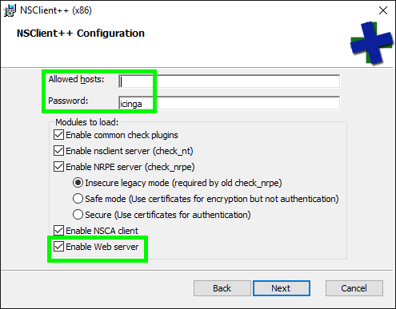

# NSClient++ REST API

NSClient++ provides its own HTTP API which can
be enabled with the [WEBServer module](../../reference/generic/WEBServer.md#WEBServer).

The REST API exposes most of NSClient++'s functionality (modules, settings,
queries, logs, scripts, metrics, …) and is also what the bundled web UI uses.
Each topic has its own page:

* [Info](info.md) — name and version
* [Login](login.md) — session login / current user
* [Modules](modules.md) — list, load, unload, enable, disable
* [Settings](settings.md) — read, write, save, load, reload, diff
* [Queries](queries.md) — list and execute checks
* [Scripts](scripts.md) — list and manage scripts
* [Logs](logs.md) — read, write, status, reset, paginate
* [Metrics](metrics.md) — internal metrics and Prometheus / OpenMetrics
* [Legacy API](legacy.md) — pre-`/api/v2` endpoints kept for backwards compatibility

## API versions

The REST API is currently exposed under two prefixes:

| Prefix    | Status   | Notes                                                                          |
|-----------|----------|--------------------------------------------------------------------------------|
| `/api/v1` | legacy   | First-generation API. All controllers (except `/metrics` and `/openmetrics`) are still mounted here for compatibility, but new fields are only added to v2. |
| `/api/v2` | current  | The version used by the bundled web UI and recommended for all integrations.   |

The root endpoint advertises the current and legacy URLs (see below).

## Setup

### Enable the WEBServer module

You can enable the WEBServer module during the package installation.

> **Note**
>
> Please ensure to specify a secure password (default).



If you wish to do this with a silent installer you can use the following command:

```
msiexec /i NSCP-<VERSION>-x64.msi /q CONF_WEB=1 NSCLIENT_PWD=<my secure API key>
```

Alternatively you can enable the WEBServer module on the CLI afterwards:

```
nscp web install --password <MY SECURE API KEY>
```

### Configuration

Edit the `/settings/WEB/server` section in the `nsclient.ini`
configuration file. The default values `password` and `allowed hosts`
(`/settings/default`) are shared by all modules (i.e. `NRPEServer` and
`NSClientServer`); if you want a separate value for the WEBServer override
them under `/settings/WEB/server`.

```
; MODULES - A list of modules.
[/modules]
WEBServer = enabled

[/settings/default]
password = <MY SECURE API KEY>
allowed hosts = 127.0.0.1,192.168.2.0/24

[/settings/WEB/server]
port = 8443s
certificate = ${certificate-path}/certificate.pem
```

Restart the `nscp` service afterwards.

You can change the password from the command line:

```
nscp web password --set icinga
```

## Quick start

### Root endpoint

A `GET` against `/api` returns the available API versions:

```
$ curl -k -s -u admin https://localhost:8443/api | python -m json.tool
{
    "current_api": "https://localhost:8443/api/v2",
    "legacy_api":  "https://localhost:8443/api/v1",
    "beta_api":    "https://localhost:8443/api/v2"
}
```

A `GET` against `/api/v2` (or `/api/v1`) returns links to all top-level
endpoint categories:

```
$ curl -k -s -u admin https://localhost:8443/api/v2 | python -m json.tool
{
    "info_url":     "https://localhost:8443/api/v2/info",
    "logs_url":     "https://localhost:8443/api/v2/logs",
    "modules_url":  "https://localhost:8443/api/v2/modules",
    "queries_url":  "https://localhost:8443/api/v2/queries",
    "scripts_url":  "https://localhost:8443/api/v2/scripts",
    "settings_url": "https://localhost:8443/api/v2/settings"
}
```

### Parameters

For `GET` requests, parameters not embedded in the path are passed as
query-string parameters:

```
curl -k -s -u admin "https://localhost:8443/api/v2/scripts/ext?all=true"
```

For `POST`, `PUT` and `DELETE` requests with a body, parameters are encoded as
JSON with `Content-Type: application/json`:

```
curl -k -s -u admin -X PUT https://localhost:8443/api/v2/modules/CheckSystem \
     -d '{"loaded":true}'
```

Reserved characters by the HTTP protocol must be
[URL-encoded](https://en.wikipedia.org/wiki/Percent-encoding) when used as
query string values, e.g. a space character becomes `%20`.

### HTTP verbs

| Verb     | Description                                  |
|----------|----------------------------------------------|
| `GET`    | Retrieve a resource.                         |
| `POST`   | Create or invoke a command on a resource.    |
| `PUT`    | Replace or update a resource.                |
| `DELETE` | Delete a resource.                           |

### Response codes

The API uses standard
[HTTP status codes](https://www.ietf.org/rfc/rfc2616.txt). When something
fails the response body usually contains a textual description of the
problem.

#### 2xx — success

A status code in the 200–299 range means the request was successful.

#### 4xx — client errors

* `400 Bad Request` — invalid JSON or malformed payload.
* `403 Forbidden` — authentication failed or the user lacks the required
  privilege.
* `404 Not Found` — unknown route or unknown resource.
* `422 Unprocessable Entity` — the JSON parsed but contained invalid fields.

#### 5xx — server errors

A status in the 500 range means there was a server-side problem. Review the
NSClient++ log file to understand the failure; if the cause is an internal
error please report it on the
[NSClient++ issue tracker](https://github.com/mickem/nscp/issues).

## Authentication

NSClient++ accepts three forms of authentication. Most endpoints require
authentication and will return `403 Forbidden` if it is missing.

### HTTP basic authentication

```
curl -k -s -u admin https://localhost:8443/api/v2/info
```

### `password` header (legacy)

The legacy `password:` header is still accepted everywhere:

```
curl -k -s -H 'password: icinga' https://localhost:8443/api/v2/info
```

### Bearer token

Once you have logged in (see [Login](login.md)) you can use the returned token
as a bearer token:

```
curl -k -s -H 'Authorization: Bearer <token>' https://localhost:8443/api/v2/info
```

## Authorization

The REST API is secured with privileges. Each endpoint requires one
privilege (listed on the per-endpoint page). Privileges are mapped to roles,
and roles are assigned to users. The default user receives the `*` role and
can do everything.

```
[/settings/WEB/server/roles]
my_role=modules.load
```

A trailing star expands to all privileges in a category, e.g.
`modules.*` covers `modules.load`, `modules.unload`, `modules.list`, …
The bundled `legacy` role is defined as `*`, which grants every privilege.

### Adding users

```
nscp web add-user --user foo --password foo
```

Which produces:

```
[/settings/WEB/server/users/foo]
password=foo
role=limited
```

### Assigning roles

```
nscp web add-role --role limited --grant info.get
```

Producing:

```
[/settings/WEB/server/roles]
limited=info.get
```

## Hypermedia

Most resources include one or more `*_url` fields linking to related
resources. Clients should follow these URLs rather than constructing them
locally so that we are free to evolve the routing in future versions.

## Pagination

List endpoints (in particular [Logs](logs.md)) support pagination via the
`?page=` and `?per_page=` query parameters and return the following headers:

| Header               | Description                                   |
|----------------------|-----------------------------------------------|
| `Link`               | RFC 5988 link relations (`next`, `last`, …)   |
| `X-Pagination-Count` | Total number of items                         |
| `X-Pagination-Page`  | Current page (1-based)                        |
| `X-Pagination-Limit` | Items per page actually returned              |

Example:

```
$ curl -k -s -u admin -i "https://localhost:8443/api/v2/logs?page=1&per_page=10"
HTTP/1.1 200
X-Pagination-Count: 137
X-Pagination-Page: 1
X-Pagination-Limit: 10
Link: <https://localhost:8443/api/v2/logs?page=2&per_page=10>; rel="next", <https://localhost:8443/api/v2/logs?page=14&per_page=10>; rel="last"
```

## Tips

### Pretty-printing JSON

The API does not pretty-print its JSON. Use `python -m json.tool` or
[jq](https://stedolan.github.io/jq/) to format the output:

```
curl -k -s -u admin https://localhost:8443/api/v2 | python -m json.tool
```

### Forward-compatible clients

Future versions of NSClient++ may add new fields. Clients should ignore
unknown fields rather than failing on them.

## Integrations

* [check_nscp_api](https://github.com/Icinga/icinga2/pull/5239) — included in Icinga 2 v2.7.
* [check_nsc_web](https://github.com/m-kraus/check_nsc_web) — standalone Go plugin.
* [centreon_plugins](https://github.com/centreon/centreon-plugins/blob/master/docs/en/user/guide.rst#nsclient) — included in the Centreon plugin project.

## References

* Icinga blog — [NSClient++ 0.5.0, REST API and Icinga 2 integration](https://www.icinga.com/2016/09/16/nsclient-0-5-0-rest-api-and-icinga-2-integration/)

