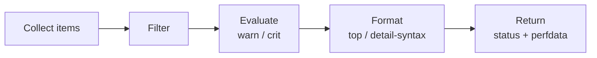

# Checks In Depth

All NSClient++ checks — `check_cpu`, `check_drivesize`, `check_service`, `check_eventlog`, and dozens more — share **one
common engine**. Once you understand it, you can configure any check.

This page walks through that engine from the ground up. Read it top-to-bottom the first time; later, jump to the section
you need.

!!! tip "New to NSClient++?"
Try the [Quick Start](../quick-start.md) or a [Monitoring Scenario](../scenarios/index.md) first to get a feel for what
checks look like in practice.

---

## 1. How a Check Works

Every check follows the same five steps:



1. **Collect** — gather a list of items (CPU cores, drives, services, event log entries…).
2. **Filter** — keep only items matching the `filter` expression.
3. **Evaluate** — test each kept item against `warn` and `crit`.
4. **Format** — build the message using `top-syntax` and `detail-syntax`.
5. **Return** — return the worst status, the message, and the performance data.

Each step has its own option. The four most important are:

| Option                                       | Purpose                          |
|----------------------------------------------|----------------------------------|
| `filter`                                     | Which items are included         |
| `warn` / `crit`                              | Which items trigger an alert     |
| `top-syntax` / `detail-syntax` / `ok-syntax` | What the message looks like      |
| `perf-config` / `perf-syntax`                | What performance data looks like |

---

## 2. Two Indispensable Built-in Helpers

Before changing anything, learn these two commands. They work for **every** check.

### Show defaults

```
check_cpu show-default
"filter=core = 'total'" "warning=load > 80" "critical=load > 90"
"empty-state=ignored" "top-syntax=${status}: ${problem_list}"
"ok-syntax=%(status): CPU load is ok." "detail-syntax=${time}: ${load}%"
"perf-syntax=${core} ${time}"
```

Use this to learn what a check does by default and to copy a single option to tweak.

!!! warning
Don't paste *all* defaults into your config. Defaults can change in newer versions; pinning them removes that benefit.

### Show help

```
check_cpu help
```

Gives the full list of options, filter keywords, and example usage for that specific check.

---

## 3. A Quick End-to-End Example

The same `check_cpu`, with progressively more customisation:

```text
# Defaults
check_cpu
OK: CPU load is ok.
'total 5m'=2%;80;90 'total 1m'=5%;80;90 'total 5s'=11%;80;90

# Custom thresholds
check_cpu "warn=load > 50" "crit=load > 70"
OK: CPU load is ok.
'total 5m'=2%;50;70 ...

# Per-core data instead of just the total
check_cpu filter=none "warn=load > 80" "crit=load > 90"

# Custom message
check_cpu "top-syntax=%(status): CPU usage is %(list)" \
          "detail-syntax=%(time) avg: %(load)%"
OK: CPU usage is 5m avg: 2%, 1m avg: 5%, 5s avg: 11%
```

The rest of this page explains exactly what each of those options does.

---

## 4. Filters — Choosing What to Check

A **filter** is an expression evaluated for each item. Items where it is `true` are included; items where it is `false`
are dropped.

If you don't supply one, the check uses its default (e.g., `check_cpu` defaults to `core = 'total'`).

### Syntax

```
keyword operator value
```

Combine with `and`, `or`, `not`. Disable the default with `filter=none`.

```
check_cpu "filter=core = 'total'"
check_cpu "filter=load > 5 or core = 'total'"
check_service "filter=start_type = 'auto' and not name like 'clr_optimization'"
check_cpu filter=none                       # include everything
```

### Operators

| Symbol            | Safe alias          | Meaning              |
|-------------------|---------------------|----------------------|
| `=`               | `eq`                | Equals               |
| `!=`              | `ne`                | Not equals           |
| `>` `<` `>=` `<=` | `gt` `lt` `ge` `le` | Numeric comparison   |
| `like`            | `like`              | Substring match      |
| `regexp`          | `regexp`            | Regular expression   |
| `in`              | `in`                | Membership in a list |
| `and` `or` `not`  | —                   | Logical              |
| `'...'`           | `str(...)`          | String literal       |

!!! note
Use the **safe aliases** (`gt`, `lt`, …) when passing arguments through NRPE or shells — they avoid `<`/`>` redirection
problems.

### Common keywords

These are available in *every* check:

| Keyword                                  | Meaning                   |
|------------------------------------------|---------------------------|
| `count`                                  | Items matching the filter |
| `total`                                  | Items before filtering    |
| `ok_count` / `warn_count` / `crit_count` | Items in each state       |
| `problem_count`                          | Warning + critical        |
| `status`                                 | Current overall status    |

Each check adds its own keywords. For `check_cpu`: `core`, `core_id`, `load`, `idle`, `kernel`, `time`. Use
`<check> help` to discover them.

### Practical filter recipes

```
# CPU: only the aggregate total
check_cpu "filter=core = 'total'"

# CPU: cores actually doing work, plus the total
check_cpu filter=none "filter=load > 5 or core = 'total'"

# Services: only auto-start, exclude one by name
check_service "filter=start_type = 'auto' and name != 'Spooler'"

# Event log: errors and criticals only
check_eventlog "filter=level in ('error', 'critical')"

# Disk: fixed and network drives
check_drivesize drive=* "filter=type in ('fixed', 'remote')"
```

### Size and time units

| Suffix                      | Size              | Time                                     |
|-----------------------------|-------------------|------------------------------------------|
| `k` / `m` / `g` / `t`       | KB / MB / GB / TB | —                                        |
| `s` / `m` / `h` / `d` / `w` | —                 | seconds / minutes / hours / days / weeks |

```
check_memory "warn=free < 4g"
check_uptime "warn=uptime < 1d"
```

Past times use **negative** values — `-1h` means "less than an hour ago":

```
check_eventlog scan-range=-24h "crit=written > -1h"
```

---

## 5. Thresholds — Choosing What's a Problem

`warn` and `crit` use the **same expression language as filters**. The difference: instead of including/excluding items,
they decide which items count as alerts.

- Any item matches `crit` → result is **CRITICAL**
- Any item matches `warn` (and none matched `crit`) → **WARNING**
- Otherwise → **OK**

```
check_cpu "warn=load > 80" "crit=load > 90"
check_memory "warn=free < 20%" "crit=free < 10%"
check_drivesize "warn=free < 15%" "crit=free < 5%"
```

### Disabling a threshold

```
check_cpu warning=none
check_cpu critical=none
```

### Composite thresholds

```
# Warn on high kernel time OR high load
check_cpu filter=none "warn=kernel > 10 or load > 80" "crit=load > 90"

# Warn only on big machines that are tight on memory
check_memory "warn=free < 4g and size > 16g"
```

### Aggregate thresholds

The `count` family of keywords lets you alert on totals rather than individual items:

```
# Alert if more than 3 services are stopped
check_service "crit=problem_count > 3"

# Alert if any matching event was written in the last hour
check_eventlog scan-range=-1w "crit=written > -1h"
```

### `empty-state` — when nothing matches

What status to return when the filter selects no items:

| Value      | Meaning                             |
|------------|-------------------------------------|
| `ok`       | Return OK (default for most checks) |
| `warning`  | Return WARNING                      |
| `critical` | Return CRITICAL                     |
| `ignored`  | Suppress the result                 |

```
check_service "filter=name = 'NonExistentService'" empty-state=ok
```

---

## 6. Output Syntax — Choosing the Message Text

Three options shape the message. They affect *only* the human-readable text — never the status or perfdata.

| Option          | When applied               | Default purpose           |
|-----------------|----------------------------|---------------------------|
| `top-syntax`    | Always — the whole message | Status + list of problems |
| `detail-syntax` | Per item, inside the list  | Per-item values           |
| `ok-syntax`     | When status is OK          | Brief "all ok" message    |

`check_cpu` defaults:

```
top-syntax=${status}: ${problem_list}
ok-syntax=%(status): CPU load is ok.
detail-syntax=${time}: ${load}%
```

### Template variables

Variables can be written `${name}` or `%(name)` — they're equivalent.

!!! note
On Unix shells `${...}` may be eaten by the shell. Prefer `%(...)` when the command travels through NRPE or a shell.

Common variables (every check):

| Variable                                       | Meaning                                         |
|------------------------------------------------|-------------------------------------------------|
| `${status}`                                    | OK / WARNING / CRITICAL / UNKNOWN               |
| `${list}`                                      | All filtered items, joined with `detail-syntax` |
| `${problem_list}`                              | Only warning/critical items                     |
| `${ok_list}` / `${warn_list}` / `${crit_list}` | Items in each state                             |
| `${count}` / `${problem_count}`                | Item counts                                     |

Per-item variables (in `detail-syntax`) depend on the check — `<check> help` lists them.

### Recipes

```
# Show all values, not just problems
check_cpu show-all
# equivalent to:
check_cpu "top-syntax=%(status): %(list)"

# Custom CPU message
check_cpu time=5m \
  "top-syntax=%(status): Cpu usage is %(list)" "detail-syntax=%(load)%"
OK: Cpu usage is 26%

# Custom memory message
check_memory "top-syntax=${list}" \
  "detail-syntax=${type} free: ${free} used: ${used} size: ${size}"
page free: 16G used: 7.98G size: 24G, physical free: 4.18G used: 7.8G size: 12G

# Service: name and state for each
check_service "top-syntax=${list}" "detail-syntax=${name}: ${state}"
```

---

## 7. Performance Data

Performance data is the machine-readable metrics used for graphing, in the standard Nagios format:

```
'metric_name'=value[unit];[warn];[crit];[min];[max]
```

Example:

```
'total 5m'=2%;80;90 'total 1m'=5%;80;90 'total 5s'=11%;80;90
```

### Perfdata needs thresholds

Without `warn`/`crit`, perfdata values are emitted but empty:

```
check_cpu warning=none critical=none
'total 5m'= 'total 1m'= 'total 5s'=
```

To get values without alerts, use `perf-config` to mark metrics as "extra":

```
check_cpu warning=none critical=none "perf-config=extra(load)"
```

### Customising with `perf-config`

`perf-config` works like a tiny stylesheet — selectors target metrics, keys transform them.

```
"perf-config=selector(key:value; key:value) selector2(key:value)"
```

| Key                 | Effect                                                                     |
|---------------------|----------------------------------------------------------------------------|
| `unit`              | Force a unit (`G`, `M`, `K`, `%`, `ms`, …)                                 |
| `ignored`           | `true` → drop this metric                                                  |
| `prefix` / `suffix` | Rename parts of the metric name                                            |
| `minimum` / `min`   | Force the perfdata `min` field (use `min` as a shorthand)                  |
| `maximum` / `max`   | Force the perfdata `max` field — useful for graphing systems that auto-fit |

Selectors match in order of specificity: `prefix.object.suffix` → `prefix.object` → `object.suffix` → `prefix` →
`suffix` → `object`. The `*` selector matches everything.

#### Recipes

```
# Lock memory metrics to GB (avoids graph jumps when auto-scaling switches units)
check_memory "perf-config=*(unit:G)"

# Lock disk metrics to GB
check_drivesize "perf-config=*(unit:G)"

# Drop the percent metrics from check_drivesize, keep the absolute ones
check_drivesize "perf-config=used %(ignored:true)"

# Rename: drop suffix label, force GB
check_drivesize "perf-config=used.used(unit:G;suffix:'') used %(ignored:true)"
'C:\'=213G;178;201;0;223 'D:\'=400G;372;419;0;465

# Force min/max bounds on a counter that doesn't know its own range
# (e.g. a raw PDH counter exposed by check_pdh). The graphing system can
# then auto-scale to the declared range instead of guessing from history.
check_pdh "counter=\\Processor(_Total)\\% Processor Time" \
  "perf-config=*(minimum:0;maximum:100)"

# Same idea on a custom queue-depth counter, with `min`/`max` shorthand.
check_pdh counter=queue_depth "perf-config=queue_depth(min:0;max:12345)"
```

### Inspecting performance data

```
render_perf remove-perf command=check_drivesize
OK: OK:
C:\ used      213.605 GB      178.777 201.124 223.471 0
C:\ used %    95      %       79      89      100     0
```

### `perf-syntax` — naming metrics

`perf-syntax` controls the metric **name** (not its value), using the same template variables as `detail-syntax`:

```
check_cpu "perf-syntax=${core} ${time}"     # 'total 5m'=...
check_cpu "perf-syntax=${core}_${time}"     # 'total_5m'=...
```

Useful when your graphing system is picky about names.

---

## 8. Putting It Together

Pick a check, run `show-default`, identify the option you want to change, change just that one. Repeat.

```
# Default behaviour
check_drivesize

# Step 1 — only fixed disks
check_drivesize "filter=type = 'fixed'"

# Step 2 — tighter thresholds
check_drivesize "filter=type = 'fixed'" \
  "warn=free_pct < 15" "crit=free_pct < 5"

# Step 3 — clean message
check_drivesize "filter=type = 'fixed'" \
  "warn=free_pct < 15" "crit=free_pct < 5" \
  "top-syntax=%(status): %(list)" \
  "detail-syntax=%(drive_or_id) %(free) free of %(size)"

# Step 4 — graph-friendly perfdata
check_drivesize "filter=type = 'fixed'" \
  "warn=free_pct < 15" "crit=free_pct < 5" \
  "perf-config=*(unit:G) used %(ignored:true)"
```
