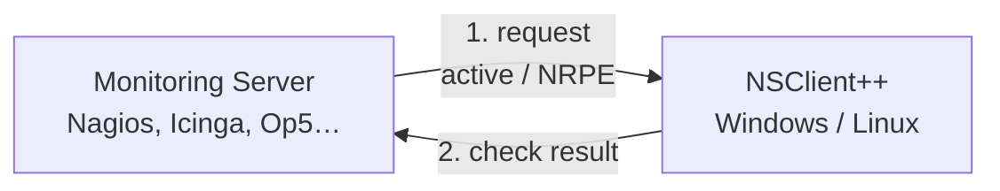
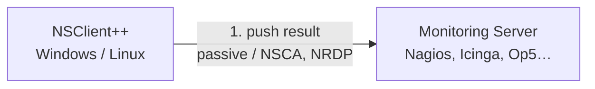

# How NSClient++ Works

Understanding the core concepts of NSClient++ will help you configure it correctly and troubleshoot problems quickly.

---

## The Big Picture

NSClient++ is a **monitoring agent** — a small service that runs on the machine you want to monitor. It does two things:

1. **Responds to requests** from a central monitoring server (active/polling mode).

2. **Pushes results** to a central monitoring server on a schedule (passive mode).


---

## Modules

Everything in NSClient++ is provided by **modules**. A module is a plugin that you load to enable specific capabilities.

**Modules must be explicitly enabled** — nothing runs unless it is loaded. This keeps the agent lightweight and its
attack surface small.

### How to enable a module

In your `nsclient.ini` configuration file, add the module to the `[/modules]` section:

```ini
[/modules]
CheckSystem = enabled
CheckDisk = enabled
NRPEServer = enabled
```

You can also enable a module from the command line without editing the file.
`--activate-module` accepts one or several module names, so the three modules
above become a single command:

```
nscp settings --activate-module CheckSystem CheckDisk NRPEServer
```

Or load it temporarily in the test shell without touching the configuration:

```
nscp test
load CheckSystem
```

### What happens if you forget to load a module?

You will see an error like this:

```
UNKNOWN: Unknown command(s): check_cpu available commands: ...
```

The fix is always the same: load the module that provides the command you need.

---

## Commands (Checks)

Each module provides one or more **commands** (also called queries or checks). A command is what your monitoring server
calls, and what produces a status and performance data.

| Module                 | Commands provided                                                                             |
|------------------------|-----------------------------------------------------------------------------------------------|
| `CheckSystem`          | `check_cpu`, `check_memory`, `check_service`, `check_process`, `check_uptime`, `check_pdh`, … |
| `CheckDisk`            | `check_drivesize`, `check_files`                                                              |
| `CheckEventLog`        | `check_eventlog`                                                                              |
| `CheckNet`             | `check_ping`, `check_tcp`, `check_http`, `check_dns`                                          |
| `CheckExternalScripts` | Any script you add to the config                                                              |
| `CheckWMI`             | `check_wmi`                                                                                   |
| `CheckTaskSched`       | `check_tasksched`                                                                             |
| `NRPEServer`           | Accepts incoming connections from `check_nrpe`                                                |
| `NSCAClient`           | Pushes passive results to an NSCA server                                                      |
| `Scheduler`            | Runs commands on a timer for passive monitoring                                               |

For a complete reference see the [Reference section](../reference/index.md).

---

## Aliases

An **alias** is a saved invocation of an existing command: a fixed command name plus a fixed argument list, exposed
under a new name. Once defined, the monitoring server can call the alias by name without specifying arguments at all.

Aliases solve two problems:

1. **Encode local policy.** Different machines need different thresholds.
   `my_check_cpu = check_cpu warn=load>80 crit=load>90` lets you tune thresholds per-host in the agent's config, and the
   monitoring side just calls `my_check_cpu`.
2. **Avoid `allow arguments = true` on the network.** Accepting arbitrary arguments from the monitoring server widens
   the attack surface (see [Securing NSClient++](../setup/securing.md)). Aliases bake the arguments into the local
   config so the protocol layer doesn't need to pass anything dangerous.

### Where to define them

Aliases live in their own configuration section. There are two modules that support them, and **the sections are
independent** — there is no automatic sharing:

```ini
; Recommended
; CheckHelpers only invokes other internal commands - no scripts, no shell.
[/settings/check helpers/alias]
my_check_cpu = check_cpu warn=load>80 crit=load>90

; Also supported, historical home of aliases. Loaded together with the
; external-script machinery.
[/settings/external scripts/alias]
my_check_mem = check_memory warn=used>80% crit=used>90%
```

Both modules can be loaded at the same time. Each reads its own section. Pick one as the home for new aliases (so you
don't have to remember which is which); if you ever define the same alias name in both, the last-loaded module wins,
which is confusing.

### Calling an alias

From the monitoring side it looks exactly like calling a regular command:

```
check_nrpe -H <agent-ip> -c my_check_cpu
```

### Argument substitution

Aliases can accept positional arguments via `$ARG1$` / `$ARG2$` placeholders, which are substituted into the
*already-declared* argument list:

```ini
[/settings/check helpers/alias]
my_check_process = check_process "process=$ARG1$" "crit=state != 'started'"
```

Then on the monitoring side:

```
check_nrpe -H <agent-ip> -c my_check_process -a w3wp.exe
```

### Which module to use

Prefer to use `CheckHelpers` for new instances and use only `CheckExternalScripts`for hstorical reasons.

---

## Check Results

Every check returns three things:

1. **Status** — `OK`, `WARNING`, `CRITICAL`, or `UNKNOWN`
2. **Message** — human-readable text explaining the status
3. **Performance data** — machine-readable key=value metrics for graphing

Example:

```
OK: CPU load is ok.
'total 5m'=2%;80;90 'total 1m'=5%;80;90 'total 5s'=11%;80;90
```

- `OK` is the status
- `CPU load is ok.` is the message
- `'total 5m'=2%;80;90` means: metric named `total 5m`, value `2%`, warn threshold `80%`, crit threshold `90%`

---

## Filters, Thresholds, and Syntax

All NSClient++ checks share the same engine for filtering, thresholds, and output formatting. Understanding this once
unlocks all checks.

- **`filter`** — SQL-like expression that selects which items to include (e.g., `filter=core = 'total'`)
- **`warn`** / **`crit`** — expressions that trigger warning or critical status (e.g., `warn=load > 80`)
- **`top-syntax`** / **`detail-syntax`** — templates that control what the message looks like

See [Checks In Depth](checks.md) for a full guide to these options.

---

## Protocols

NSClient++ speaks many protocols. The most common are:

| Protocol        | Direction              | Use case                                 |
|-----------------|------------------------|------------------------------------------|
| **NRPE**        | Server polls agent     | Active monitoring with Nagios/Icinga/Op5 |
| **NSCA / NRDP** | Agent pushes to server | Passive monitoring                       |
| **REST**        | Both                   | NSClient++ native protocol, web UI       |
| **Graphite**    | Agent pushes metrics   | Real-time graphing                       |
| **check_mk**    | Server polls agent     | Check_MK monitoring                      |

See [Quick Start](../quick-start.md) for step-by-step protocol setup.

---

## Configuration

NSClient++ is configured via a hierarchical key/value store, typically an INI file (`nsclient.ini`) in the
installation directory but optionally the Windows registry or a remote HTTP source. Sections are paths
(`[/modules]`, `[/settings/NRPE/server]`, …) and each module documents its own keys.

See [Settings](settings.md) for the full reference: settings stores (INI, registry, HTTP), the `[/includes]`
mechanism for splitting configuration across files, path variables, and `nscp settings` commands for migrating
between stores.

---

## Permissions

By default any caller that can reach a transport (NRPE, WEB, NSCA, the scheduler, …) can invoke any command the
loaded modules expose. NSClient++ has an optional core-level **permission policy** that turns this into a strict
allow-list: rules name a subject (the calling module, optionally with a principal such as the authenticated web user)
and the `module.command` patterns that subject may invoke. The policy is disabled by default for backwards
compatibility.

See [Permissions](permissions.md) for the identity model, how `CheckHelpers` forwards the original caller through
proxy chains, and a step-by-step guide for enabling the policy safely.

---

## Summary

| Concept    | What it means                                                                  |
|------------|--------------------------------------------------------------------------------|
| Module     | A plugin that must be loaded to enable its commands                            |
| Command    | A check that returns status + message + performance data                       |
| Alias      | A saved invocation of a command under a new name, with arguments baked in      |
| Filter     | An expression that selects which items to check                                |
| Threshold  | A `warn=` or `crit=` expression that triggers an alert                         |
| Protocol   | How NSClient++ talks to your monitoring server                                 |
| Permission | An optional allow-list controlling which callers may invoke which commands     |

**Next steps:**

- [Quick Start](../quick-start.md) — Install and run your first check
- [Monitoring Scenarios](../scenarios/index.md) — Real-world examples
- [Checks In Depth](checks.md) — Master filters and thresholds
