# Getting started with NSClient++

The getting started guide has been split into multiple sections to allow easier reading.

* [Getting-started](./index.md)
* [Getting-started with NSClient++](./nsclient.md)
* [Checking with NRPE client](./nrpe.md)
* [Checking with NSCA client](./nsca.md)

**Sections:**

* [Installing NSClient++](#installing-nsclient)
* [Starting NSClient++ in debug mode](#starting-nsclient-in-debug-mode)
* [Configure NSClient++ from command line](#configure-nsclient-from-command-line)
* [Accessing the Web Interface](#accessing-the-web-interface)
* [Checking things from the Web Interface](#checking-things-from-the-web-interface)
* [Loading modules via Web Interface](#loading-modules-via-web-interface)
* [Configuration via Web Interface](#configuration-via-web-interface)
* [Changing settings via command line](#changing-settings-via-command-line)
* [Adding certificates to NSClient++](#adding-certificates-to-nsclient)
* [Using `check_nsclient` Command](#using-check_nsclient-command)
* [Checking with NRPE client](./nrpe.md)
* [Checking with NSCA](./nsca.md)
* [TODO: Using the query language](#todo-using-the-query-language)
* [TODO: Checking with REST client](#todo-checking-with-rest-client)
* [TODO: Checking with NRDP](#todo-checking-with-nrdp)

## Installing NSClient++

The first thing we need to do is to download the latest version of NSClient++.
You can find the latest version on the [releases page](https://github.com/mickem/nscp/releases).

Download `NSCP-VERSION-x64.msi` and launch it.
This will start the installer which will guide you through the installation process.

### Select monitoring tool

The first thing you will be asked is which monitoring tool you are using.
This will affect the default configuration of NSClient++.

Currently, the following monitoring tools are supported:
* Generic: Select this for any other monitoring solution.
* Op5 Monitor: Select this if you are using Op5 Monitor.

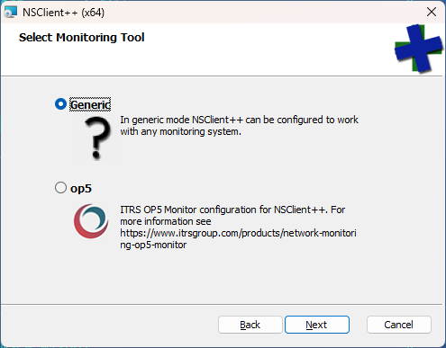

### Select Configuration

If you select `custom install` you will get the options to configure NSClient++ (if not you can skip ahead).
The next step is to select the configuration you want to use.

The default is fine it means you will use a configuration file in the ini format stored in the NSClient++ folder.
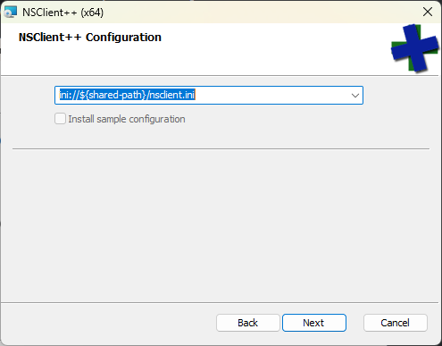

Options here would be to use a remote configuration file for instance hosted on a web server or place the configuration in the registry.

### Select configuration

Next we get to pick some basic configuration options.

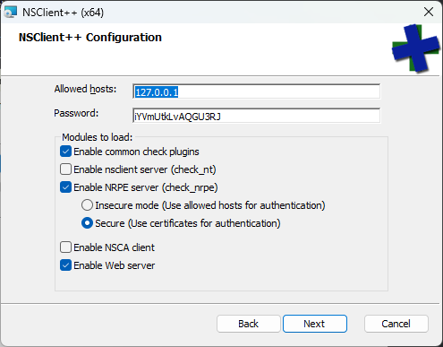

> This is important so make sure you read and understand the options carefully.

* `Allowed hosts`: This is a list of IP addresses which are allowed to connect to NSClient++.
* `Password`: This is the password used to authenticate against NSClient++. Make sure you note down the default generated password as you will need it later.
* `Enable common checks`: This will enable some common checks such as CPU, memory, disk space, etc.
* `Enable nsclient server`: This is an old and outdated protocol and not recommended to use.
* `Enable NRPE server`: This will enable the NRPE server which allows the monitoring server to execute commands on this machine.
  * `Insecure`: This will allow any host (in allowed hosts) to connect to the NRPE server without authentication. **Not recommended**.
  * `Secure`: This will require the monitoring server to authenticate with a certificates.
* `Enable NSCA client`: This will enable the NSCA client which allows NSClient++ to submit passive checks to a remote server.
* `Enable Web server`: This will enable the web server which allows you to access NSClient++ via a web interface.

In general, I would recommend the default options here if you are using Nagios as they will give you a good starting point.
But beware that this requires manual configuration if using NRPE as certificate needs to be generated and configured manually.

### Automated installation

There is a dedicated page about automating the installation of NSClient++.
See [Reference: Installing](./installing.md).

### Using NSClient++ as a service

After you install NSClient++ you will have a started service running on the machine.
This service is called `nscp` and it will start automatically when the machine boots.
You can control the service using the `net` command or the `sc` command.
```
net start nscp
net stop nscp
sc start nscp
sc stop nscp
```
You can also control the service using the Windows Services management console (services.msc).

## Starting NSClient++ in debug mode

Using NSClient++ as a service is not very useful for debugging and testing.
So it is often useful to run NSClient++ in "debug mode" which allows you to see what is happening in real-time and interact with it.
For the reminder of this guide we will run NSClient++ in debug mode.

To do this we first need to shut down the service.
```
net stop nscp
```

Since much of what NSClient++ does requires "elevated privileges" you should always run NSClient++ in an "Administrator command prompt".
Now lest start NSClient++ in debug mode.

```
cd c:\program files\nsclient++
nscp test
...
exit
```

After starting in debug mode you can type exit to stop NSClient++.

## Configure NSClient++ from command line

NSClient++ has a command line interface to make configuration changes.

To try this out lets enable the WMI module which is a module that allows you to run WMI queries on the local machine.

```
nscp settings --activate-module CheckWMI
```

If you check `nsclient.ini` you will see that the module has been added to the configuration file.

```ini
[/modules]
; ...
CheckWMI = enabled
```

There are many more command line options to interact with the configuration for a full list you can run:

```
nscp settings --help
```

## Accessing the Web Interface

When we installed NSClient++ we enabled the web server.
This allows us to access NSClient++ via a web interface.

As we have stopped the service we need to either start it again or run NSClient++ in debug mode:
```
nscp test
```

Next up to access the web interface you can open a web browser and navigate to `https://localhost:8443/`.
Then you are met with a scary looking dialog (in your language) about an untrusted certificate:
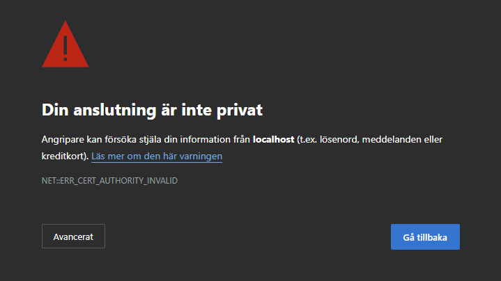

This is normal and due to the fact that to use TLS (HTTPS) NSClient++ generates a self-signed certificate on startup.
If you have a CA in your organization you can use that to sign trusted certificates or you can click `Advanced` and then `Accept the risk and continue` to proceed to the web interface.

Next up we need to login:

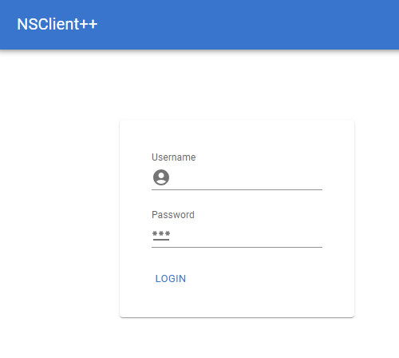

Here you can login with the username `admin` and the password you set during installation.
If you do not remember the password you can reset it using the command line:

```
nscp settings --path /settings/default --key password --set your_password
```
Once you have logged in you will be presented with the NSClient++ web interface.

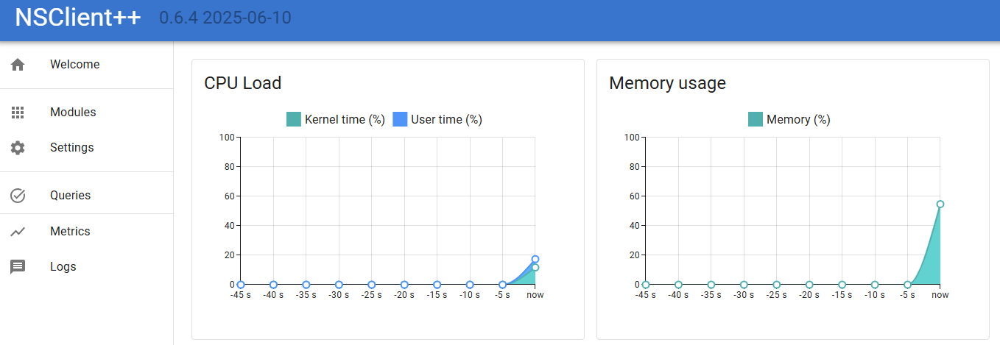

> If you fail to log in, ensure you are not running a service in the background, or that you have restarted since changing the password.


## Checking things from the Web Interface

The next step is to start checking things.
NSClient++ is a monitoring agent and as such it is designed to check various aspects of your system.
This is done using modules which provide various checks and commands.
Modules can be loaded and unloaded at runtime and they provide various features and functionality.

If we click on `Queries` in the web interface we will see a list of available queries.
In the list you will find `check_cpu` so lets try it out.

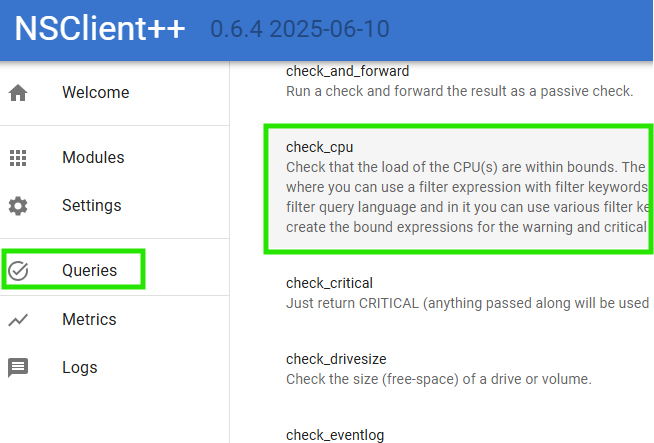

Then you are met with a screen which looks a bit like this:
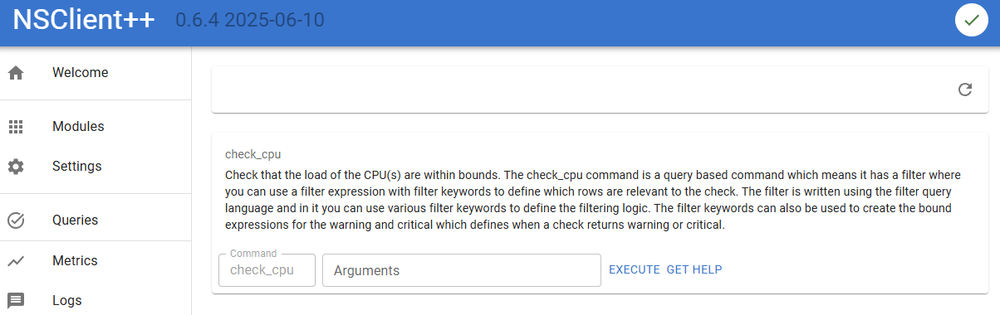

Here we can:

* Click `Execute` to run the check.
* Click `Get Help` to get help on how to use the check.
* Enter `Arguments` to pass arguments to the check.

Let start by click `Execute` and see what happens.

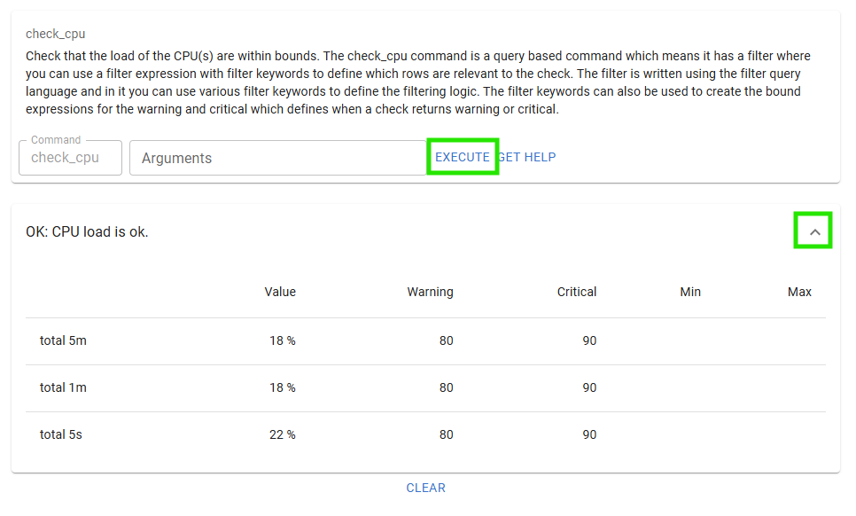

If you click the `Expand` chevron you will also see the performance data from the check.

Next up lets click `Get Help` to see how to use the check.
At the very end you can find the `cores` options, so lets try that out.

Enter `cores`in the arguments field and click `Execute` again.
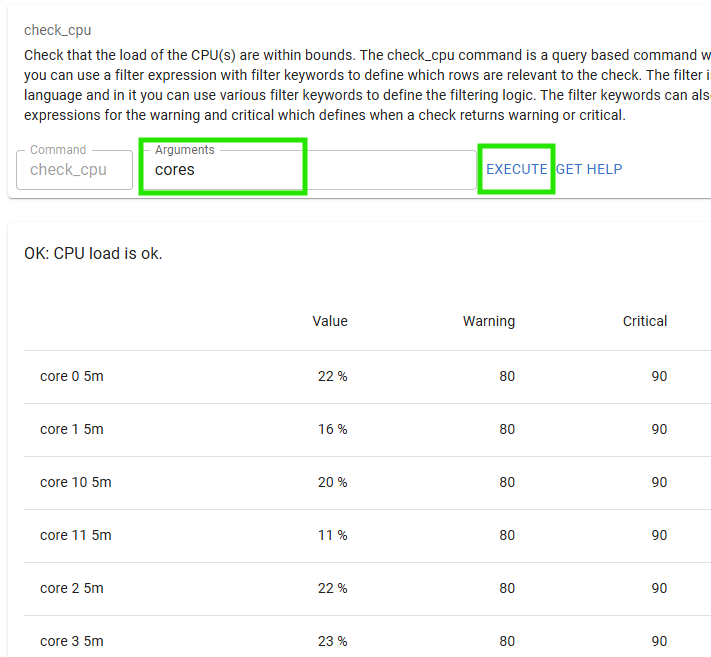

And there you have it the CPU load for each core.


## Loading modules via Web Interface

Before we loaded a module using the command line.
Now we will load a module using the web interface.
To do this we will click on `Modules` in the web interface.
Here you will see a list of available modules.
Click the `CheckNet` module to configure that module.

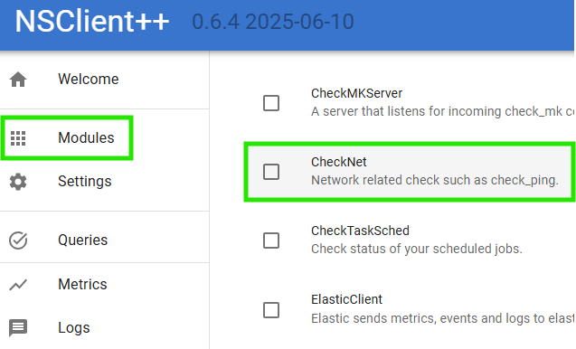

Here we can see that the module is neither loaded nor enabled.

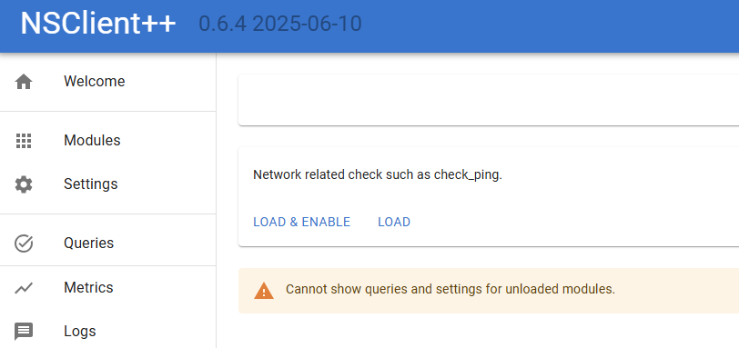

A quick word about the difference between loaded and enabled.

* Loaded means that the module is loaded into memory and can be used.
* Enabled means that the module is configured to be loaded when NSClient++ starts.

Normally you want the module to be both loaded and enabled.
So lets click the `Load & Enable` button to load the module.

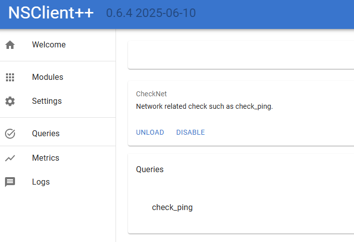

Now we can see the queries provided by the module.
Lets try out the `check_ping` query which checks the ping response time to a host.

As you noticed this is the same dialog as we saw before when we executed the `check_cpu` query.
So lets try it out by entering `host=nsclient.org` in the `Arguments` field and clicking `Execute`.

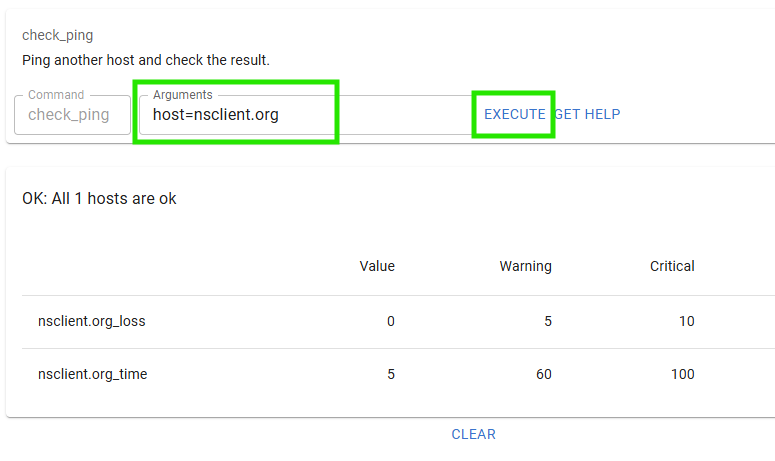

## Configuration via Web Interface

The web interface also allows you to configure NSClient++.
To do this you can use the `Settings` tab but a simpler way is to use the settings widget on the module dialog as that only have settings relevant for a given module so that is what we will do.
So lets click `Modules` in the web interface and then click on the `WEBServer` module.

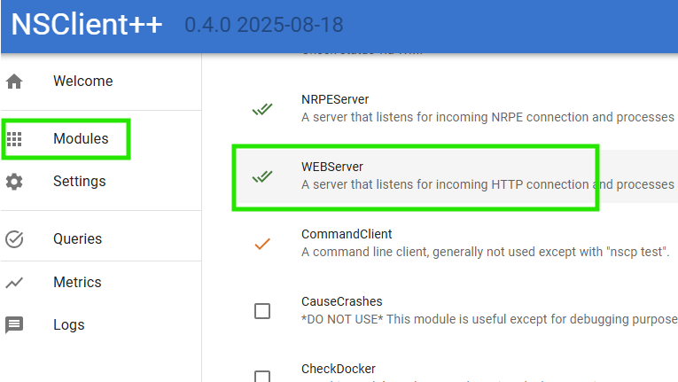.

Once you are here Click `Settings` and then expand `/settings/WEB/server` to show the port setting.

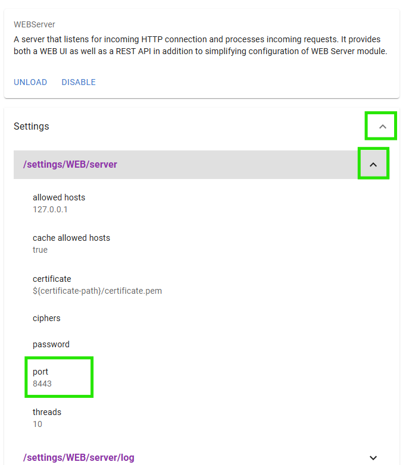

You should now be able to change the `port` to `1234` and click save:

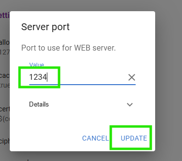

After this you should get a popup asking you to save and update the settings.

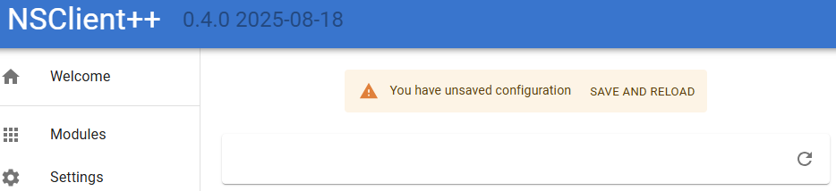

If you click `Save and reload` the service will restart and the web server will now be served on port 1234 instead.
So navigate to `http://localhost:1234/` and you should see the web interface again.

## Changing settings via command line

Lets use the command line to change the port back to 8443.

First we need to exit the debug mode if you are running it.
```
...
exit
```

After this we can run the following command to change the port:

```
nscp settings --path /settings/WEB/server --key port --set 8443
```

And start NSClient++ in debug mode again:

```
nscp test
...
exit
```

And you should now be able to access the web interface again at `https://localhost:8443/`.

## Adding certificates to NSClient++

By default, NSClient++ generates a self-signed certificate on startup.
This is fine for testing but in a production environment you will want to use a certificate signed by a trusted CA.
As we do not have a CA in this example we will create our own CA using the `mkcert` tool to simulate CA here.
First we need to install `mkcert`.
You can find the installation instructions on the [mkcert GitHub page](https://github.com/FiloSottile/mkcert).
Once you have installed `mkcert` you can create a CA and generate a certificate for localhost.

```
mkcert -install
mkcert localhost
```

> **NOTICE** This will install the root certificate on your local machine.

This will install the root certificate and generate two files `localhost.pem` and `localhost-key.pem`.
Next we need to copy these files to the NSClient++ security folder.

```
copy localhost.pem "c:\program files\nsclient++\security\server.pem"
copy localhost-key.pem "c:\program files\nsclient++\security\server.key"
```
Next we need to configure NSClient++ to use these files.
We can do this using the command line:

```
nscp settings --path /settings/WEB/server --key certificate --set "${certificate-path}\server.pem"
nscp settings --path /settings/WEB/server --key "certificate key" --set "${certificate-path}\server.key"
```

If we restart NSClient++ in debug mode again:

```
nscp test
...
exit
```

We should now have a valid certificate when we visit the web interface on `https://localhost:8443/`.

If you wish to remove the root certificate you can do so using:

```
mkcert -uninstall
```

## Using `check_nsclient` Command

If we want to use trusted communication we can use the root cert from `mkcert`. To extract this we can run: 

```
mkcert -CAROOT
```
This will give us the path to the root certificate which we can use when we login with `check_nsclient`.
If you do not want to use trusted connections you can instead use the `--insecure` flag to skip certificate validation.

```commandline
$ check_nsclient nsclient auth login --password PASSWORD --ca %LOCALAPPDATA%\mkcert\rootCA.pem
Successfully logged in

# or optionally
$ check_nsclient nsclient auth login --password PASSWORD --insecure
Successfully logged in
```

This command will connect to a local NSClient instance and authenticate using the provided password and CA certificate.
The password and key will be store in your local credential store.
To logout (and remove password and key from credential store) you can run:

```
check_nsclient nsclient auth logout
```

Next up we can try to connect using the ping command:

```
check_nsclient nsclient check ping
Successfully pinged NSClient++ version 0.4.0 2026-01-10
```

This tool can also be used to connect to remote NSClient++ instances by providing the `--url` option:
```commandline
$ check_nsclient nsclient auth login --help
Login and store token

Usage: check_nsclient.exe nsclient auth login [OPTIONS] --password <PASSWORD> [ID]

Arguments:
  [ID]  Profile ID to store the token under [default: default]

Options:
      --url <URL>            NSClient++ URL [default: https://localhost:8443]
      --username <USERNAME>  Username to login with [default: admin]
      --password <PASSWORD>  Password to login with
      --insecure             Allow insecure TLS connections (i.e. dont validate certificate)
      --ca <CA>              CA File to use for TLS connections
  -h, --help                 Print help
```

One of the benefits of the `check_nsclient` tool apart from having a CLI interface where you can manage NSClient is that it also has an interactive client you can use:

```commandline
$ check_nsclient nsclient client
```


In this client you can execute queries, check status, see log and so on and so fort.

## Checking things

As there are many ways to check things using NSClient++ we will split this into separate sections.

* [Checking with NRPE client](./nrpe.md)
* [Checking with NSCA](./nsca.md)


