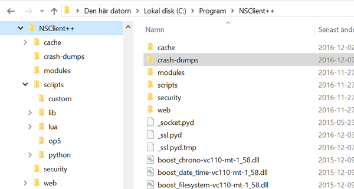
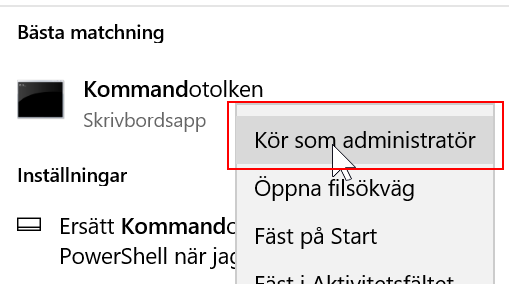
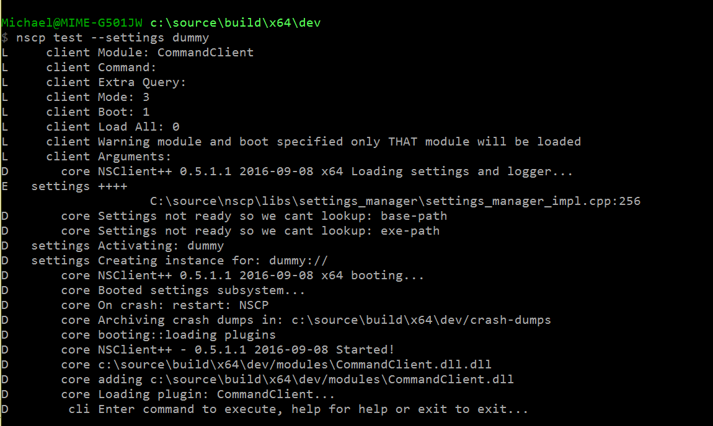

# Getting started with NSClient++

This is a hands on guide to getting started with NSClient++.
We will start with a clean slate and work our way in small easy to follow steps towards a fully functional monitoring solution.

For the sake of simplicity this will be based on a Windows version.
If you would like to do this on Linux it "should" work much the same apart from some of the system specific checks will not be available for your platform.

## Getting it!

The first thing we want to do is installing it!



After you install it you should have the following folder structure if you don't please don't continue instead try to figure out why you do not :)

Now that we (presumably) have NSClient++ installed let start by starting it in "debug mode".
To do this we first need to shutdown the service.
```
net stop nscp
```


Since much of what NSClient++ does requires "elevated privileged" you should always run NSClient++ in a "Administrator command prompt".



Now change directory to where you installed NSClient++ and run nscp without any arguments like so:


```
cd to/your/nsclient++/folder</dt>
nscp
...
```

Running nscp without arguments will show you the initial help screen.

## Getting Help

The next step is to explore the various "modes".

```
nscp --help
$ nscp --help
Allowed options:

Common options:
  --settings arg                    Override (temporarily) settings subsystem
                                    to use
  --debug                           Set log level to debug (and show debug
                                    information)
  --log arg                         The log level to use
  --define arg                      Defines to use to override settings. Syntax
                                    is PATH:KEY=VALUE

                                    List of arguments (does not get -- prefixed)
...
  A short list of all available contexts are:
client, help, service, settings, unit, check_mk, eventlog, ext, ext-scr, lua, mk, nrpe, nsca, nscp, py, python, sys, syslog, test, web, wmi
```

As you can see there is a nice little help screen describing most of the options you can use.
An important thing to understand is that like many other command line tools such as git or subversion the first "option" is not an option instead it acts as a "mode of operation".
In our case we have the following modes:

| Command  | Description                                   |
|----------|-----------------------------------------------|
| client   | Run client side commands                      |
| help     | Display help screen                           |
| service  | Control the service as well as (un)install it |
| settings | Work with the settings subsystem              |
| test     | run NSClient++ in the famous "test" mode      |
| unit     | Execute unit tests                            |

In addition to this we have alias for various "common" client modules.
They are merely a glorified way to save yourself some typing for instance `nscp sys` will yield the same result as saying `nscp client --module CheckSystem`.

| Command  | Description                                                                                                       |
|----------|-------------------------------------------------------------------------------------------------------------------|
| eventlog | Inject event log message into the event-log (mainly for testing event-log filtering and setup)                    |
| ext-scr  | External scripts                                                                                                  |
| lua      | Execute lua scripts                                                                                               |
| nrpe     | Use a NRPE client to request information from other systems via NRPE similar to standard NRPE check_nrpe command. |
| nsca     | Use a NSCA to submit passive checks to a remote system. Similar to the send_nsca command                          |
| python   | Execute python scripts                                                                                            |
| sys      | Various system tools to get information about the system (generally PDH on windows curretly)                      |
| test     | The best way to diagnose and find errors with your configuration and setup.                                       |
| web      | Configure the web server                                                                                          |
| wmi      | Run WMI queries from command line                                                                                 |


## Getting setup!

Since NSClient++ is an agent or daemon or service or whatever you want to call it. It is generally designed to run by it self without user intervention.
Thus it requires a lot of configuration to know what to do so next up on our guide is getting to know the configuration and the interface.

So the first thing we need to decide is where to place our configuration since I like the simplicity of the ini file I tend to opt for an ini-file in the "current folder".
This, though, a rather crappy place to have the configuration and breaks both the Linux and Windows design guidelines but I tend to opt for simplicity.
The long term plan is to some day move the settings file over to where settings files should be stored (but you can do this manually if you prefer).
So the first thing you need to do now is tell NSClient++ this but before we get ahead of our self lets look at how we can manipulate the settings via the nscp command line interface.
If you remember from the getting help section above we had a "settings" mode of operation. Lets look into that one a bit more.

```
$ nscp settings --help
Allowed options (settings):

Common options:
  --settings arg                Override (temporarily) settings subsystem to
                                use
  --debug                       Set log level to debug (and show debug
                                information)
  --log arg                     The log level to use
  --define arg                  Defines to use to override settings. Syntax is
                                PATH:KEY=VALUE

Common options:
  --help                        Show the help message for a given command
  --no-stderr                   Do not report errors on stderr
  --version                     Show version information

Settings options:
  --migrate-to arg              Migrate (copy) settings from current store to
                                given target store
  --migrate-from arg            Migrate (copy) settings from old given store to
                                current store
  --generate [=arg(=settings)]  Add comments to the current settings store (or
                                a given one).
  --add-missing                 Add all default values for all missing keys.
  --validate                    Validate the current configuration (or a given
                                configuration).
  --load-all                    Load all plugins (currently only used with
                                generate).
  --path arg                    Path of key to work with.
  --key arg                     Key to work with.
  --set arg                     Set a key and path to a given value (use --key
                                and --path).
  --switch arg                  Set default context to use (similar to migrate
                                but does NOT copy values)
  --show                        Show a value given a key and path.
  --list                        List all keys given a path.
  --add-defaults                Same as --add-missing
  --remove-defaults             Remove all keys which have default values (and
                                empty sections)
  --use-samples                 Add sample commands provided by some sections
                                such as targets and real time filters
  --activate-module arg         Add a module (and its configuration options) to
                                the configuration.
```

In our case what we want is something which goes by the fancy name of "set default context".
This has the option --switch and takes a single argument which defines the settings system to "switch to".
Notice the comment about difference between the various --migrate-xxx options and switch. Switch will not migrate your current settings.
Using migrate here would thus copy all settings from whatever settings you are using today to the new one before updating the settings to use.

```
d:\source\nscp\build\x64>nscp settings --switch ini://${exe-path}/nscp.ini
Current settings instance loaded:
INI settings: (ini://${exe-path}/nscp.ini, d:/source/nscp/build/x64//nscp.ini)
```

What this does is configure NSClient++ to use the nsclient.ini config file and that the fie is placed in the ${exe-path} folder (which is the same path as the exe file you are launching it from is placed).
But how does it do this you ask? What does actually change when you run this command?
And the answer is simply a file called boot.ini is updated. This file describes where all settings files are found (and any configuration the settings file might require).
Go ahead try it, delete this file and re-run the above command and it will come back looking the same.

So now that we actually have a configuration file what can we do with it?
If you read the theoretical version of the getting-started page you know by now that NSClient++ settings are self-describing.
The command to for this is: `nscp settings --generate ini --add-defaults --load-all`

The "--add-missing" will force NSClient++ to add all missing keys to the settings store.

So lets go ahead and run this command and see what our nsclient.ini file looks like.
If you open up the file you will be pleasantly (or not) surprised it has very few options.
The reason for this is the modular nature of NSClient++ with a clean install there are no modules configured so we only get configuration options for the "core program" which really has very little in the way of configuration.

Now if we regret this option we can remove all the keys which have the default value by running:  `nscp settings --generate ini --remove-defaults --load-all`

## Getting modular

Loading modules is the most important aspect of NSClient++ and there is plenty to choose from.
NSClient++ has over 35 different modules.
Modules can be grouped into three generic kinds of modules.

*   Check modules
    They provide various check metrics and commands for checking your system.
*   Protocol providers (Servers and clients)
    They provide the communication protocols you can use when connection NSClient++ to the outside world.
*   Scripting modules
    They provide additional features in the form of scripts and even other modules. I tend to think of them as proxies.

We will start exploring "check-modules" here as they are the simplest form of module.
Now comes a hefty dose of Linux hate. This guide will use the CheckSystem module which is (currently) only available on Windows.
So how do we load modules?
The simple way is to use the NSClient++ command line syntax here as well.

```
nscp settings --activate-module CheckSystem --add-missing
```

As always open up the config file and see what was added.

## Getting your hands dirty

So now that we have a module loaded lets move on to actually using the module.
The best (and most ignored) way to work with NSClient++ is to use the "test mode".
Test mode provides you with two things.

1.  A real-time debug log of what NSClient++ does
2.  A way to run commands quickly and easily and see the debug log at the same time.

To start test mode you run the following command: `nscp test`

This will print some debug log messages and eventually leave you with blinking cursor.



Now you can enter commands.

Lest start by loading the CheckSystem module

```
...
load CheckSystem
```

After which we can list all commands (queries):

```
commands
check_cpu  -Check that the load of the CPU(s) are within bounds.
check_memory    -Check free/used memory on the system.
check_network   -Check network interface status.
check_os_version        -Check the version of the underlaying OS.
check_pagefile  -Check the size of the system pagefile(s).
check_pdh       -Check the value of a performance (PDH) counter on the local or remote system.
The counters can also be added and polled periodcally to get average values. Performance Log Users group membership is required to check performance counters.
check_process   -Check state/metrics of one or more of the processes running on the computer.
check_service   -Check the state of one or more of the computer services.
check_uptime    -Check time since last server re-boot.
checkcounter    -Legacy version of check_pdh
checkcpu        -Legacy version of check_cpu
checkmem        -Legacy version of check_mem
checkprocstate  -Legacy version of check_process
checkservicestate       -Legacy version of check_service
checkuptime     -Legacy version of check_uptime
```

Now your list might be different as you might have other modules loaded.

You get a list of all commands you can execute.
Commands in this context is actual check commands which generally checks some aspect of you system.
Lets try out the first one:

```
check_cpu
L        cli OK: OK: CPU load is ok.
L        cli  Performance data: 'total 5m'=1%;80;90 'total 1m'=7%;80;90 'total 5s'=7%;80;90
```

And as you can see the check return the cpu load over the last 5 seconds as well as 1 and 5 minutes.
So there we have it the system is now being monitored (albeit manually by you but we will resolve that in the next section).

For more details on working with check commands see the [checks page](howto/checks.md)

## Getting Connected

Now that we have a sense of how to check our data we shall start connecting our self with the outside world so our monitoring agent can connect and see if we are actually working properly.

**TODO**

## Getting scheduled

**TODO**

## Getting to the end

**TODO**

SO now we have walked through the basics of setting up NSClient++ some of this requires Windows some requires 0.4.1 and some requires manual work.
Most of this  can be automated and/or configured from the installer but I think it is better to understand what actually happens and I hope this gives a sense of how NSClient++ works and how you can use NSClient++.
