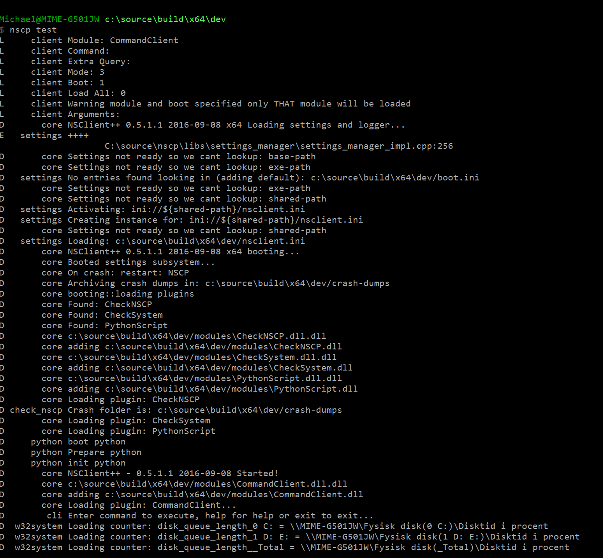

# Checking things

This page will tell you how to check your computer using NSClient++.
This information in only valid for 0.4.2 and beyond since this is based off the new check syntax.

## Getting started

The simplest way to execute checks with NSClient++ is through the built-in client also known as test mode.
To start NSClient++ in test mode you need top open the NSClient++ test shell.



Once you have started the shell it will tell you it is loading some modules and so on during startup and finish with:
```
nscp test
...
L     client Enter command to inject or exit to terminate...
```

Once you see this you can either execute commands or exit the client.
Lets start out by exiting the client which you do by typing "exit" and then pressing enter.

!!! danger
    The "test mode" will start NSClient++ in the same way as when you run the service.
    This means that if the service is running it will not be able to open the ports and start the sockets.

!!! note
    Since NSClient++ in test mode is the same as NSClient++ as a service it is very useful to use even when debugging checks from Nagios as you can see all debug information in real time.
    Just remember to stop the service before you start NSClient++ in test mode.

## Getting started again

Now we are going to start NSClient++ without a settings file to make sure you don't have any strange settings lurking around.
To do that we add the option --settings dummy. This tells NSClient++ to use a "dummy" settings store:
```
nscp test --settings dummy
...
```

Now lets run our first check command. A good place to start is the CheckSystem module and the check_cpu command:

```
check_cpu
E       core Unknown command(s): check_cpu available commands: commands {}, plugins {}
D:\source\nscp\master\nscp\service\NSClient++.cpp:1010
L     client UNKNOWN: Unknown command(s): check_cpu
```

The reason we get an error is that we have not loaded the CheckSystem module yet.
To load modules from the "test client" you issue the load <module> command:

```
load CheckSystem
D       core adding d:\source\build\vs2012\x64\dev\/modules\CheckSystem.dll
```

Next lets retry our command:

```
check_cpu
L     client OK: CPU Load ok
L     client  Performance data: 'total 5m'=0%;80;90 'total 1m'=1%;80;90 'total 5s'=11%;80;90
```

## Reflect in Silence

So what have learned so far?
Well, we need to load a module before we can execute its command.
And if we look at the output we can discern that we get various messages. Many of them marked D for debug..
These message will only be available if log level is set to debug.

This can be achieved in two ways:

1.  the --log debug command line options
2.  Configuring the log level in the config file:
```
[/settings/log]
level = debug
```

The main benefit of debug messages are that they can help you find issues and why things are wrong.
In addition to debug log messages many commands have a debug option to print extra information when they execute.
This can be useful when you run into problems and things does not work as you expect.

We have also learned that we can specify which settings tore to use and that NSClient++ has an empty settings tore called dummy which can be useful if you want to get around the current configuration.

## Getting help

Since you have found your way to this document it is safe to assume that you are aware that all commands are described here in the help.
In addition to this all commands also feature built-in command line help. Since this is extensive it can not really be used remotely via for instance check_nrpe since it has a limited payload (out of the box).

Thus the "test mode client" which we are using here is a great place to run your commands.
To get help you run the command with the help option:

```
check_cpu help
...
```

As you can see the help is rather extensive and comprehensive.

All commands are added on the form of `*keyword*=*value*`. Or in some instance *keyword* only when a value is not nessecary.
For instance help like so: `check_cpu help`

Using the normal form *keyword*=*value* it looks like this: `check_cpu filter=none`

## Filters

The next thing we need to understand is the basics for configuring checks.
NSClient++ uses something called "filters" filters are the basis for everything and very important to understand.
The idea is derived from the SQL Where clause. And the idea is that you define a natural language expression which either match something or not.
Thus you can think of a filter as an expression which either return true (and marks the item in question) or false.

For instance:

```
check_cpu "filter=core = 'core 0'" "top-syntax=${list}"
L     client OK: core 0>5%, core 0>32%, core 0>57%
L     client  Performance data: 'core 0 5m'=5%;80;90 'core 0 1m'=32%;80;90 'core 0 5s'=57%;80;90
```

Lets for the moment ignore the "top-syntax=${list}" option and instead focus on the filter part: "filter=core = 'core 0'"
Lets dissect this:

1.  *filter* Is the keyword
2.  *core = 'core 0'* is the expression

Dissecting this expression further we get:

1.  *core* is a variable representing the name of the core
2.  *'core 0'* is the name of the first core.

To get a list of all keyword we can use the help option as shown above. Here is the available variables for check_cpu filter keyword.

| Key            | Value                                                                                                          |
| -------------- | -------------------------------------------------------------------------------------------------------------- |
| count          | Number of items matching the filter. Common option for all checks.                                             |
| total          |  Total number of items. Common option for all checks.                                                          |
| ok_count       |  Number of items matched the ok criteria. Common option for all checks.                                        |
| warn_count     |  Number of items matched the warning criteria. Common option for all checks.                                   |
| crit_count     |  Number of items matched the critical criteria. Common option for all checks.                                  |
| problem_count  |  Number of items matched either warning or critical criteria. Common option for all checks.                    |
| list           |  A list of all items which matched the filter. Common option for all checks.                                   |
| ok_list        |  A list of all items which matched the ok criteria. Common option for all checks.                              |
| warn_list      |  A list of all items which matched the warning criteria. Common option for all checks.                         |
| crit_list      |  A list of all items which matched the critical criteria. Common option for all checks.                        |
| problem_list   |  A list of all items which matched either the critical or the warning criteria. Common option for all checks.  |
| detail_list    |  A special list with critical, then warning and finally ok. Common option for all checks.                      |
| status         |  The returned status (OK/WARN/CRIT/UNKNOWN). Common option for all checks.                                     |
| core           | The core to check (total or core ##)                                                                           |
| core_id        | The core to check (total or core_##)                                                                           |
| idle           | The current idle load for a given core                                                                         |
| kernel         | The current kernel load for a given core                                                                       |
| load           | The current load for a given core                                                                              |
| time           | The time frame to check                                                                                        |


In our example we used the core to limit the output to only show core 0.
Now if you run this without a filter using the extended isplay as before we get:

```
check_cpu "top-syntax=${list}"
L     client OK: total>8%, total>8%, total>8%
L     client  Performance data: 'total 5m'=8%;80;90 'total 1m'=8%;80;90 'total 5s'=8%;80;90
```

Now you might be wondering why we don't get any information about the cores here?
Without a filter a default filter is used which means that if we do not specify one we get "some filter".

If we do not like this behavior we can enforce an empty filter by specify filter=none:

```
check_cpu filter=none "top-syntax=${list}"
L     client OK: core 0>19%, core 1>1%, core 2>13%, core 3>1%, core 4>19%, core 5>0%, core 6>14%, core 7>0%, total>8%, core 0>20%, core 1>2%, core 2>15%, core 3>1%, core 4>20%, core 5>0%, core 6>16%, core 7>0%, total>9%, core 0>22%, core 1>2%, core 2>15%, core 3>0%, core 4>19%, core 5>0%, core 6>14%, core 7>0%, total>9%
L     client  Performance data: 'core 0 5m'=19%;80;90 'core 1 5m'=1%;80;90 'core 2 5m'=13%;80;90 'core 3 5m'=1%;80;90 'core 4 5m'=19%;80;90 'core 5 5m'=0%;80;90 'core 6 5m'=14%;80;90 'core 7 5m'=0%;80;90 'total 5m'=8%;80;90 'core 0 1m'=20%;80;90 'core 1 1m'=2%;80;90 'core 2 1m'=15%;80;90 'core 3 1m'=1%;80;90 'core 4 1m'=20%;80;90 'core 5 1m'=0%;80;90 'core 6 1m'=16%;80;90 'core 7 1m'=0%;80;90 'total 1m'=9%;80;90 'core 0 5s'=22%;80;90 'core 1 5s'=2%;80;90 'core 2 5s'=15%;80;90 'core 3 5s'=0%;80;90 'core 4 5s'=19%;80;90 'core 5 5s'=0%;80;90 'core 6 5s'=14%;80;90 'core 7 5s'=0%;80;90 'total 5s'=9%;80;90
```

!!! note
    Your list might differ depending on how many cores you have.

Now we get the full list of cores but since this output is not very useful (since most people are only interested in the total load that is the default:

```
check_cpu "filter=core = 'total'" "top-syntax=${list}"
L     client OK: total>8%, total>8%, total>8%
L     client  Performance data: 'total 5m'=8%;80;90 'total 1m'=8%;80;90 'total 5s'=8%;80;90
```

Next up is altering our filter a bit.
Lets instead of getting core 2 get any core with is doing actual work. Lets say where the load (in percentages) is greater then 5:

```
check_cpu "filter=load > 5" "top-syntax=${list}"
L     client OK: core 0>17%, core 2>12%, core 4>20%, core 6>13%, total>8%
L     client  Performance data: 'core 0 5s'=17%;80;90 'core 2 5s'=12%;80;90 'core 4 5s'=20%;80;90 'core 6 5s'=13%;80;90 'total 5s'=8%;80;90
```

The best thing about filters is they they are expressions which means you can combine any number of expression together by using *and* or *or* between them.

For instance lets get all cores which are working and the total. This would be all cores where load is either above 5 or name is total:

```
check_cpu "filter=load > 5 or core = 'total'" "top-syntax=${list}"
L     client OK: core 0>11%, core 2>8%, core 4>11%, core 6>8%, total>5%, core 0>19%, core 2>13%, core 4>18%, core 6>13%, total>8%, core 0>18%, core 2>15%, core 4>19%, core 6>17%, total>9%
L     client  Performance data: 'core 0 5m'=11%;80;90 'core 2 5m'=8%;80;90 'core 4 5m'=11%;80;90 'core 6 5m'=8%;80;90 'total 5m'=5%;80;90 'core 0 1m'=19%;80;90 'core 2 1m'=13%;80;90 'core 4 1m'=18%;80;90 'core 6 1m'=13%;80;90 'total 1m'=8%;80;90 'core 0 5s'=18%;80;90 'core 2 5s'=15%;80;90 'core 4 5s'=19%;80;90 'core 6 5s'=17%;80;90 'total 5s'=9%;80;90
```

In this way we can keep adding more and more expressions together to form any filter we want.

## Beyond filters

Now Nagios doe not care about the message nor the performance data. What Nagios cares about is the return status.
The return status in the Nagios context can be:

-   ok
-   warning
-   critical
-   unknown

The way this work in NSClient++ is that besides the filter keyword there are other similar filters which define the various states.
-   *warning* Define the warning state
-   *critical* Defines the critical state


The actual expressions work exactly the same it is only the outcome which differs.
When the expression for the filter keyword is matched the information is returned in the performance and message.
But the return core to Nagios is always ok regardless of what matches.
And when the expression for warning matches instead of changing the message a warning state is returned to Nagios.
The same goes for the critical keyword which in turn return a critical status to Nagios.


This looks like this:

```
check_cpu "filter=core = 'total'" "top-syntax=${list}" "warning=load > 80" "critical=load > 90"
L     client OK: total>9%, total>8%, total>8%
L     client  Performance data: 'total 5m'=9%;80;90 'total 1m'=8%;80;90 'total 5s'=8%;80;90
```

Now if you observe the performance data contains the warning and critical thresholds. Since my CPU load is so low I keep getting n ok threshold.

To change this we can set the warning threshold to be 2 which will generate a warning status:

```
check_cpu "filter=core = 'total'" "top-syntax=${list}" "warning=load > 2" "critical=load > 90"
L     client WARNING: total>9%, total>9%, total>9%
L     client  Performance data: 'total 5m'=9%;2;90 'total 1m'=9%;2;90 'total 5s'=9%;2;90
```

The flexibility of the filter keyword is also the same for the warning and critical thresholds which can be extended as much as you want.

## Syntax

The last thing we are going to explore is the syntax keywords.

-   *top-syntax* Defines the over all message
-   *detail-syntax* Defines the rendering of each item.
