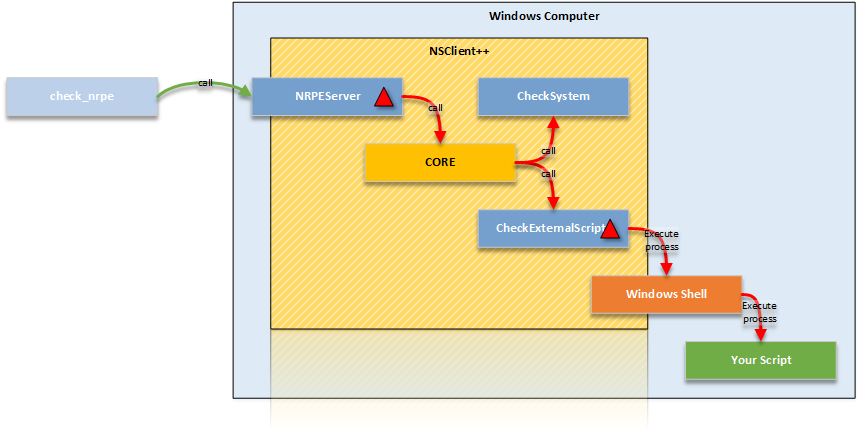
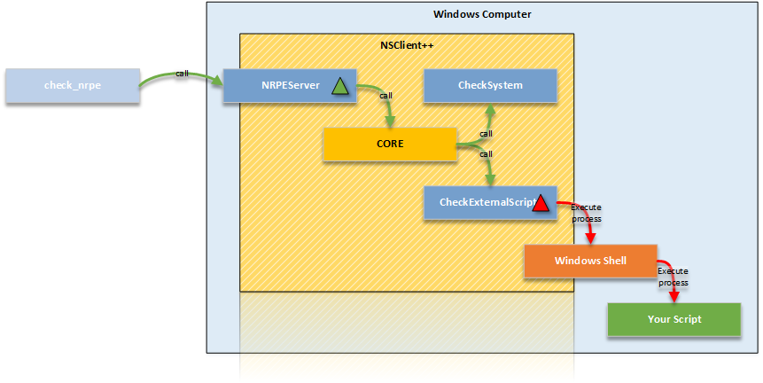

# External scripts

## Finding Scripts

Scripts can be found on many third party sites such as [http://exchange.nagios.org](http://exchange.nagios.org) or [http://exchange.icinga.org](http://exchange.icinga.org).
You can also find scripts in many other place such as your monitoring providers web page or similar.

## Writing Scripts

Writing scripts is easy and works exactly like writing script on Linux. And if you install an common language runtime such as perl or python you can even re-use your scripts across platform. In essence the communication between a script and NSClient++ consists of three things:

-   Arguments passed **to** script to control execution
-   Exit status passed **from** to define status (critical, error, warning and so on)
-   Any message on standard out to define the message

A simple script in batch (.bat) looks like this:

```
@echo OK: Everything is going to be fine a
@exit 0
```

This prints a message "OK ..." and return status 0 which equates to ok or good.
Exit codes are the same as Nagios use:

1.  OK
2.  WARNING
3.  CRITICAL
4.  UNKNOWN


The message can be anything and is passed along as text. Notice you require Nagios 3 if you want to use multiple lines in the message. And please notice that most protocol and transports have hard coded payload lengths such as NRPE (1024) NSCA (512) etc etc.

## Debugging scripts

It is important to validate that a script works before trying to add it to NSClient++ the best way to do this is to run the script as-is from the Windows Console (Command prompt).
There are two things you need to validate the first being that the script does the right things ie. the logic works. And the second is that it returns the correct exit status.

Nagios (and thus also NSClient++) defines exit statuses as OK (0), WARNING (1), CRITCAL (2) and UNKNOWN (3). TO see the exit status in Windows you can echo the ERRORLEVEL variable directly after executing the script like this:

```
scripts\test.bat
OK: Everything is fine
echo %ERRORLEVEL%
0
```

## Theory: How scripts work


NSClient++ is modular this means there is a core which loads modules which provide either functionality (commands/queries) or servers which expose the functionality.
In our examples we have NRPEServer exposing the commands to a remote Nagios server running check_nrpe we also use a CheckExternalScripts which provides the ability to run commands. But CheckExternalScripts does not by it self execute scripts instead it simply delegates the command to the windows shell and runs the program as a normal program.


This means that if you want to run a Perl script you need to have a perl interpreter installed it also means that you can easily debug and test all your scripts using the normal windows shell.

## Adding scripts

For scripts to work we need at least the [CheckExternalScripts](../reference/check/CheckExternalScripts.md) module but in reality most likely `NRPEServer <NRPEServer>`_ or `Scheduler <Scheduler>`_ as well.
We will initially focus on just check external scripts before introducing executing them remotely via NRPE for how to configure them via NSCA please check the NSCA guide in conjunction with the setup for this page.

### Load the CheckExternalScripts module

The first thing we need to do is make sure the CheckExternalScripts module is loaded this is done by checking the /modules section and make sure you have something similar:

```
[/modules]
; ...
CheckExternalScripts=enabled
```

Notice that enabled can also be 1 as well as some other syntax's which we wont cover here.

### Adding a script

Adding a script is equally simple just add a line under the /settings/external scripts/scripts section like so:

```
[/settings/external scripts/scripts]
foo=scripts\foo.bat
```

This will when you execute the "foo" query/command run the script locate the in the scripts folder called foo.bat
IN essence you create a binding between the script and the command. The names does not have to be the same (any in most cases they are not) so the following is equally valid and creates a binding between the query/command bar to the script foo.bat instead.

```
[/settings/external scripts/scripts]
bar=scripts\foo.bat
```

Also please note that the script does not have to be a script it can be any valid command line command for instance the following will bind the list_file to return a list of files by executing dir in the root folder of the C-drive:

```
[/settings/external scripts/scripts]
list_file=cmd /c "dir c:\\"
```

### Adding more scripts

Adding more then one script is much the same here we have several scripts bound to different command:

```
[/settings/external]
script_1=scripts\script.bat
script_2=scripts\script.bat
script_3=scripts\script.bat
script_4=scripts\script.bat
foo=scripts\foo.bat
bar=scripts\foo.bat
```


And as you can see there is no limit to the number of bindings you can create for each scripts. but notice that it is impossible to create more then one binding with the same name as well as any other already bound command such as `check_cpu` provided by the `CheckSystem <CheckSystem>`_ module.

## Running your script

The first thing to try when you want to run a script is **ALWAYS** to execute it from the interactive NSClient++ test prompt like so:


```
nscp test
...
foo
OK: Everything is going to be fine a
...
exit
...
```

This will allow you to try commands and change arguments and options without restarting/reloading or editing files. It also allows you to in real-time see any errors.
To run a script from within NSClient++ we use the bound alias  for instance foo which is bound to scripts\foo.bat (we never use the actual scripts name). Many people to this by adding all the configuration and then having Nagios run the script for them which makes debugging very difficult (as error messages are never shown) but more importantly it takes much longer.

## Accessing scripts remotely

To access scripts remotely you need a server module. There is no configuration required to connect the server module to CheckExternalScripts so the only things required is configure the Server module to allow connection from Nagios.
This usually includes a allowed hosts directive as well as passwords and encryption settings. Since this is detailed in various other section I will only briefly touch the the subject here.
For details on various protocols go to their individual guides:

-   `check_nt <wiki/doc/usage/nagios/nsclient>`_
-   `NRPE <wiki/doc/usage/nagios/nrpe>`_
-   `NSCA <wiki/doc/usage/nagios/nsca>`_


We will assume we are using NRPE here which means we will run the check_nrpe command from our monitoring server (Nagios).
When we execute the command (script) remotely we use the bound command much like we did from the "test" console in the previous section thus a call would look like this:

```
check_nrpe -H 10.1.1.1 -c foo
OK: Everything is going to be fine a
```

To see the exit status we can echo the last return code like so:

```
check_nrpe -H 10.1.1.1 -c foo
OK: Everything is going to be fine a
echo $?
0
```

## Arguments

### NO arguments

Using arguments requires you to decide on a strategy as there are two options. All this boils down to security versus easy of use.
The first and most secure option disallows arguments entirely. This will require you to configure all scripts bound with all their arguments.
This is of course a problem if you want to maintain configuration in Nagios since it wont work.



To configure this we need not set any allow arguments option. Here I have for clarity set them to false but that is the default value so you can leave them out.
Please note that the actual arguments here are hardcoded as we do not allow arguments remotely from external scripts.

```
[/settings/NRPE/server]
allow arguments=false

[/settings/external scripts]
allow arguments=false

[/settings/external scripts/scripts]
foo=scripts\\foo.bat "argument 1" "argument 2"
```

### Arguments for internal commands

The second strategy allows arguments for built-in commands but NOT external commands.
This is not much more useful for us but means all internal commands can be configured from Nagios and only the external once have to be hand configured in NSClient++



To configure this we need to allow arguments for the NRPEServer module.
Please note that the actual arguments here are hardcoded as we do not allow arguments remotely from external scripts.

```
[/settings/NRPE/server]
allow arguments=true

[/settings/external scripts]
allow arguments=false

[/settings/external scripts/scripts]
foo=scripts\\foo.bat "argument 1" "argument 2"
```

### Arguments for both internal commands and external commands

The third option is to allow arguments BOTH for internal commands AND external scripts.
This means we can keep (almost) all configuration inside Nagios but on the other hand provides a third party with command line access to our configured machine which is a security night mare. It is vitally important if you do this that your network is other wise secure and you use the allowed hosts directive as well as firewalls to disallow anyone except the monitoring machine to access your NSClient++ remotely.


To configure this requires us to set **TWO** allow arguments options.
one (as before) for the NRPEServer and once again for the CheckExternalScripts module.

```
[/settings/NRPE/server]
allow arguments=true

[/settings/external scripts]
allow arguments=true

[/settings/external scripts/scripts]
foo=scripts\\foo.bat $ARG1$ $ARG2$
```

## Languages

As scripting on Windows is not as easy as it is on Linux where the script it self can dictate how it should be run we have a section detailing some common scripting languages and how to run them.

### VBS --- Visual Basic Script

The was the most common scripting language for advanced things but powershell has pretty much taken over.
Thus if you are starting anew and/or migrating it might be a good idea to consider powershell.

Anyways, VB Script (VBS) is a common language and there are numerous VBS script out there.
VBScript is somewhat loosely related to Visual Basic (hence the name) but in reality they have little in common.

Writing VB scripts guide can be found on the web so we will not focus on the language here in detail.
The normal stuff applies i.e. the "console output" will be returned as a message, anything after a | char is treated as performance data.
And finally the exit code dictates the status.

A quick sample script:

```
Wscript.Echo “Everything is not fine!”
Wscript.Quit(2)
```

Adding scripts is a bit more involved. The core component is cscript which is the script host which will execute your script.

```
check_updates=cscript.exe //T:30 //NoLogo “scripts\check_updates.vbs”
```

The timeout for the script can be set via the //T:<time> option and //NoLogo is used to suppress the startup banner.

```
[/settings/external scripts/wrappings]
vbs=cscript.exe //T:30 //NoLogo %SCRIPT% %ARGS%

[/settings/external scripts/wrapped scripts]
check_updates=scripts\check_updates.vbs
```

This makes for less typing if you plan on adding many vbs scripts.

### PY --- Python

**TODO**

### PL --- Perl

**TODO**

### PS1 --- Power Shell

Powershell is probably the strangest beat to tame when it comes to scripting. The main reason for this is that Microsoft went with a non standard console for it. This means that it wont work like normal script languages from a programming perspective.
The most obvious way this is visible is the extremely arcane syntax for running powershell. The reason behind it is to force powershell to acknowledge the regular stdin/stdout redirection schemes which we need to use to be able to read powershell output.

Adding a powershell will look like this:

```
[/settings/external scripts/scripts]
test_ps1 = cmd /c echo scripts\check_test.ps1; exit($lastexitcode) | powershell.exe -command -
```

If we want to use arguments we add them before the semi colon like so:

```
[/settings/external scripts/scripts]
test_ps1 = cmd /c echo scripts\check_test.ps1 "--argument" "$ARG1$" --foo --bar; exit($lastexitcode) | powershell.exe -command -
```

There are also some things to remember when writing script:

-   For instance some powershell "print" methods will wrap (whilst other wont)


## Advanced topics

### Wrapped scripts

Wrapped script really become a necessity when powershell started to become more used.
As I mentioned in the powershell section above the command line syntax for powershell script is arcane at best.
TO work around this and try to make it simpler to configure wrapped script help reduce the clutter by creating a template for the command line so only the script and argument has to be configured.

The way this works is that we first define a template using %SCRIPT% and %ARGS% which will be replaced at run-time with the script in question.
Let take a fictional script language as an example:

```
[/settings/external scripts/wrappings]
foo=foo.exe %SCRIPT% -- %ARGS%
```

With this template all scripts ending with "foo" defined under wrapped scripts will use the above template which means if we define a script like so:

```
[/settings/external scripts/wrapped scripts]
script_foo=test.foo "Hello World"
```

Will be translated into: `foo.exe test.foo -- "Hello World"`

When the script is executed. The benefit here is negligible for such a simple command line but still if you have 10 script is starts to pay off.
If we instead look at powershell (for which it was conceived) the benefit becomes much more noticeable

```
[/settings/external scripts/wrappings]

ps1=cmd /c echo scripts\\\\%SCRIPT% %ARGS%; exit($lastexitcode) | powershell.exe -command -
```

And when you define the scripts you simply add:

```
[/settings/external scripts/wrapped scripts]
test_ps1_1=test1.ps1 "Hello World"
test_ps1_2=test2.ps1 $ARG1$ $ARG2$
test_ps1_3=test3.ps1
```

### Ignoring performance data

With 0.4.0 NSClient++ started to parse Nagios performance data. There are some snags with this and also sometimes nothing you want.
This can be disabled both on a per command basis and a global basis:

To disable it for all external commands add the following to your config:

```
[/settings/external scripts/scripts/default]
ignore perfdata = true
```

To disable it only for a specific command (check_foo) add the following:

```
[/settings/external scripts/scripts/check_foo]
ignore perfdata = true
command=...
```
