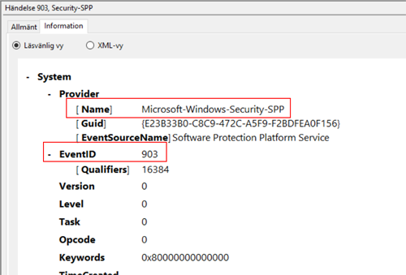
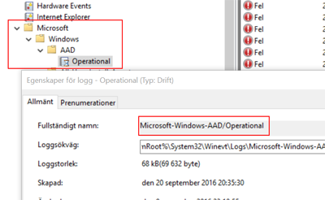
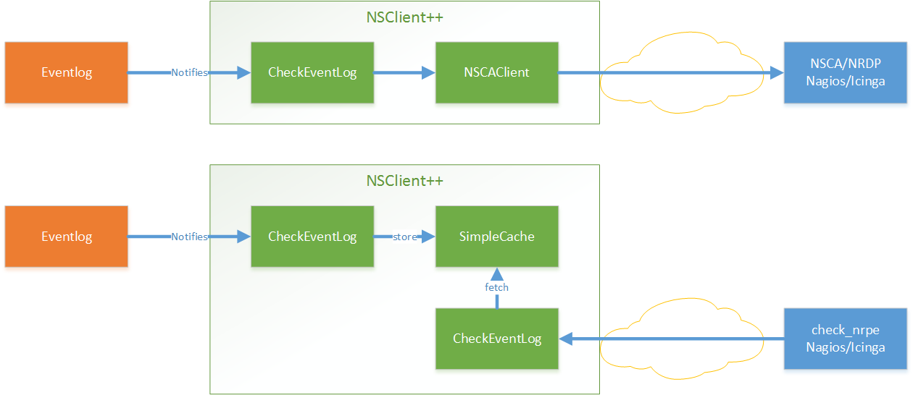
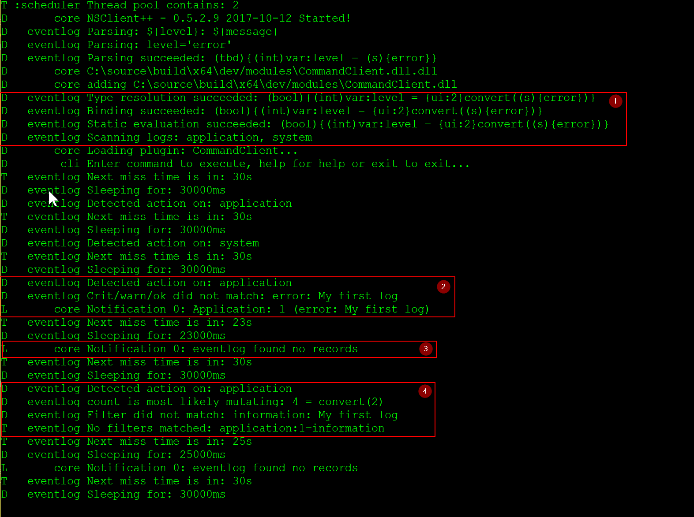

# CheckEventLog

Check for errors and warnings in the event log.


**List of commands:**

A list of all available queries (check commands)

| Command                           | Description                        |
|-----------------------------------|------------------------------------|
| [check_eventlog](#check_eventlog) | Check for errors in the event log. |
| [checkeventlog](#checkeventlog)   | Legacy version of check_eventlog   |


**Configuration Keys:**


    
    
    
| Path / Section                                                | Key                                                      | Description        |
|---------------------------------------------------------------|----------------------------------------------------------|--------------------|
| [/settings/eventlog](#/settings/eventlog)                     | [buffer size](#/settings/eventlog_buffer size)           | BUFFER_SIZE        |
| [/settings/eventlog](#/settings/eventlog)                     | [debug](#/settings/eventlog_debug)                       | DEBUG              |
| [/settings/eventlog](#/settings/eventlog)                     | [lookup names](#/settings/eventlog_lookup names)         | LOOKUP NAMES       |
| [/settings/eventlog](#/settings/eventlog)                     | [syntax](#/settings/eventlog_syntax)                     | SYNTAX             |
| [/settings/eventlog/real-time](#/settings/eventlog/real-time) | [debug](#/settings/eventlog/real-time_debug)             | DEBUG              |
| [/settings/eventlog/real-time](#/settings/eventlog/real-time) | [enabled](#/settings/eventlog/real-time_enabled)         | REAL TIME CHECKING |
| [/settings/eventlog/real-time](#/settings/eventlog/real-time) | [log](#/settings/eventlog/real-time_log)                 | LOGS TO CHECK      |
| [/settings/eventlog/real-time](#/settings/eventlog/real-time) | [startup age](#/settings/eventlog/real-time_startup age) | STARTUP AGE        |


| Path / Section                                                                | Description       |
|-------------------------------------------------------------------------------|-------------------|
| [/settings/eventlog/real-time/filters](#/settings/eventlog/real-time/filters) | Real-time filters |


## Samples

_Feel free to add more samples [on this page](https://github.com/mickem/docs/blob/master/docs/samples/CheckEventLog_samples.md)_

### Monitoring event-log

Monitoring the event-log is a single command away in the form of `check_eventlog`.
The default command will monitor the application/system/security logs which usually have the generic errors.

```
check_eventlog
L        cli CRITICAL: CRITICAL: 5 message(s) Application Bonjour Service (Task Scheduling Error: ... e DNS-servrarna svarade.)
L        cli  Performance data: 'problem_count'=5;0;0
```

### Time and date

The default time frame is 24 hours. This can be configured via the scan-range which specifies the number of hours from now to look.
This might seem a bit off at first but all date and time ranges which reflect past times are "negative" in NSClient++.
Thus the default is: `check_eventlog scan-range=-24h`

If you instead wish to check the past week you would change this to: `check_eventlog scan-range=-1w`

The other option you can use for defining time is the filter keyword written.
This can be used much the same but is used if you wish to use the time in the filter so you still need to specify scan-range.
But if you for instance want to get an error if the message is 24 hours old and a warning if it is 1 week you would do:
```
check_eventlog scan-range=-1w "warn=count gt 0" "critical=written > -24h"
```

### Checking for specific messages

There are many ways to find messages but the optimum solution is to filter on log, source (provider), and id.
This is as this combination is guaranteed to be unique and still quick to look for.
Another option it so look for messages which will obviously work as well but it will be magnitudes slower in terms of performance.

To find the source and event id you can easily look at the messages property in the event viewer.


With this information in hand we can easily create a filter for a specific message like so:

```
check_eventlog "filter=provider = 'Microsoft-Windows-Security-SPP' and id = 903"
```

Sometimes, rarely, the message is important and then it is best to add that as a last check to the above filter as it will be faster.

```
check_eventlog "filter=provider = 'Microsoft-Windows-Security-SPP' and id = 903 and message like 'foo'"
```

### Modern windows (channels)

Since version 0.4.2 NSClient++ has had the ability to check all logs on modern windows machines.
This works out of the box and you specify the path of the channel you want to look for with the file command.
A slight snag here is that the separator for "folders" is - not \ r / as one might expect this is unfortunately a windows flaw most likely related to the fact that event logs can also be read from the file system.

A simple way to find the actual name of an event log channel is to view its properties (right-click the channel and click properties):



```
check_eventlog scan-range=-100w show-all filter=none "file=Microsoft-Windows-AAD/Operational"
```

### Checking for non errors

The default filters are filtering out only warnings, errors and critical messages:

| Property | Default value                             |
|----------|-------------------------------------------|
| filter   | level in ('warning', 'error', 'critical') |
| warning  | level = 'warning' or problem_count > 0    |
| critical | level in ('error', 'critical')            |

Thus if you want to find a message which is not warnings, errors and critical messages you need to either change or disable the default filter like so:

```
check_eventlog filter=none
```

### Severity/Level/Error

In the previous event-log API it was common for people to use severity to filter out errors.
This has never worked as severity was never message severity, it remains however, a common thing.
Regardless of version of API and version of NSClient++ the proper way to find errors is to use the level keyword like so:

```
check_eventlog "filter=level = 'error'"
```

While we have never been able to find an official list of the meaning of the level this is how NSClient++ interprets the values:

| Level | Keyword in NSClient++                                   |
|-------|---------------------------------------------------------|
| 1     | critical                                                |
| 2     | error                                                   |
| 3     | warning, warn                                           |
| 4     | informational, info, information, success, auditSuccess |
| 5     | debug, verbose                                          |
| #     | Specify any number for other values                     |

Thus if you run into a non standard level you can check this like so:

```
check_eventlog "filter=level = 42"
```

### Using Real-time monitoring

The benefit of real-time monitoring of the event-log is that it is often significantly faster and more resources efficient.
The drawback is that it is more complex to setup and normally requires passive monitoring (via NSCA/NRDP)

The basic idea is depict in the following figure.



We have a filter which listens to event log entries.
These entries are (when they matched) turned into messages and statuses which is then sent onward to various channels.
On the other end of these channels are (hopefully) someone who is interested in the message.

In most cases the first channel you are interested in is NSCA which is the default name where the NSCAClient listens.
It will in turn forward all incoming messages on to Nagios via NSCA.

So in short we need to configure three things

*   Activate real time filtering
*   Add a filter which listens for events
*   Setup a destination

#### Enabling real-time filtering

To setup real time filtering we only need a single flag (as well as the eventlog module).

**configuration:**
```
[/modules]
CheckEventLog=enabled

[/settings/eventlog/real-time]
enabled = true
```

Adding this will not do much since we don't have a filter yet but adding one is pretty simple as well so lets go ahead and do that.

To make life simple we set the destination in this filter to "log" which means the information only ends up in the NSClient++ log file.
Not very usefull in reality but very usefull when we are debuggning as it removes possible errors sources.

**configuration:**
```
[/settings/eventlog/real-time/filters/my_alert]
log=application
destination=log
filter=level='error'
maximum age=30s
debug=true
```

Going through the configuration line by line we have:

* `log=application` is the log we listen to.
* `destination=log` is where the message is sent
* `filter=level='error'` means we only want to recieve error messages.
* `maximum age=30s` sets a repeating "ok" messages every 30 seconds.
* `debug=true` will increase the debug level for this filter

If we were to test this (and please do go ahead) we would start getting warning on the console about no one listening to our events.

To be able to test this we need to inject some messages in the eventlog.
This we can do with the eventcreate command.

**Add error to eventlog:**
```
eventcreate /ID 1 /L application /T ERROR /SO MYEVENTSOURCE /D "My first log"
```

**Add info to eventlog:**
```
eventcreate /ID 1 /L application /T INFORMATION /SO MYEVENTSOURCE /D "My first log"
```

If we check the log we should see something similar to this:



* 1: Always makre sure there are not errors and that the parsed tree looks like you want it. If the filter has syntax issues nothign will work
* 2: This is how it looks when we inject an error message, it is caught and we get the `Notification 0: Application: 1 (error: My first log)` in the log.
* 3: This is the periodical "ok" message we get when there are not errors: `Notification 0: eventlog found no records`
* 4: Here we can see the output when there is a message but it does not match our filter.

#### Enabling cache to check actively

**TODO**

## Queries

A quick reference for all available queries (check commands) in the CheckEventLog module.

### check_eventlog

Check for errors in the event log.


* [Command-line Arguments](#check_eventlog_options)
* [Filter keywords](#check_eventlog_filter_keys)


<a name="check_eventlog_warn"/>

<a name="check_eventlog_crit"/>

<a name="check_eventlog_debug"/>

<a name="check_eventlog_show-all"/>

<a name="check_eventlog_escape-html"/>

<a name="check_eventlog_help"/>

<a name="check_eventlog_help-pb"/>

<a name="check_eventlog_show-default"/>

<a name="check_eventlog_help-short"/>

<a name="check_eventlog_log"/>

<a name="check_eventlog_truncate-message"/>

<a name="check_eventlog_options"/>
#### Command-line Arguments


| Option                                         | Default Value                                  | Description                                                                                                      |
|------------------------------------------------|------------------------------------------------|------------------------------------------------------------------------------------------------------------------|
| [filter](#check_eventlog_filter)               | level in ('warning', 'error', 'critical')      | Filter which marks interesting items.                                                                            |
| [warning](#check_eventlog_warning)             | level = 'warning', problem_count > 0           | Filter which marks items which generates a warning state.                                                        |
| warn                                           |                                                | Short alias for warning                                                                                          |
| [critical](#check_eventlog_critical)           | level in ('error', 'critical')                 | Filter which marks items which generates a critical state.                                                       |
| crit                                           |                                                | Short alias for critical.                                                                                        |
| [ok](#check_eventlog_ok)                       |                                                | Filter which marks items which generates an ok state.                                                            |
| debug                                          | N/A                                            | Show debugging information in the log                                                                            |
| show-all                                       | N/A                                            | Show details for all matches regardless of status (normally details are only showed for warnings and criticals). |
| [empty-state](#check_eventlog_empty-state)     | ok                                             | Return status to use when nothing matched filter.                                                                |
| [perf-config](#check_eventlog_perf-config)     | level(ignored:true)                            | Performance data generation configuration                                                                        |
| escape-html                                    | N/A                                            | Escape any < and > characters to prevent HTML encoding                                                           |
| help                                           | N/A                                            | Show help screen (this screen)                                                                                   |
| help-pb                                        | N/A                                            | Show help screen as a protocol buffer payload                                                                    |
| show-default                                   | N/A                                            | Show default values for a given command                                                                          |
| help-short                                     | N/A                                            | Show help screen (short format).                                                                                 |
| [unique-index](#check_eventlog_unique-index)   |                                                | Unique syntax.                                                                                                   |
| [top-syntax](#check_eventlog_top-syntax)       | ${status}: ${count} message(s) ${problem_list} | Top level syntax.                                                                                                |
| [ok-syntax](#check_eventlog_ok-syntax)         | %(status): Event log seems fine                | ok syntax.                                                                                                       |
| [empty-syntax](#check_eventlog_empty-syntax)   | %(status): No entries found                    | Empty syntax.                                                                                                    |
| [detail-syntax](#check_eventlog_detail-syntax) | ${file} ${source} (${message})                 | Detail level syntax.                                                                                             |
| [perf-syntax](#check_eventlog_perf-syntax)     | ${file}_${source}                              | Performance alias syntax.                                                                                        |
| [file](#check_eventlog_file)                   |                                                | File to read (can be specified multiple times to check multiple files.                                           |
| log                                            |                                                | Same as file                                                                                                     |
| [scan-range](#check_eventlog_scan-range)       |                                                | Date range to scan.                                                                                              |
| truncate-message                               |                                                | Maximum length of message for each event log message text.                                                       |
| [unique](#check_eventlog_unique)               | 1                                              | Shorthand for setting default unique index: ${log}-${source}-${id}.                                              |


<a name="check_eventlog_filter"/>
**filter:**

Filter which marks interesting items.
Interesting items are items which will be included in the check.
They do not denote warning or critical state instead it defines which items are relevant and you can remove unwanted items.


*Deafult Value:* | `level in ('warning', 'error', 'critical')`


<a name="check_eventlog_warning"/>
**warning:**

Filter which marks items which generates a warning state.
If anything matches this filter the return status will be escalated to warning.


*Deafult Value:* | `level = 'warning', problem_count > 0`


<a name="check_eventlog_critical"/>
**critical:**

Filter which marks items which generates a critical state.
If anything matches this filter the return status will be escalated to critical.


*Deafult Value:* | `level in ('error', 'critical')`


<a name="check_eventlog_ok"/>
**ok:**

Filter which marks items which generates an ok state.
If anything matches this any previous state for this item will be reset to ok.


<a name="check_eventlog_empty-state"/>
**empty-state:**

Return status to use when nothing matched filter.
If no filter is specified this will never happen unless the file is empty.


*Deafult Value:* | `ok`


<a name="check_eventlog_perf-config"/>
**perf-config:**

Performance data generation configuration
TODO: obj ( key: value; key: value) obj (key:valuer;key:value)


*Deafult Value:* | `level(ignored:true)`


<a name="check_eventlog_unique-index"/>
**unique-index:**

Unique syntax.
Used to filter unique items (counted will still increase but messages will not repeated)


<a name="check_eventlog_top-syntax"/>
**top-syntax:**

Top level syntax.
Used to format the message to return can include text as well as special keywords which will include information from the checks.
To add a keyword to the message you can use two syntaxes either ${keyword} or %(keyword) (there is no difference between them apart from ${} can be difficult to excpae on linux).


*Deafult Value:* | `${status}: ${count} message(s) ${problem_list}`


<a name="check_eventlog_ok-syntax"/>
**ok-syntax:**

ok syntax.
DEPRECATED! This is the syntax for when an ok result is returned.
This value will not be used if your syntax contains %(list) or %(count).


*Deafult Value:* | `%(status): Event log seems fine`


<a name="check_eventlog_empty-syntax"/>
**empty-syntax:**

Empty syntax.
DEPRECATED! This is the syntax for when nothing matches the filter.


*Deafult Value:* | `%(status): No entries found`


<a name="check_eventlog_detail-syntax"/>
**detail-syntax:**

Detail level syntax.
Used to format each resulting item in the message.
%(list) will be replaced with all the items formated by this syntax string in the top-syntax.
To add a keyword to the message you can use two syntaxes either ${keyword} or %(keyword) (there is no difference between them apart from ${} can be difficult to excpae on linux).


*Deafult Value:* | `${file} ${source} (${message})`


<a name="check_eventlog_perf-syntax"/>
**perf-syntax:**

Performance alias syntax.
This is the syntax for the base names of the performance data.


*Deafult Value:* | `${file}_${source}`


<a name="check_eventlog_file"/>
**file:**

File to read (can be specified multiple times to check multiple files.
Notice that specifying multiple files will create an aggregate set you will not check each file individually.In other words if one file contains an error the entire check will result in error.


<a name="check_eventlog_scan-range"/>
**scan-range:**

Date range to scan.
A negative value scans backward (historical events) and a positive value scans forwards (future events). This is the approximate dates to search through this speeds up searching a lot but there is no guarantee messages are ordered.


<a name="check_eventlog_unique"/>
**unique:**

Shorthand for setting default unique index: ${log}-${source}-${id}.


*Deafult Value:* | `1`


<a name="check_eventlog_filter_keys"/>
#### Filter keywords


| Option                                         | Description                                                                                                  |
|------------------------------------------------|--------------------------------------------------------------------------------------------------------------|
| [category](#check_eventlog_category)           | TODO                                                                                                         |
| [computer](#check_eventlog_computer)           | Which computer generated the message                                                                         |
| [count](#check_eventlog_count)                 | Number of items matching the filter. Common option for all checks.                                           |
| [crit_count](#check_eventlog_crit_count)       | Number of items matched the critical criteria. Common option for all checks.                                 |
| [crit_list](#check_eventlog_crit_list)         | A list of all items which matched the critical criteria. Common option for all checks.                       |
| [customer](#check_eventlog_customer)           | TODO                                                                                                         |
| [detail_list](#check_eventlog_detail_list)     | A special list with critical, then warning and finally ok. Common option for all checks.                     |
| [file](#check_eventlog_file)                   | The logfile name                                                                                             |
| [guid](#check_eventlog_guid)                   | The logfile name                                                                                             |
| [id](#check_eventlog_id)                       | Eventlog id                                                                                                  |
| [keyword](#check_eventlog_keyword)             | The keyword associated with this event                                                                       |
| [level](#check_eventlog_level)                 | Severity level (error, warning, info, success, auditSucess, auditFailure)                                    |
| [list](#check_eventlog_list)                   | A list of all items which matched the filter. Common option for all checks.                                  |
| [log](#check_eventlog_log)                     | alias for file                                                                                               |
| [message](#check_eventlog_message)             | The message rendered as a string.                                                                            |
| [ok_count](#check_eventlog_ok_count)           | Number of items matched the ok criteria. Common option for all checks.                                       |
| [ok_list](#check_eventlog_ok_list)             | A list of all items which matched the ok criteria. Common option for all checks.                             |
| [problem_count](#check_eventlog_problem_count) | Number of items matched either warning or critical criteria. Common option for all checks.                   |
| [problem_list](#check_eventlog_problem_list)   | A list of all items which matched either the critical or the warning criteria. Common option for all checks. |
| [provider](#check_eventlog_provider)           | Source system.                                                                                               |
| [rawid](#check_eventlog_rawid)                 | Raw message id (contains many other fields all baked into a single number)                                   |
| [source](#check_eventlog_source)               | Source system.                                                                                               |
| [status](#check_eventlog_status)               | The returned status (OK/WARN/CRIT/UNKNOWN). Common option for all checks.                                    |
| [task](#check_eventlog_task)                   | The type of event (task)                                                                                     |
| [total](#check_eventlog_total)                 | Total number of items. Common option for all checks.                                                         |
| [type](#check_eventlog_type)                   | alias for level (old, deprecated)                                                                            |
| [warn_count](#check_eventlog_warn_count)       | Number of items matched the warning criteria. Common option for all checks.                                  |
| [warn_list](#check_eventlog_warn_list)         | A list of all items which matched the warning criteria. Common option for all checks.                        |
| [written](#check_eventlog_written)             | When the message was written to file                                                                         |


### checkeventlog

Legacy version of check_eventlog


* [Command-line Arguments](#checkeventlog_options)


<a name="checkeventlog_help"/>

<a name="checkeventlog_help-pb"/>

<a name="checkeventlog_show-default"/>

<a name="checkeventlog_help-short"/>

<a name="checkeventlog_MaxWarn"/>

<a name="checkeventlog_MaxCrit"/>

<a name="checkeventlog_MinWarn"/>

<a name="checkeventlog_MinCrit"/>

<a name="checkeventlog_warn"/>

<a name="checkeventlog_crit"/>

<a name="checkeventlog_filter"/>

<a name="checkeventlog_file"/>

<a name="checkeventlog_truncate"/>

<a name="checkeventlog_scan-range"/>

<a name="checkeventlog_options"/>
#### Command-line Arguments


| Option                                      | Default Value       | Description                                   |
|---------------------------------------------|---------------------|-----------------------------------------------|
| help                                        | N/A                 | Show help screen (this screen)                |
| help-pb                                     | N/A                 | Show help screen as a protocol buffer payload |
| show-default                                | N/A                 | Show default values for a given command       |
| help-short                                  | N/A                 | Show help screen (short format).              |
| MaxWarn                                     |                     | Maximum value before a warning is returned.   |
| MaxCrit                                     |                     | Maximum value before a critical is returned.  |
| MinWarn                                     |                     | Minimum value before a warning is returned.   |
| MinCrit                                     |                     | Minimum value before a critical is returned.  |
| warn                                        |                     | Maximum value before a warning is returned.   |
| crit                                        |                     | Maximum value before a critical is returned.  |
| filter                                      |                     | The filter to use.                            |
| file                                        |                     | The file to check                             |
| [debug](#checkeventlog_debug)               | 1                   | The file to check                             |
| truncate                                    |                     | Deprecated and has no meaning                 |
| [descriptions](#checkeventlog_descriptions) | 1                   | Deprecated and has no meaning                 |
| [unique](#checkeventlog_unique)             | 1                   |                                               |
| [syntax](#checkeventlog_syntax)             | %source%, %strings% | The syntax string                             |
| [top-syntax](#checkeventlog_top-syntax)     | ${list}             | The top level syntax string                   |
| scan-range                                  |                     | TODO                                          |


<a name="checkeventlog_debug"/>
**debug:**

The file to check


*Deafult Value:* | `1`


<a name="checkeventlog_descriptions"/>
**descriptions:**

Deprecated and has no meaning


*Deafult Value:* | `1`


<a name="checkeventlog_unique"/>
**unique:**


*Deafult Value:* | `1`


<a name="checkeventlog_syntax"/>
**syntax:**

The syntax string


*Deafult Value:* | `%source%, %strings%`


<a name="checkeventlog_top-syntax"/>
**top-syntax:**

The top level syntax string


*Deafult Value:* | `${list}`


## Configuration

<a name="/settings/eventlog"/>
### Eventlog configuration

Section for the EventLog Checker (CheckEventLog.dll).


| Key                                              | Default Value | Description  |
|--------------------------------------------------|---------------|--------------|
| [buffer size](#/settings/eventlog_buffer size)   | 131072        | BUFFER_SIZE  |
| [debug](#/settings/eventlog_debug)               | false         | DEBUG        |
| [lookup names](#/settings/eventlog_lookup names) | true          | LOOKUP NAMES |
| [syntax](#/settings/eventlog_syntax)             |               | SYNTAX       |


```ini
# Section for the EventLog Checker (CheckEventLog.dll).
[/settings/eventlog]
buffer size=131072
debug=false
lookup names=true

```


<a name="/settings/eventlog_buffer size"/>

**BUFFER_SIZE**

The size of the buffer to use when getting messages this affects the speed and maximum size of messages you can recieve.


| Key            | Description                               |
|----------------|-------------------------------------------|
| Path:          | [/settings/eventlog](#/settings/eventlog) |
| Key:           | buffer size                               |
| Default value: | `131072`                                  |
| Used by:       | CheckEventLog                             |


**Sample:**

```
[/settings/eventlog]
# BUFFER_SIZE
buffer size=131072
```


<a name="/settings/eventlog_debug"/>

**DEBUG**

Log more information when filtering (useful to detect issues with filters) not useful in production as it is a bit of a resource hog.


| Key            | Description                               |
|----------------|-------------------------------------------|
| Path:          | [/settings/eventlog](#/settings/eventlog) |
| Key:           | debug                                     |
| Default value: | `false`                                   |
| Used by:       | CheckEventLog                             |


**Sample:**

```
[/settings/eventlog]
# DEBUG
debug=false
```


<a name="/settings/eventlog_lookup names"/>

**LOOKUP NAMES**

Lookup the names of eventlog files


| Key            | Description                               |
|----------------|-------------------------------------------|
| Path:          | [/settings/eventlog](#/settings/eventlog) |
| Key:           | lookup names                              |
| Default value: | `true`                                    |
| Used by:       | CheckEventLog                             |


**Sample:**

```
[/settings/eventlog]
# LOOKUP NAMES
lookup names=true
```


<a name="/settings/eventlog_syntax"/>

**SYNTAX**

Set this to use a specific syntax string for all commands (that don't specify one).


| Key            | Description                               |
|----------------|-------------------------------------------|
| Path:          | [/settings/eventlog](#/settings/eventlog) |
| Key:           | syntax                                    |
| Default value: | _N/A_                                     |
| Used by:       | CheckEventLog                             |


**Sample:**

```
[/settings/eventlog]
# SYNTAX
syntax=
```


<a name="/settings/eventlog/real-time"/>
### Real-time monitoring

A set of options to configure the real time checks


| Key                                                      | Default Value      | Description        |
|----------------------------------------------------------|--------------------|--------------------|
| [debug](#/settings/eventlog/real-time_debug)             | false              | DEBUG              |
| [enabled](#/settings/eventlog/real-time_enabled)         | false              | REAL TIME CHECKING |
| [log](#/settings/eventlog/real-time_log)                 | application,system | LOGS TO CHECK      |
| [startup age](#/settings/eventlog/real-time_startup age) | 30m                | STARTUP AGE        |


```ini
# A set of options to configure the real time checks
[/settings/eventlog/real-time]
debug=false
enabled=false
log=application,system
startup age=30m

```


<a name="/settings/eventlog/real-time_debug"/>

**DEBUG**

Log missed records (useful to detect issues with filters) not useful in production as it is a bit of a resource hog.


| Key            | Description                                                   |
|----------------|---------------------------------------------------------------|
| Path:          | [/settings/eventlog/real-time](#/settings/eventlog/real-time) |
| Key:           | debug                                                         |
| Default value: | `false`                                                       |
| Used by:       | CheckEventLog                                                 |


**Sample:**

```
[/settings/eventlog/real-time]
# DEBUG
debug=false
```


<a name="/settings/eventlog/real-time_enabled"/>

**REAL TIME CHECKING**

Spawns a background thread which detects issues and reports them back instantly.


| Key            | Description                                                   |
|----------------|---------------------------------------------------------------|
| Path:          | [/settings/eventlog/real-time](#/settings/eventlog/real-time) |
| Key:           | enabled                                                       |
| Default value: | `false`                                                       |
| Used by:       | CheckEventLog                                                 |


**Sample:**

```
[/settings/eventlog/real-time]
# REAL TIME CHECKING
enabled=false
```


<a name="/settings/eventlog/real-time_log"/>

**LOGS TO CHECK**

Comma separated list of logs to check


| Key            | Description                                                   |
|----------------|---------------------------------------------------------------|
| Path:          | [/settings/eventlog/real-time](#/settings/eventlog/real-time) |
| Key:           | log                                                           |
| Default value: | `application,system`                                          |
| Used by:       | CheckEventLog                                                 |


**Sample:**

```
[/settings/eventlog/real-time]
# LOGS TO CHECK
log=application,system
```


<a name="/settings/eventlog/real-time_startup age"/>

**STARTUP AGE**

The initial age to scan when starting NSClient++


| Key            | Description                                                   |
|----------------|---------------------------------------------------------------|
| Path:          | [/settings/eventlog/real-time](#/settings/eventlog/real-time) |
| Key:           | startup age                                                   |
| Default value: | `30m`                                                         |
| Used by:       | CheckEventLog                                                 |


**Sample:**

```
[/settings/eventlog/real-time]
# STARTUP AGE
startup age=30m
```


<a name="/settings/eventlog/real-time/filters"/>
### Real-time filters

A set of filters to use in real-time mode


This is a section of objects. This means that you will create objects below this point by adding sections which all look the same.


**Keys:**


| Key           | Default Value             | Description     |
|---------------|---------------------------|-----------------|
| command       |                           | COMMAND NAME    |
| critical      |                           | CRITICAL FILTER |
| debug         |                           | DEBUG           |
| destination   |                           | DESTINATION     |
| detail syntax |                           | SYNTAX          |
| empty message | eventlog found no records | EMPTY MESSAGE   |
| escape html   |                           | ESCAPE HTML     |
| filter        |                           | FILTER          |
| log           |                           | FILE            |
| logs          |                           | FILES           |
| maximum age   | 5m                        | MAGIMUM AGE     |
| ok            |                           | OK FILTER       |
| ok syntax     |                           | SYNTAX          |
| perf config   |                           | PERF CONFIG     |
| severity      |                           | SEVERITY        |
| source id     |                           | SOURCE ID       |
| target        |                           | DESTINATION     |
| target id     |                           | TARGET ID       |
| top syntax    |                           | SYNTAX          |
| truncate      |                           | Truncate        |
| warning       |                           | WARNING FILTER  |


**Sample:**

```ini
# An example of a Real-time filters section
[/settings/eventlog/real-time/filters/sample]
#command=...
#critical=...
#debug=...
#destination=...
#detail syntax=...
empty message=eventlog found no records
#escape html=...
#filter=...
#log=...
#logs=...
maximum age=5m
#ok=...
#ok syntax=...
#perf config=...
#severity=...
#source id=...
#target=...
#target id=...
#top syntax=...
#truncate=...
#warning=...

```


