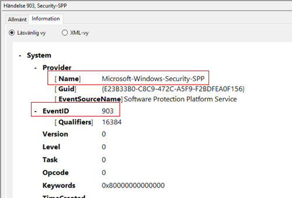
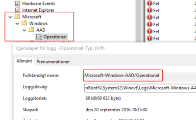
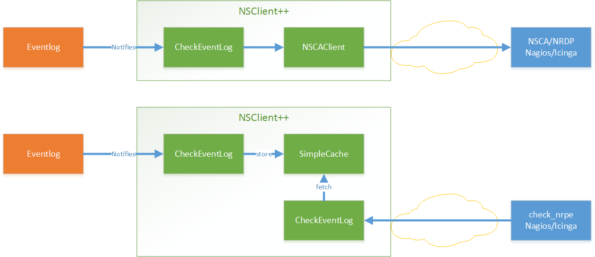
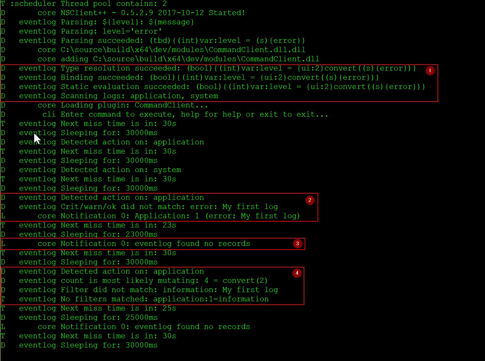

# CheckEventLog

*Available on Windows only.*

Check for errors and warnings in the event log.

#### Standard event-logs

The default command will monitor the application/system/security logs which usually have the generic errors.

```
check_eventlog
L        cli CRITICAL: CRITICAL: 5 message(s) Application Bonjour Service (Task Scheduling Error: ... e DNS-servrarna svarade.)
L        cli  Performance data: 'problem_count'=5;0;0
```

#### Time and date

The default time frame is 24 hours. This can be configured via the scan-range which specifies the number of hours from now to look.
This might seem a bit off at first but all date and time ranges which reflect past times are "negative" in NSClient++.
Thus the default is: `check_eventlog scan-range=-24h`

If you instead wish to check the past week you would change this to: `check_eventlog scan-range=-1w`

The other option you can use for defining time is the filter keyword written.
This can be used much the same but is used if you wish to use the time in the filter so you still need to specify scan-range.
But if you for instance want to get an error if the message is 24 hours old and a warning if it is 1 week you would do:
```
check_eventlog scan-range=-1w "warn=count gt 0" "critical=written > -24h"
```

#### Checking for specific messages

There are many ways to find messages but the optimum solution is to filter on log, source (provider), and id.
This is as this combination is guaranteed to be unique and still quick to look for.
Another option it so look for messages which will obviously work as well but it will be magnitudes slower in terms of performance.

To find the source and event id you can easily look at the messages property in the event viewer.


With this information in hand we can easily create a filter for a specific message like so:

```
check_eventlog "filter=provider = 'Microsoft-Windows-Security-SPP' and id = 903"
```

Sometimes, rarely, the message is important and then it is best to add that as a last check to the above filter as it will be faster.

```
check_eventlog "filter=provider = 'Microsoft-Windows-Security-SPP' and id = 903 and message like 'foo'"
```

#### Modern windows (channels)

NSClient++ also has had the ability to check all logs on modern windows machines.
This works out of the box and you specify the path of the channel you want to look for with the file command.
A slight snag here is that the separator for "folders" is - not \ r / as one might expect this is unfortunately a windows flaw most likely related to the fact that event logs can also be read from the file system.

A simple way to find the actual name of an event log channel is to view its properties (right-click the channel and click properties):



```
check_eventlog scan-range=-100w show-all filter=none "file=Microsoft-Windows-AAD/Operational"
```

#### Checking for non errors

The default filters are filtering out only warnings, errors and critical messages:

| Property | Default value                             |
|----------|-------------------------------------------|
| filter   | level in ('warning', 'error', 'critical') |
| warning  | level = 'warning' or problem_count > 0    |
| critical | level in ('error', 'critical')            |

Thus if you want to find a message which is not warnings, errors and critical messages you need to either change or disable the default filter like so:

```
check_eventlog filter=none
```

#### Severity/Level/Error

In the previous event-log API it was common for people to use severity to filter out errors.
This has never worked as severity was never message severity, it remains however, a common thing.
Regardless of version of API and version of NSClient++ the proper way to find errors is to use the level keyword like so:

```
check_eventlog "filter=level = 'error'"
```

While we have never been able to find an official list of the meaning of the levels, the mapping NSClient++ uses between the numeric values and the keywords (critical, error, warning, ...) is documented on the `level` keyword in the filter keywords table below.

Thus if you run into a non standard level you can check this like so:

```
check_eventlog "filter=level = 42"
```

#### Using Real-time monitoring

The benefit of real-time monitoring of the event-log is that it is often significantly faster and more resources efficient.
The drawback is that it is more complex to setup and normally requires passive monitoring (via NSCA/NRDP)

The basic idea is depict in the following figure.



We have a filter which listens to event log entries.
These entries are (when they matched) turned into messages and statuses which is then sent onward to various channels.
On the other end of these channels are (hopefully) someone who is interested in the message.

In most cases the first channel you are interested in is NSCA which is the default name where the NSCAClient listens.
It will in turn forward all incoming messages on to Nagios via NSCA.

So in short we need to configure three things

*   Activate real time filtering
*   Add a filter which listens for events
*   Setup a destination

##### Enabling real-time filtering

To setup real time filtering we only need a single flag (as well as the eventlog module).

**configuration:**
```
[/modules]
CheckEventLog=enabled

[/settings/eventlog/real-time]
enabled = true
```

Adding this will not do much since we don't have a filter yet but adding one is pretty simple as well so lets go ahead and do that.

To make life simple we set the destination in this filter to "log" which means the information only ends up in the NSClient++ log file.
Not very useful in reality but very useful when we are debugging as it removes possible errors sources.

**configuration:**
```
[/settings/eventlog/real-time/filters/my_alert]
log=application
destination=log
filter=level='error'
maximum age=30s
debug=true
```

Going through the configuration line by line we have:

* `log=application` is the log we listen to.
* `destination=log` is where the message is sent
* `filter=level='error'` means we only want to receive error messages.
* `maximum age=30s` sets a repeating "ok" messages every 30 seconds.
* `debug=true` will increase the debug level for this filter

If we were to test this (and please do go ahead) we would start getting warning on the console about no one listening to our events.

To be able to test this we need to inject some messages in the eventlog.
This we can do with the eventcreate command.

**Add error to eventlog:**
```
eventcreate /ID 1 /L application /T ERROR /SO MYEVENTSOURCE /D "My first log"
```

**Add info to eventlog:**
```
eventcreate /ID 1 /L application /T INFORMATION /SO MYEVENTSOURCE /D "My first log"
```

If we check the log we should see something similar to this:



* 1: Always make sure there are not errors and that the parsed tree looks like you want it. If the filter has syntax issues nothing will work
* 2: This is how it looks when we inject an error message, it is caught and we get the `Notification 0: Application: 1 (error: My first log)` in the log.
* 3: This is the periodical "ok" message we get when there are not errors: `Notification 0: eventlog found no records`
* 4: Here we can see the output when there is a message but it does not match our filter.

##### Enabling cache to check actively

**TODO**


## Enable module

To enable this module and and allow using the commands you need to ass `CheckEventLog = enabled` to the `[/modules]` section in nsclient.ini:

```
[/modules]
CheckEventLog = enabled
```

## Queries

A quick reference for all available queries (check commands) in the CheckEventLog module.

**List of commands:**

A list of all available queries (check commands)

| Command                           | Description                        |
|-----------------------------------|------------------------------------|
| [check_eventlog](#check_eventlog) | Check for errors in the event log. |

### check_eventlog

Check for errors in the event log.

#### Filtering by account SID (`user` / `sid`)

Each event carries the security identifier (SID) of the account associated with
it. The `user` keyword (alias `sid`) exposes that SID as a string (e.g.
`S-1-5-18` for `LOCAL SYSTEM`), so you can scope a check to a specific account.

```
check_eventlog file=Security "filter=user = 'S-1-5-18'" "detail-syntax=${id}: ${message}"
```

`user`/`sid` is populated by the modern Windows Event Log API
(`EvtSystemUserID`). On the legacy `ReadEventLog` API (pre-Vista, or when the
modern API is unavailable) it renders as an empty string.

#### "Since last check" scanning

To avoid re-scanning and double-counting the same events on every poll, use the
`bookmark` option. With `bookmark=auto` (or a shared bookmark name) the check
resumes after the last event it saw, rather than re-walking the whole
`scan-range` window each time:

```
check_eventlog file=Application bookmark=auto "filter=level = 'error'"
```

The bookmark position is persisted across restarts (stored under
`eventlog.bookmarks`), so a monitoring cycle only ever reports genuinely new
events. Without a bookmark the check falls back to the time-window `scan-range`
(default `-24h`), which is stateless and may re-report events inside the window.

**Jump to section:**

* [Command-line Arguments](#check_eventlog_options)
* [Filter keywords](#check_eventlog_filter_keys)


<a id="check_eventlog_options"></a>
#### Command-line Arguments

<a id="check_eventlog_log"></a>
<a id="check_eventlog_truncate-message"></a>

| Option                                   | Default Value | Description                                                                                                                                                                                                 |
|------------------------------------------|---------------|-------------------------------------------------------------------------------------------------------------------------------------------------------------------------------------------------------------|
| [file](#check_eventlog_file)             |               | File to read (can be specified multiple times to check multiple files.                                                                                                                                      |
| log                                      |               | Same as file                                                                                                                                                                                                |
| [scan-range](#check_eventlog_scan-range) |               | Date range to scan.                                                                                                                                                                                         |
| truncate-message                         |               | Maximum length of message for each event log message text.                                                                                                                                                  |
| [unique](#check_eventlog_unique)         | true          | Shorthand for setting default unique index: ${log}-${source}-${id}.                                                                                                                                         |
| [bookmark](#check_eventlog_bookmark)     | auto          | Use bookmarks to only look for messages since last check (with the same bookmark name). If you set this to auto or leave it empty the bookmark name will be derived from your logs, filters, warn and crit. |


<h5 id="check_eventlog_file">file:</h5>

File to read (can be specified multiple times to check multiple files.
Notice that specifying multiple files will create an aggregate set you will not check each file individually.In other words if one file contains an error the entire check will result in error.


<h5 id="check_eventlog_scan-range">scan-range:</h5>

Date range to scan.
A negative value (e.g. -1h) scans backward through historical events; a positive value (e.g. +1h) scans forward into future events. The value is a relative offset from now using the suffixes s (seconds), m (minutes), h (hours), d (days) or w (weeks); a bare number is treated as seconds. This is used as an approximate time window to limit how far the scan walks the log and significantly speeds up large logs, but messages are not guaranteed to be returned in order. Defaults to -24h when omitted.


<h5 id="check_eventlog_unique">unique:</h5>

Shorthand for setting default unique index: ${log}-${source}-${id}.

*Default Value:* `true`

<h5 id="check_eventlog_bookmark">bookmark:</h5>

Use bookmarks to only look for messages since last check (with the same bookmark name). If you set this to auto or leave it empty the bookmark name will be derived from your logs, filters, warn and crit.

*Default Value:* `auto`


**Common options:**

These options are shared by all filter based commands and are described on the [common options](../common-options.md#common-options) page; the default values below are specific to this command.


| Option                                                                                                         | Default Value                                  |
|----------------------------------------------------------------------------------------------------------------|------------------------------------------------|
| <a id="check_eventlog_filter"></a>[filter](../common-options.md#filter)                                        | level in ('warning', 'error', 'critical')      |
| <a id="check_eventlog_warning"></a>[warning](../common-options.md#warning)                                     | level = 'warning', problem_count > 0           |
| <a id="check_eventlog_warn"></a>[warn](../common-options.md#warn)                                              |                                                |
| <a id="check_eventlog_critical"></a>[critical](../common-options.md#critical)                                  | level in ('error', 'critical')                 |
| <a id="check_eventlog_crit"></a>[crit](../common-options.md#crit)                                              |                                                |
| <a id="check_eventlog_ok"></a>[ok](../common-options.md#ok)                                                    |                                                |
| <a id="check_eventlog_debug"></a>[debug](../common-options.md#debug)                                           | false                                          |
| <a id="check_eventlog_show-all"></a>[show-all](../common-options.md#show-all)                                  | false                                          |
| <a id="check_eventlog_empty-state"></a>[empty-state](../common-options.md#empty-state)                         | ok                                             |
| <a id="check_eventlog_perf-config"></a>[perf-config](../common-options.md#perf-config)                         | level(ignored:true)                            |
| <a id="check_eventlog_escape-html"></a>[escape-html](../common-options.md#escape-html)                         | false                                          |
| <a id="check_eventlog_list-separator"></a>[list-separator](../common-options.md#list-separator)                | ,                                              |
| <a id="check_eventlog_top-syntax"></a>[top-syntax](../common-options.md#top-syntax)                            | ${status}: ${count} message(s) ${problem_list} |
| <a id="check_eventlog_ok-syntax"></a>[ok-syntax](../common-options.md#ok-syntax)                               | %(status): Event log seems fine                |
| <a id="check_eventlog_empty-syntax"></a>[empty-syntax](../common-options.md#empty-syntax)                      | %(status): No entries found                    |
| <a id="check_eventlog_detail-syntax"></a>[detail-syntax](../common-options.md#detail-syntax)                   | ${file} ${source} (${message})                 |
| <a id="check_eventlog_perf-syntax"></a>[perf-syntax](../common-options.md#perf-syntax)                         | ${file}_${source}                              |
| <a id="check_eventlog_unique-index"></a>[unique-index](../common-options.md#unique-index)                      |                                                |
| <a id="check_eventlog_byte-unit"></a>[byte-unit](../common-options.md#byte-unit)                               |                                                |
| <a id="check_eventlog_decimal-separator"></a>[decimal-separator](../common-options.md#decimal-separator)       |                                                |
| <a id="check_eventlog_decimals"></a>[decimals](../common-options.md#decimals)                                  | -1                                             |
| <a id="check_eventlog_thousands-separator"></a>[thousands-separator](../common-options.md#thousands-separator) |                                                |


This command also accepts the standard [help options](../common-options.md#standard-options): help, help-pb, show-default, help-short.


<a id="check_eventlog_filter_keys"></a>
#### Filter keywords

| Option      | Description                                                                                                                                                                                  |
|-------------|----------------------------------------------------------------------------------------------------------------------------------------------------------------------------------------------|
| category    | TODO                                                                                                                                                                                         |
| computer    | Which computer generated the message                                                                                                                                                         |
| customer    | TODO                                                                                                                                                                                         |
| file        | The logfile name                                                                                                                                                                             |
| guid        | The logfile name                                                                                                                                                                             |
| id          | Eventlog id                                                                                                                                                                                  |
| keyword     | The keyword associated with this event                                                                                                                                                       |
| level       | Severity level: critical (1), error (2), warning/warn (3), informational/info/information/success/auditSuccess (4), debug/verbose (5); use the raw number for other values (e.g. level = 42) |
| log         | alias for file                                                                                                                                                                               |
| message     | The message rendered as a string.                                                                                                                                                            |
| opcode      | The opcode associated with this event                                                                                                                                                        |
| provider    | Source system.                                                                                                                                                                               |
| rawid       | Raw message id (contains many other fields all baked into a single number)                                                                                                                   |
| sid         | Alias for user (the event's account SID)                                                                                                                                                     |
| source      | Source system.                                                                                                                                                                               |
| task        | The type of event (task)                                                                                                                                                                     |
| type        | alias for level (old, deprecated)                                                                                                                                                            |
| user        | SID of the account associated with the event (e.g. S-1-5-18); empty on the legacy API. Enables filtering by SID.                                                                             |
| written     | When the message was written to file                                                                                                                                                         |
| written_str | When the message was written to file as an absolute date string                                                                                                                              |
| xml         | Get event as XML message.                                                                                                                                                                    |

This command also supports the [common filter keywords](../common-options.md#common-filter-keywords): count, total, ok_count, warn_count, crit_count, problem_count, list, ok_list, warn_list, crit_list, problem_list, detail_list, sep, status.

## Configuration

| Path / Section                                                      | Description                   |
|---------------------------------------------------------------------|-------------------------------|
| [/settings/eventlog](#eventlog)                                     | Eventlog                      |
| [/settings/eventlog/real-time](#real-time-eventlog-monitoring)      | Real-time eventlog monitoring |
| [/settings/eventlog/real-time/filters](#real-time-eventlog-filters) | Real-time eventlog filters    |


### Eventlog <a id="/settings/eventlog"></a>

Section for the EventLog Checker (CheckEventLog.dll).

| Key                                    | Default Value | Description           |
|----------------------------------------|---------------|-----------------------|
| [buffer size](#default-buffer-size)    | 131072        | Default buffer size   |
| [debug](#enable-debugging)             | false         | Enable debugging      |
| [lookup names](#lookup-eventlog-names) | true          | Lookup eventlog names |
| [syntax](#default-syntax)              |               | Default syntax        |


```ini
# Section for the EventLog Checker (CheckEventLog.dll).
[/settings/eventlog]
buffer size=131072
debug=false
lookup names=true
```

#### Default buffer size <a id="/settings/eventlog/buffer size"></a>

The size of the buffer to use when getting messages this affects the speed and maximum size of messages you can receive.


| Key            | Description                               |
|----------------|-------------------------------------------|
| Path:          | [/settings/eventlog](#/settings/eventlog) |
| Key:           | buffer size                               |
| Default value: | `131072`                                  |


**Sample:**

```
[/settings/eventlog]
# Default buffer size
buffer size=131072
```

#### Enable debugging <a id="/settings/eventlog/debug"></a>

Log more information when filtering (useful to detect issues with filters) not useful in production as it is a bit of a resource hog.


| Key            | Description                               |
|----------------|-------------------------------------------|
| Path:          | [/settings/eventlog](#/settings/eventlog) |
| Key:           | debug                                     |
| Default value: | `false`                                   |


**Sample:**

```
[/settings/eventlog]
# Enable debugging
debug=false
```

#### Lookup eventlog names <a id="/settings/eventlog/lookup names"></a>

Lookup the names of eventlog files


| Key            | Description                               |
|----------------|-------------------------------------------|
| Path:          | [/settings/eventlog](#/settings/eventlog) |
| Key:           | lookup names                              |
| Default value: | `true`                                    |


**Sample:**

```
[/settings/eventlog]
# Lookup eventlog names
lookup names=true
```

#### Default syntax <a id="/settings/eventlog/syntax"></a>

Set this to use a specific syntax string for all commands (that don't specify one).


| Key            | Description                               |
|----------------|-------------------------------------------|
| Path:          | [/settings/eventlog](#/settings/eventlog) |
| Key:           | syntax                                    |
| Default value: | _N/A_                                     |


**Sample:**

```
[/settings/eventlog]
# Default syntax
syntax=
```

### Real-time eventlog monitoring <a id="/settings/eventlog/real-time"></a>

A set of options to configure the real time checks

| Key                                         | Default Value      | Description                 |
|---------------------------------------------|--------------------|-----------------------------|
| [debug](#enable-debugging)                  | false              | Enable debugging            |
| [enabled](#enable-realtime-monitoring)      | false              | Enable realtime monitoring  |
| [log](#logs-to-check)                       | application,system | Logs to check               |
| [startup age](#read-old-records-at-startup) | 30m                | Read old records at startup |


```ini
# A set of options to configure the real time checks
[/settings/eventlog/real-time]
debug=false
enabled=false
log=application,system
startup age=30m
```

#### Enable debugging <a id="/settings/eventlog/real-time/debug"></a>

Log missed records (useful to detect issues with filters) not useful in production as it is a bit of a resource hog.


| Key            | Description                                                   |
|----------------|---------------------------------------------------------------|
| Path:          | [/settings/eventlog/real-time](#/settings/eventlog/real-time) |
| Key:           | debug                                                         |
| Default value: | `false`                                                       |


**Sample:**

```
[/settings/eventlog/real-time]
# Enable debugging
debug=false
```

#### Enable realtime monitoring <a id="/settings/eventlog/real-time/enabled"></a>

Spawns a background thread which detects issues and reports them back instantly.


| Key            | Description                                                   |
|----------------|---------------------------------------------------------------|
| Path:          | [/settings/eventlog/real-time](#/settings/eventlog/real-time) |
| Key:           | enabled                                                       |
| Default value: | `false`                                                       |


**Sample:**

```
[/settings/eventlog/real-time]
# Enable realtime monitoring
enabled=false
```

#### Logs to check <a id="/settings/eventlog/real-time/log"></a>

Comma separated list of logs to check


| Key            | Description                                                   |
|----------------|---------------------------------------------------------------|
| Path:          | [/settings/eventlog/real-time](#/settings/eventlog/real-time) |
| Key:           | log                                                           |
| Default value: | `application,system`                                          |


**Sample:**

```
[/settings/eventlog/real-time]
# Logs to check
log=application,system
```

#### Read old records at startup <a id="/settings/eventlog/real-time/startup age"></a>

The initial age to scan when starting NSClient++


| Key            | Description                                                   |
|----------------|---------------------------------------------------------------|
| Path:          | [/settings/eventlog/real-time](#/settings/eventlog/real-time) |
| Key:           | startup age                                                   |
| Default value: | `30m`                                                         |


**Sample:**

```
[/settings/eventlog/real-time]
# Read old records at startup
startup age=30m
```

### Real-time eventlog filters <a id="/settings/eventlog/real-time/filters"></a>

A set of filters to use in real-time mode


This is a section of objects. This means that you will create objects below this point by adding sections which all look the same.


**Keys:**


| Key                 | Default Value             | Description         |
|---------------------|---------------------------|---------------------|
| byte unit           |                           | BYTE UNIT           |
| command             |                           | COMMAND NAME        |
| critical            |                           | CRITICAL FILTER     |
| debug               |                           | DEBUG               |
| decimal separator   |                           | DECIMAL SEPARATOR   |
| decimals            | -1                        | DECIMALS            |
| destination         |                           | DESTINATION         |
| detail syntax       |                           | SYNTAX              |
| empty message       | eventlog found no records | EMPTY MESSAGE       |
| escape html         |                           | ESCAPE HTML         |
| filter              |                           | FILTER              |
| list separator      |                           | LIST SEPARATOR      |
| log                 |                           | FILE                |
| logs                |                           | FILES               |
| maximum age         | 5m                        | MAXIMUM AGE         |
| ok                  |                           | OK FILTER           |
| ok syntax           |                           | SYNTAX              |
| perf config         |                           | PERF CONFIG         |
| severity            |                           | SEVERITY            |
| silent period       | false                     | Silent period       |
| source id           |                           | SOURCE ID           |
| target              |                           | DESTINATION         |
| target id           |                           | TARGET ID           |
| thousands separator |                           | THOUSANDS SEPARATOR |
| top syntax          |                           | SYNTAX              |
| truncate            |                           | Truncate            |
| warning             |                           | WARNING FILTER      |


**Sample:**

```ini
# An example of a Real-time eventlog filters section
[/settings/eventlog/real-time/filters/sample]
#byte unit=...
#command=...
#critical=...
#debug=...
#decimal separator=...
decimals=-1
#destination=...
#detail syntax=...
empty message=eventlog found no records
#escape html=...
#filter=...
#list separator=...
#log=...
#logs=...
maximum age=5m
#ok=...
#ok syntax=...
#perf config=...
#severity=...
silent period=false
#source id=...
#target=...
#target id=...
#thousands separator=...
#top syntax=...
#truncate=...
#warning=...

```


