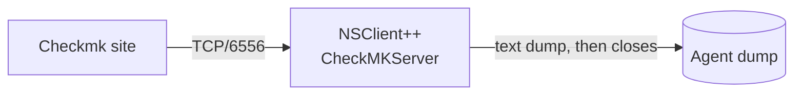

# Checkmk Agent Integration

**Goal:** Have a Checkmk site monitor a Windows host through NSClient++ — pulling an agent dump that looks and behaves like the official Checkmk agent, complete with system sections, local checks, MRPE entries, and scheduler-driven cached results.

<!-- @formatter:off -->
!!! tip
    This scenario is for connecting NSClient++ to an existing Checkmk site (open-source or commercial). If you already have nscp deployed for NRPE or NSCA, you can layer Checkmk on top without removing those — they're separate listeners.
<!-- @formatter:on -->

---

## How Checkmk Talks to the Agent

Checkmk's agent protocol is **active and pull-style**: the site opens a TCP connection to the agent on port 6556, the agent pushes a single text "agent dump", and the connection closes.



A typical agent dump looks like:

```text
<<<check_mk>>>
Version: ...
<<<mem>>>
MemTotal: 16382336 kB
...
```

The dump is plain UTF-8 text divided into `<<<section_name>>>` blocks. Checkmk's parser routes each section to the appropriate "check plugin" on the server side (`mem`, `df`, `services`, `local`, `mrpe`, etc.).

NSClient++ produces this dump from a Lua script (`scripts/lua/default_check_mk.lua`) that mixes three sources:

| Source                         | Sections                                           |
|--------------------------------|----------------------------------------------------|
| Internal metrics store         | `<<<uptime>>>`, `<<<mem>>>`                        |
| Native check `fetch-only`      | `<<<services>>>`, `<<<ps>>>`, `<<<df>>>`           |
| Settings-driven bridge         | `<<<local>>>`, `<<<mrpe>>>`                        |
| Scheduler / passive submission | Cached entries inside `<<<local>>>` / `<<<mrpe>>>` |

You don't normally edit the Lua script — you control everything from `nsclient.ini`.

---

## Prerequisites

Enable these modules in `nsclient.ini`:

```ini
[/modules]
CheckMKServer = enabled   ; the agent listener (port 6556)
CheckSystem   = enabled   ; mem, ps, services, uptime
CheckDisk     = enabled   ; df / drive sizes (Windows)
CheckHelpers  = enabled   ; useful for local-check expressions
Scheduler     = enabled   ; only if you want passive cached checks (Step 5)
```

---

## Step 1 — Verify the Listener

Configure the listener and start NSClient++:

```ini
[/settings/check_mk/server]
port          = 6556
allowed hosts = 127.0.0.1, <checkmk-site-ip>
```

Restart and verify with any TCP client:

```
nc -w 5 127.0.0.1 6556
```

Or from PowerShell:

```powershell
$tc = [System.Net.Sockets.TcpClient]::new("127.0.0.1", 6556)
$sr = [System.IO.StreamReader]::new($tc.GetStream())
$sr.ReadToEnd()
```

You should see something like:

```
<<<check_mk>>>
Version: nsclient++
AgentOS: windows
Hostname: WIN-DESKTOP
<<<systemtime>>>
1715361234
<<<uptime>>>
175140
<<<mem>>>
MemTotal:      16382336 kB
MemFree:       8000000 kB
SwapTotal:     32000000 kB
SwapFree:      31000000 kB
<<<df>>>
C: NTFS 1953511476 526123456 1427388020 27% C:
<<<services>>>
Spooler running/auto Print Spooler
...
<<<ps>>>
(,123456,67890,42,1234) explorer
...
```

Empty output usually means the source IP isn't in `allowed hosts` (the Checkmk site connects from its own IP, not the docker host's).

---

## Step 2 — What Comes For Free

These sections are produced automatically with no extra configuration:

| Section            | Source                                                                         |
|--------------------|--------------------------------------------------------------------------------|
| `<<<check_mk>>>`   | Header with version, OS, hostname                                              |
| `<<<systemtime>>>` | Current Unix epoch (Windows; lets Checkmk warn on clock skew)                  |
| `<<<uptime>>>`     | Seconds since boot (read from the metrics store)                               |
| `<<<mem>>>`        | `/proc/meminfo`-style kB lines (Windows: from `GlobalMemoryStatusEx` metrics)  |
| `<<<df>>>`         | Per-volume size/used/free/mountpoint (Windows: `GetDiskFreeSpaceEx` per drive) |
| `<<<services>>>`   | `name state/start_type display_name` per service (Windows SCM)                 |
| `<<<ps>>>`         | `(user,vsz_kb,rss_kb,cputime,pid) cmdline` per process                         |

Once Checkmk has a host pointing at your nscp instance, all of these light up automatically as services in WATO discovery (`Memory`, `Filesystem C:/`, `Service Summary`, `Uptime`, `CPU Load`, etc.).

---

## Step 3 — Expose nscp Checks as Local Checks

The most powerful part of the integration: any nscp check command becomes a **Checkmk local check** by adding one line to `nsclient.ini`:

```ini
[/settings/check_mk/server/local]
; service-name = command=<nscp-check> [args...]
CPU Load        = command=check_cpu warn=load>80 crit=load>95
Disk C          = command=check_drivesize drive=C: "warn=free<20%" "crit=free<10%"
Mail Queue      = command=check_files path="C:\Mail\Queue" maxage=5m
```

On every agent fetch, NSClient++ runs each command, formats the result as a Checkmk local-check line (`state "name" perfdata text`), and emits it inside `<<<local>>>`. Checkmk discovers each entry as a service named after the key.

<!-- @formatter:off -->
!!! note "Perfdata label gotcha"
    nscp emits Nagios-style single-quoted labels like `'load 5m'=10%;80;90`.
    Checkmk's local-check parser doesn't accept those, so the script
    automatically rewrites them to `load_5m=10%;80;90`. You don't need to do
    anything special — just be aware that metric names with spaces become
    underscored in the Checkmk view.
<!-- @formatter:on -->

---

## Step 4 — Add MRPE Entries

MRPE is the "Nagios plugin" relay format. Functionally equivalent to local checks for most purposes; useful if your Checkmk site already has MRPE rules wired up.

```ini
[/settings/check_mk/server/mrpe]
; service-name = command=<nscp-check> [args...]
Uptime    = command=check_uptime warn=uptime<2d
Memory    = command=check_memory type=committed warn=used>80% crit=used>90%
```

Same pattern as local checks; the output goes into `<<<mrpe>>>` instead.

| Use `local` when…                               | Use `mrpe` when…                                   |
|-------------------------------------------------|----------------------------------------------------|
| Starting fresh, no preference                   | You already have MRPE-based service templates      |
| You want fast-discovery                         | The site uses MRPE rule packs                      |
| You care about Checkmk-style perfdata rendering | You need raw Nagios-format perfdata round-tripping |

---

## Step 5 — Scheduler-Driven Cached Checks (Optional)

For checks that are **slow** or **expensive** (large directory walks, WMI queries, calls to remote services), running them inline on every agent fetch is wasteful. Checkmk pulls roughly every minute, so a 30-second check runs 50% of the time.

The **submission channel** path solves this: have the Scheduler run the check on its own interval, submit the result to a CheckMKServer channel, and let it serve the *cached* result on every subsequent fetch with a `cached(generated, interval)` prefix that tells Checkmk how fresh the data is.

```ini
[/modules]
Scheduler = enabled

; Defaults applied to all entries below
[/settings/scheduler/schedules/default]
channel  = check_mk-mrpe   ; or check_mk-local
interval = 5m
report   = all

; A scheduled MRPE check (inherits channel = check_mk-mrpe)
[/settings/scheduler/schedules/Slow Inventory]
command = check_files path="\\fileserver\share\inventory" pattern=*.csv

; Override channel per-schedule for a local-formatted entry
[/settings/scheduler/schedules/AD Replication]
command = check_ad_replication
channel = check_mk-local
```

**Two channels are pre-registered** by `CheckMKServer`:

| Channel           | Result lands in       |
|-------------------|-----------------------|
| `check_mk-mrpe`   | `<<<mrpe>>>` section  |
| `check_mk-local`  | `<<<local>>>` section |

The schedule key (`Slow Inventory`, `AD Replication`) becomes the Checkmk service name. CheckMKServer keeps the latest result per service in memory; the next agent fetch emits it with a `cached(<gen_epoch>,<ttl>)` prefix:

```
<<<mrpe>>>
cached(1715361234,60) Slow Inventory 0 OK: 412 files|count=412
```

Checkmk's UI surfaces this as a freshness indicator — for example: *"Cache generated 4 seconds ago, cache interval: 1 minute, elapsed cache lifespan: 6.54%"*.

### Scheduler-channel TTL

The `cached(...)` prefix tells Checkmk how stale the data may be. Tune it under the listener:

```ini
[/settings/check_mk/server]
submission ttl = 60   ; seconds; should be ≥ scheduler interval
```

Keep the TTL **at least as long as the scheduler interval** — otherwise Checkmk will show the entry as stale between scheduler ticks.

---

## Step 6 — Register the Host in Checkmk

In the Checkmk site web UI:

1. **Setup → Hosts → Add host** (or use the REST API).
2. **Hostname**: anything you like (this is the WATO host name).
3. **IPv4 address**: the IP/DNS name of the Windows machine running NSClient++.
4. **Agent / data source**: leave at the default *"Checkmk agent"* (TCP).
5. **Save → Activate changes**.
6. **Run service discovery** on the new host — Checkmk pulls one agent dump and lists every section it found as a discoverable service.
7. **Accept all** (or pick the ones you want), then activate again.

Within one fetch interval (default ~1 minute) every monitored item turns green.

---

## Complete Configuration Example

```ini
[/modules]
CheckMKServer = enabled
LUAScript     = enabled
CheckSystem   = enabled
CheckDisk     = enabled
CheckHelpers  = enabled
Scheduler     = enabled

[/settings/check_mk/server]
port           = 6556
allowed hosts  = 127.0.0.1, 10.0.0.5
submission ttl = 300

[/settings/check_mk/server/local]
CPU Load = command=check_cpu warn=load>80 crit=load>95
Disk C   = command=check_drivesize drive=C: "warn=free<20%" "crit=free<10%"

[/settings/check_mk/server/mrpe]
Uptime  = command=check_uptime warn=uptime<2d
Memory  = command=check_memory type=committed warn=used>80% crit=used>90%

[/settings/scheduler/schedules/default]
channel  = check_mk-mrpe
interval = 5m
report   = all

[/settings/scheduler/schedules/Slow Inventory]
command = check_files path="\\fileserver\share\inventory" pattern=*.csv

[/settings/scheduler/schedules/AD Replication]
command = check_ad_replication
channel = check_mk-local
```

---

## Troubleshooting

### Agent dump is empty / connection refused

Almost always one of:

- **`CheckMKServer` not enabled** — check `/modules` and module load logs.
- **`allowed hosts` blocks the source IP** — Checkmk connects from the site's IP, not from the docker host or 127.0.0.1.
- **Port 6556 not reachable** — Windows Firewall, corporate routing, or another process bound to the port. Verify with `Test-NetConnection -ComputerName <host> -Port 6556`.

### `Invalid data:` in Checkmk's `cmk -v` output

Means Checkmk's parser rejected one of our lines. Most common causes:

- A **local check** line with single-quoted perfdata labels (`'metric name'=...`). The script normalizes these automatically; if you see them, you may have an outdated `default_check_mk.lua` in your `scripts/lua/` directory.
- A **service name with spaces** in `<<<mrpe>>>` (MRPE protocol cannot quote spaces — use underscores).

### Service name shows as `check_xxx` instead of the schedule alias

The CheckMKServer in your build is older than the alias-aware fix. Rebuild
`CheckMKServer.dll` and redeploy.

### Checkmk shows "stale" / "no data" for cached entries

The `cached(...)` interval is shorter than the scheduler period, so Checkmk
considers the data expired before the next push. Either lengthen
`submission ttl` or shorten the schedule's `interval`.

### What's NOT supported (yet)

- **Symmetric encryption** (AES-256-CBC with pre-shared password). Checkmk site needs to be configured *without* encryption for nscp to work today, or routed through a TLS-terminating proxy.
- **Real-Time Check (UDP push)**.
- **`cmk-agent-ctl` mTLS**.
- **`<<<logwatch>>>`** / **`<<<winperf_*>>>`** / **`<<<fileinfo>>>`** sections.

For these, fall back to the official Checkmk agent on hosts that need them, or expose the check via the local/mrpe bridge.

---

## Next Steps

- [Reference: CheckMKServer](../reference/check/CheckMKServer.md) — full settings reference for the listener
- [Reference: Scheduler](../reference/generic/Scheduler.md) — full scheduler reference for the submission channels
- [Passive Monitoring with NSCA](passive-monitoring-nsca.md) — same scheduler pattern targeting a Nagios-style server instead
