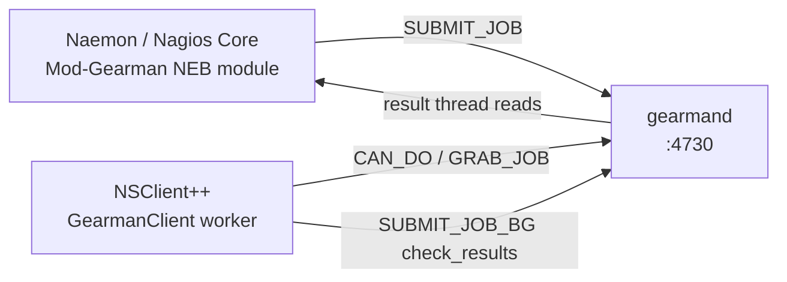

# Mod-Gearman (Naemon / Nagios Core)

**Goal:** Let a Naemon or Nagios Core keep scheduling its checks, but have
NSClient++ pull them off a gearmand job server and answer them — with no
inbound port on the Windows host, and with `check_cpu` and friends reading the
running agent's own collector.

The same module also pushes **passive** results into the core's result queue,
which is what lets a Mod-Gearman installation drop NSCA.

<!-- @formatter:off -->
!!! tip "Two projects, one protocol"
    **Mod-Gearman** (ConSol, `sni/mod_gearman`) is the Naemon one.
    **Nagios-Mod-Gearman** (Nagios Enterprises) is the fork for Nagios Core
    4.5 and later. They differ in package names, paths and binaries — not in
    the protocol, the encryption or the job format — so the agent is
    configured identically for both. Where a path or a binary name differs,
    this page shows both.
<!-- @formatter:on -->
---

## How It Works

The core never stops scheduling. What changes is *who runs the plugin*:



1. The NEB module intercepts a check the core was about to fork, with every
   `$ARGn$` and `$HOSTADDRESS$` macro already expanded, and puts it on a
   gearmand queue.
2. NSClient++ has registered on that queue and grabs the job.
3. It runs the command line as a **native query** — no process is spawned —
   and submits the result to `check_results`.
4. The core's result thread files it exactly as if it had run the plugin
   itself. Retries, notifications and state history are unchanged.

**Every connection is opened by the agent**, outbound to gearmand on TCP/4730.
Nothing listens on the monitored host.

### Routing is decided on the core, by group

The agent never picks checks. `module.conf` on the core decides what goes to
gearmand at all:

| Check                                                            | Queue                     |
|------------------------------------------------------------------|---------------------------|
| host/service in a hostgroup listed in `hostgroups=`              | `hostgroup_<name>`        |
| service in a servicegroup listed in `servicegroups=`             | `servicegroup_<name>`     |
| everything else (with `do_hostchecks=yes` / `services=yes`)      | `host` / `service`        |
| host/service with `_WORKER=local`, or in `local_hostgroups=`     | none — the core runs it   |

There is **no host-name matching anywhere in the protocol**. A worker
registered on `hostgroup_windows` is offered every check for every host in
that group, and gearmand hands each job to whichever worker asks first. That
single fact produces the two ways to deploy this module.

---

## Two Modes

| | **Agent mode** (default) | **Proxy mode** |
|---|---|---|
| Runs on | every monitored Windows host | one or two boxes per site, typically domain-joined |
| Queue | `hostgroup_<hostname>` — one group per host | `hostgroup_windows` — one group for many hosts |
| Command line | a bare query: `check_cpu "warning=load gt 80"` | a query naming its target: `check_nrpe host=$HOSTADDRESS$ command=check_cpu` |
| Host binding | **on** — a job for another `host_name` is answered UNKNOWN, not executed | **off** — the command line carries the target |
| Redundancy | not needed | two proxies on the same queue share the load and cover each other, with no extra configuration |
| Replaces | inbound NRPE/REST plus a firewall rule per host | a Linux worker box that cannot do WMI, remote event log, MSSQL or PowerShell against the domain |

Agent mode is the obvious first thing to try. Proxy mode is usually the
stronger case: it puts check execution on a machine that *has* Windows
credentials and Windows tooling, still needs no inbound port, and gets load
balancing and failover from gearmand for free.

---

## Prerequisites

On the monitored host (or the proxy):

```ini
[/modules]
GearmanClient = enabled
CheckSystem   = enabled   ; check_cpu, check_memory — collector-backed
CheckDisk     = enabled   ; check_drivesize
CheckHelpers  = enabled   ; check_ok, check_and_forward
; Proxy mode only — the modules the proxy reaches its targets with:
NRPEClient    = enabled
;NSCPClient   = enabled
;CheckWMI     = enabled
```

On the monitoring server: a running `gearmand` reachable from the agent, and
the Mod-Gearman NEB module loaded into the core. The agent needs the
**shared key** from the core's `module.conf` and nothing else.

---

## Step 1 — Configure the Worker

### Agent mode

```ini
[/settings/gearman/worker]
; One or more gearmand job servers, host or host:port (4730 by default),
; tried in order.
server      = gearmand.example.com:4730
; The same value as key= in the core's module.conf. On Windows this can be
; moved into the credential manager ($CRED$), see Securing NSClient++.
key         = <shared secret>
; The hostgroup(s) this host is in on the core. In agent mode the usual
; arrangement is one hostgroup per host.
hostgroups  = win-srv01
workers     = 2
```

That is the whole configuration. `mode` defaults to `agent`, encryption
defaults to on, and results go back to `check_results` unless the job names a
different result queue.

### Proxy mode

```ini
[/settings/gearman/worker]
server      = gearmand.example.com:4730
key         = <shared secret>
mode        = proxy
; One group for every host this proxy monitors.
hostgroups  = windows
; A proxy answers many hosts, so give it more threads.
workers     = 8
```

Starting as a proxy says so once in the log — worth checking, because it is
the line that tells you the blast radius:

```text
gearman: running in proxy mode: every check on hostgroup_windows is executed
here whichever host it names, through this agent's own commands and
credentials. Keep the key to these queues to the hosts that should have it.
```

### Worker settings reference

| Key                      | Default        | Meaning                                                                                              |
|--------------------------|----------------|------------------------------------------------------------------------------------------------------|
| `server`                 | *(required)*   | Comma-separated `host` or `host:port` list, tried in order.                                          |
| `mode`                   | `agent`        | `agent` (this host's checks only) or `proxy`. An unknown value refuses to start.                     |
| `encryption`             | `true`         | AES-256 envelope, matching `encryption=yes` in `module.conf`.                                        |
| `insecure`               | `false`        | Required alongside `encryption = false`.                                                             |
| `key`                    | *(empty)*      | The shared password; at most 32 bytes are used, as in mod_gearman.                                   |
| `key file`               | *(empty)*      | A file whose first line is the key. Used only when `key` is empty.                                   |
| `hostgroups`             | *(empty)*      | Comma-separated group names; `windows` registers `hostgroup_windows`.                                |
| `servicegroups`          | *(empty)*      | Same, registering `servicegroup_<name>`.                                                             |
| `allow shared queues`    | `false`        | Also register the generic `host` and `service` queues. See the warning below.                        |
| `host names`             | *(empty)*      | Agent mode only: extra names this agent answers for.                                                 |
| `workers`                | `2`            | Worker threads, each with its own connection.                                                        |
| `timeout return`         | `2`            | Status reported when a check overruns the job's timeout (0 OK, 1 WARNING, 2 CRITICAL, 3 UNKNOWN).     |
| `max age`                | `0`            | Refuse a job whose `core_time` is older than this many seconds (0 disables).                         |
| `allow arguments`        | `true`         | On by default, unlike NRPE: the core has already expanded `$ARGn$`, so a job *is* arguments.          |
| `allow nasty characters` | `false`        | Same guard and default as NRPEServer. See [Writing check commands](#step-3-write-the-check-commands). |

<!-- @formatter:off -->
!!! warning "`allow shared queues` steals other hosts' checks"
    The generic `host` and `service` queues carry every check that is not in a
    routed group — including the Linux ones. A Windows agent registered there
    will grab them and answer UNKNOWN. Leave it off unless the installation
    really has one shared pool of workers.
<!-- @formatter:on -->

---

## Step 2 — Configure the Core

Both flavours read the same keys; only the paths and binary names differ.

=== "Naemon (ConSol Mod-Gearman)"

    `/etc/mod_gearman/module.conf`:

    ```ini
    server=localhost:4730
    encryption=yes
    key=<shared secret>
    hostgroups=windows
    do_hostchecks=yes
    services=no
    ```

    Loaded from `naemon.cfg`:

    ```text
    broker_module=/usr/lib/mod_gearman/mod_gearman_naemon.o config=/etc/mod_gearman/module.conf
    ```

    Tools: `send_gearman`, `check_gearman`, `gearman_top`.

=== "Nagios Core 4.5+ (Nagios-Mod-Gearman)"

    `/etc/nagios-mod-gearman/module.conf`:

    ```ini
    server=localhost:4730
    encryption=yes
    key=<shared secret>
    hostgroups=windows
    do_hostchecks=yes
    services=no
    ```

    Loaded from `nagios.cfg`:

    ```text
    broker_module=/usr/lib64/nagios-mod-gearman/nagios-mod-gearman.o config=/etc/nagios-mod-gearman/module.conf
    ```

    Tools: `nagios-send-gearman`, `nagios-check-gearman`, `nagios-gearman-top`.

<!-- @formatter:off -->
!!! note
    `hostgroups=` in `module.conf` is what makes a check go to gearmand at all,
    and it has to name the same groups as `hostgroups` in the agent's worker
    section. A group the core routes but no worker registered leaves those
    checks unanswered until the core's orphan timeout; a group a worker
    registered but the core does not route simply never sees a job.
<!-- @formatter:on -->

---

## Step 3 — Write the Check Commands

The job's `command_line` is an **NSClient++ query**, not a plugin path. One
generic command definition carries all of them:

```text
define command {
  command_name  nscp
  command_line  $ARG1$
}
```

### Two things a Nagios operator writes the Nagios way first

Both fail in a way that does not name the cause, so they are worth getting
right before anything else.

<!-- @formatter:off -->
!!! warning "Write `host=`, not `-H`"
    A check's arguments reach the agent as separate tokens, and a first token
    of two characters puts the request parser into key-value mode. `-H
    $HOSTADDRESS$` then arrives as an option whose value went missing, and the
    check answers with a **help screen** instead of connecting. Write
    `host=$HOSTADDRESS$` (or the long form `--host $HOSTADDRESS$`).

!!! warning "Write `warn=load gt 80`, not `warn=load>80`"
    `>` is a metacharacter, and `allow nasty characters` is `false` by default
    — as it is in NRPEServer. A threshold written with `>` is refused with
    *"Not run: the command contains illegal metacharacters"*. The filter
    language spells it `gt`, `lt`, `ge`, `le`, which needs no exception.
<!-- @formatter:on -->

### Agent mode

```text
define hostgroup { hostgroup_name win-srv01  members win-srv01 }

define service {
  host_name            win-srv01
  service_description  CPU load
  check_command        nscp!check_cpu "warning=load gt 80" "critical=load gt 90"
}
define service {
  host_name            win-srv01
  service_description  Disk
  check_command        nscp!check_drivesize drive=C: "warning=free lt 20%" "critical=free lt 10%"
}
```

```ini
; module.conf — one group per agent host
hostgroups=win-srv01,win-srv02
```

### Proxy mode

The host has no agent of its own; every check names it:

```text
define hostgroup { hostgroup_name windows  members win-srv01,win-srv02,win-db01 }

define service {
  hostgroup_name       windows
  service_description  CPU load
  check_command        nscp!check_nrpe host=$HOSTADDRESS$ command=check_cpu "argument=warning=load gt 80"
}
define service {
  host_name            win-db01
  service_description  SQL Server
  check_command        nscp!check_wmi target=$HOSTADDRESS$ "query=SELECT ..." user=... password=...
}
```

```ini
; module.conf — one group for the whole estate
hostgroups=windows
```

The proxy reaches its targets with the modules it already has:
[`check_nrpe`](../reference/client/NRPEClient.md) (NRPE),
[`check_remote_nscp`](../reference/client/NSCPClient.md) (the NSCP protocol),
`check_mk_query`, or `check_wmi` / `check_mssql` straight from the proxy's own
domain credentials.

---

## Step 4 — Verify

Check that the worker registered, from the core's side:

=== "Naemon"

    ```commandline
    $ gearman_top --batch
    ```

=== "Nagios Core 4.5+"

    ```commandline
    $ nagios-gearman-top --batch
    ```

Or straight from gearmand's admin protocol, which needs no Mod-Gearman tools:

```commandline
$ printf 'status\n' | nc localhost 4730
hostgroup_windows	0	0	2
```

The last column is the number of registered workers — it should match
`workers` in the agent's configuration (multiplied by the number of agents on
that group). If it is `0`, the agent is not connected: check the agent log for
the key, the server address and the queue name.

The agent also publishes its own view on `/api/v2/openmetrics`, when the
`WEBServer` module is enabled:

| Metric                       | Type    | Meaning                                                           |
|------------------------------|---------|-------------------------------------------------------------------|
| `gearman.worker.jobs`        | counter | check jobs taken off a queue since start                           |
| `gearman.worker.errors`      | counter | connection failures, undecodable payloads, failed result submits   |
| `gearman.worker.connected`   | gauge   | worker threads holding a live connection                           |
| `gearman.worker.last_job_age`| gauge   | seconds since the last job was grabbed, `-1` if none has been      |

`last_job_age` is the useful alert: a worker that is *connected* but has not
been given a check in an hour means the core stopped routing, not that the
agent is down.

---

## Step 5 (optional) — Replace NSCA with the Same Connection

Mod-Gearman's result queue accepts results dropped straight into it — that is
all `send_gearman` does. So scheduled (passive) results can travel back over
the same outbound connection the checks come from, with one daemon fewer to
run and no mcrypt:

```ini
[/modules]
GearmanClient = enabled
Scheduler     = enabled

[/settings/gearman/client]
channel  = GEARMAN
; The name the core knows this host by; auto is the machine's own name.
hostname = auto

[/settings/gearman/client/targets/default]
address  = gearmand.example.com:4730
key      = <shared secret>
; check_results unless module.conf names another result queue.
queue    = check_results

[/settings/scheduler/schedules/default]
channel  = GEARMAN
interval = 5m

[/settings/scheduler/schedules/cpu]
command  = check_cpu "warning=load gt 80" "critical=load gt 90"
```

The core files each result as a passive check of the service named after the
schedule. Verify one by hand before relying on it:

```commandline
$ nscp gearman --address gearmand.example.com:4730 --key <shared secret> \
      --command cpu --result WARNING --message "cpu is busy"
Submission successful
```

See [`submit_gearman`](../reference/client/GearmanClient.md#submit_gearman)
for the full command, including host results and batches.

<!-- @formatter:off -->
!!! note "The two halves are independent"
    An installation that only wants the passive channel configures
    `/settings/gearman/client` and leaves the worker section empty — the
    module then loads with no worker at all. One that only wants the worker
    does the reverse.
<!-- @formatter:on -->

---

## Troubleshooting

| Symptom                                                        | Cause                                                                                                                                    |
|----------------------------------------------------------------|-------------------------------------------------------------------------------------------------------------------------------------------|
| Checks stay at their last state and eventually go UNKNOWN with an orphan message | Nothing registered on the queue. Compare `hostgroups=` in `module.conf` with `hostgroups` in the worker section, and check the worker count with `gearman_top`. |
| `could not decode a job … (wrong key?)` in the agent log        | `key` does not match `key=` in `module.conf`, or one side has `encryption` off. Nothing negotiates here — a mismatch is silent on the core. |
| `Not run: this NSClient++ agent does not answer for <host>`     | Agent mode received a job for another host in the same group. Either give each host its own hostgroup, add the name to `host names`, or switch to `mode = proxy`. |
| `Not run: the command contains illegal metacharacters`          | A threshold written `warn=load>80`. Write `warn=load gt 80`.                                                                                 |
| The check answers with a usage/help screen                      | An argument written as a short Nagios flag (`-H`, `-p`). Write `host=`, `port=`.                                                             |
| `Command was not found: <name>`                                 | The module providing that query is not enabled on the agent (or the proxy).                                                                  |
| `(Check Timed Out)` with status 2                               | The check overran the timeout the core put in the job (`service_check_timeout`). Raise it on the core, or change `timeout return`.            |
| `Not run: the job is older than the configured max age`         | A backlog is being drained after an outage and `max age` is discarding it. Intended — the answers would describe a moment that has passed.    |
| Passive results never appear                                    | `hostname` is not the `host_name` the core knows, or `queue` is not the queue the result thread reads. A result on a queue nobody reads is discarded without a word. |

---

## Security

The security model is inherited from the protocol, and it is worth being
explicit about:

- **gearmand has no authentication.** The envelope is AES-256 in ECB mode with
  the password used directly as the key. It hides content; it does not
  authenticate the sender and does not prevent replay.
- Anyone holding the key — or anyone at all with `encryption = false` — can
  **queue jobs** onto a queue a worker listens on and **forge results**.
- The agent refuses to start with encryption on and no key, and refuses
  `encryption = false` unless `insecure = true` is also set.
- **Proxy mode is the bigger target.** A job can drive the proxy's NRPEClient,
  NSCPClient and CheckWMI at any host those can reach, with any credentials
  stored in the proxy's configuration.

The mitigations are the ordinary ones: a dedicated key per proxy queue,
monitoring-scoped credentials, gearmand and the proxy on a network you
control, and a short `max age` so a replayed job expires. See
[Securing NSClient++](../setup/securing.md#mod-gearman) for the full posture,
and [Permissions](../concepts/permissions.md) to cap which commands a job can
reach at all.

---

## Next Steps

- [Securing NSClient++](../setup/securing.md#mod-gearman) — key handling, queue
  choice and the proxy blast radius.
- [`submit_gearman` reference](../reference/client/GearmanClient.md) — the
  passive submission command in full.
- [Active Monitoring with NRPE](nrpe.md) — what proxy mode calls out to, and
  the alternative when an inbound port is acceptable.
- [Prometheus Scraping](prometheus.md) — where the `gearman.worker.*` metrics
  above are exposed.
