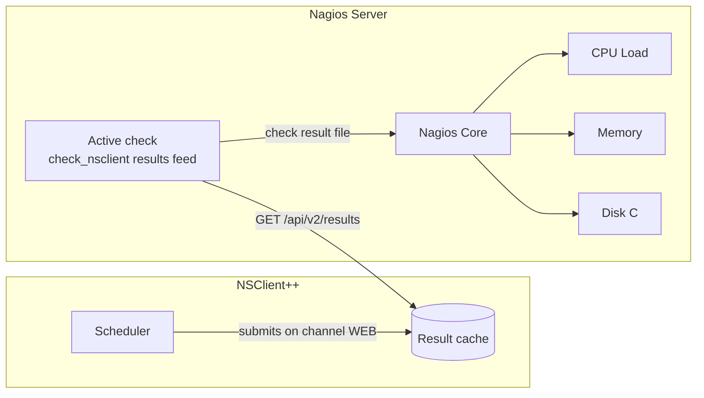

# Polled Passive Checks with Nagios Core

**Goal:** Let NSClient++ run its checks on a schedule, keep the results in the agent, and have Nagios Core collect all of them with a **single active check** that feeds them in as passive results — one connection per host instead of one per check, and no NSCA/NRDP daemon on the Nagios server.

<!-- @formatter:off -->
!!! tip
    This is the modern take on what `check_multi` used to do: one active check that fills in many passive services. Use it when a host has ten or twenty checks and you want the Nagios server to stop polling each one separately, or when the agent cannot push to the server (no NSCA/NRDP, no inbound route) but the server can reach the agent's REST API.
<!-- @formatter:on -->
---

## How It Works

Three parties take part:



1. The **Scheduler** runs `check_cpu`, `check_memory`, `check_drivesize`, ... at their intervals and submits the results on the `WEB` channel.
2. The **WEBServer** keeps the newest (or the worst, see below) result per check in its [result cache](../api/rest/results.md) and serves it over REST.
3. On the Nagios server one active check, `check_nsclient nsclient results feed`, polls the cache and writes every result into Nagios as a passive check result for the matching service.

The passive services in Nagios are plain services with active checks off and freshness checking on, exactly as for NSCA-style passive monitoring — only the transport differs.

---

## Prerequisites

On the **monitored host**, enable these modules in `nsclient.ini`:

```ini
[/modules]
WEBServer   = enabled   ; REST API and the result cache
Scheduler   = enabled   ; runs the checks on a timer
CheckSystem = enabled   ; check_cpu, check_memory, check_uptime, ...
CheckDisk   = enabled   ; check_drivesize
```

On the **Nagios server** you need:

* Nagios Core 3.x or 4.x with `accept_passive_service_checks=1` and `check_service_freshness=1` in `nagios.cfg`.
* [`check_nsclient`](https://github.com/mickem/check_nsclient) **1.1.0 or later**, the NSClient++ command line client, installed where Nagios can run it (for example `/usr/local/bin/check_nsclient`). The `results` commands used below are new in 1.1.0; that is the version bundled with the NSClient++ packages, so copying the binary off an agent of this release is one way to get it.
* Network access from the Nagios server to the agent's REST port (8443 by default).

---

## Step 1 — Enable the Result Cache

The cache is **off by default**. Turn it on and pick how results are kept:

```ini
[/settings/WEB/server/results]
enabled       = true
channel       = WEB
mode          = worst
clear on poll = true
```

| Setting         | Why this value                                                                                                                                         |
|-----------------|--------------------------------------------------------------------------------------------------------------------------------------------------------|
| `mode = worst`  | If a check went CRITICAL and recovered between two Nagios polls, the CRITICAL is still reported once instead of vanishing. With `last` Nagios only ever sees the newest result. |
| `clear on poll` | The default. Every poll reports what happened since the previous one, which is what makes `worst` mean "worst since Nagios last asked". Keep it unless several systems poll the same agent. |

Restart the service after this: `enabled` and `channel` are read when the web server starts, since a submission channel cannot be registered by a settings reload. The remaining settings take effect on a reload.

The full list of settings (key format, size and age bounds) is on the [Results API page](../api/rest/results.md#configuration).

### Create a user for the Nagios server

The `results.*` privileges are not part of any bundled role except `full`, so give Nagios its own role and user rather than the admin password:

```
nscp web add-role --role poller --grant results.list,results.get,login.get
nscp web add-user nagios --role poller --password "<strong password>"
```

`login.get` is what lets `check_nsclient` log in and refresh its API token; `results.list` is the poll itself. Nagios does not need `results.delete`.

---

## Step 2 — Schedule the Checks

Point the scheduler at the `WEB` channel and list the checks. The **schedule name becomes the alias** the result is cached under, and that alias is what Nagios will use as the service description — so name the schedules the way you want the services to be called:

```ini
[/settings/scheduler/schedules/default]
channel        = WEB
interval       = 1m
run on startup = true

[/settings/scheduler/schedules]
CPU Load = check_cpu
Memory   = check_memory
Disk C   = check_drivesize drive=c: warning=used>80% critical=used>90%
Uptime   = check_uptime
```

`run on startup = true` makes every check report right after a restart so Nagios is not left with stale results for a whole interval. Set the interval to what you would have used as the Nagios check interval.

<!-- @formatter:off -->
!!! note
    The `alias` of a schedule defaults to the schedule's name, so `CPU Load = check_cpu` is cached as `<host>/CPU Load`. A schedule defined in its own section (`[/settings/scheduler/schedules/CPU Load]`) behaves the same way.
<!-- @formatter:on -->

Restart NSClient++ and confirm results are arriving:

```
net stop nscp
net start nscp
curl -k -u nagios "https://localhost:8443/api/v2/results"
```

(Remember that this `curl` drains the cache when `clear on poll` is on; the scheduler refills it on the next interval.)

---

## Step 3 — Log the Nagios Server In

`check_nsclient` stores a profile per agent, with the credentials in the operating system's credential store. Nagios runs its checks as the `nagios` user, so the profile has to be created **as that user**:

```
sudo -u nagios check_nsclient nsclient auth login winsrv01 \
    --url https://winsrv01.example.com:8443 \
    --username nagios \
    --ca /etc/nagios/nsclient-ca.pem
Successfully logged in
```

Name the profile after the Nagios host (`winsrv01` here): the command definition below passes the host name straight through as the profile. Use `--insecure` instead of `--ca` only if you have decided not to validate the agent's certificate.

Check the cache is reachable from that user:

```
sudo -u nagios check_nsclient nsclient --profile winsrv01 results list
╭───────────────────┬─────────┬─────┬──────────────────────────────╮
│ key               │ result  │ age │ message                      │
├───────────────────┼─────────┼─────┼──────────────────────────────┤
│ winsrv01/CPU Load │ OK      │ 8   │ OK: CPU load is ok.          │
│ winsrv01/Disk C   │ WARNING │ 8   │ WARNING: C: 85% used         │
│ winsrv01/Memory   │ OK      │ 8   │ OK: memory within bounds     │
│ winsrv01/Uptime   │ OK      │ 8   │ OK: uptime: 12d 4:03         │
╰───────────────────┴─────────┴─────┴──────────────────────────────╯
```

<!-- @formatter:off -->
!!! warning "Credential store on a headless server"
    On Linux `check_nsclient` uses the Secret Service (for example `gnome-keyring`) to store the password and token. It must be available to the `nagios` user in the environment Nagios runs checks from, not just in your interactive shell. Test with `sudo -u nagios check_nsclient nsclient --profile winsrv01 ping` from that environment before going further; a `503` names the cache setting, a `403` names the missing privilege, and a keyring error points at this note.
<!-- @formatter:on -->

---

## Step 4 — Configure Nagios

### The command

```
define command {
    command_name    check_nsclient_results
    command_line    /usr/local/bin/check_nsclient nsclient --profile $ARG1$ results feed --nagios-host $HOSTNAME$ --spool-dir /usr/local/nagios/var/spool/checkresults
}
```

`--nagios-host $HOSTNAME$` files the results under the Nagios host object whatever the agent calls itself. `--spool-dir` writes one check result file per poll into Nagios's `check_result_path`, which is the cheapest way to hand Nagios many results at once. The alternative, `--command-file /usr/local/nagios/var/rw/nagios.cmd`, writes one external command per result and needs `check_external_commands=1`.

### The active feeder service

One per host. Its interval is how often Nagios collects:

```
define service {
    use                     generic-service
    host_name               winsrv01
    service_description     NSClient++ results
    check_command           check_nsclient_results!winsrv01
    check_interval          1
    retry_interval          1
}
```

This service is **OK when the feed worked**, regardless of what the fed checks reported — the passive services below carry their own states. It goes UNKNOWN when the agent cannot be reached, the cache is disabled, the user lacks a privilege or the spool directory cannot be written. Add `--worst` to the command if you would rather have it mirror the worst fed state.

### The passive services

One per schedule, named exactly like the schedule:

```
define service {
    use                     generic-service
    host_name               winsrv01
    service_description     CPU Load
    check_command           check_dummy!3!"No result received from NSClient++"
    active_checks_enabled   0
    passive_checks_enabled  1
    check_freshness         1
    freshness_threshold     300
}
```

Repeat for `Memory`, `Disk C` and `Uptime`. With freshness checking on, a service that has not received a result within `freshness_threshold` seconds gets its `check_command` run once, and `check_dummy` (part of the standard Nagios plugins) turns it UNKNOWN. Size the threshold as scheduler interval + feeder interval + headroom; here 60 s + 60 s + slack = 300 s.

Because the feed records each result with the time the agent produced it, freshness works even for a result that is re-fed: an old result stays old in Nagios.

### nagios.cfg

```
accept_passive_service_checks=1
check_service_freshness=1
check_result_path=/usr/local/nagios/var/spool/checkresults
```

Reload Nagios afterwards.

---

## Step 5 — Verify

Run the feed by hand first, as the `nagios` user and with `--dry-run`, which prints what would be submitted instead of submitting it:

```
sudo -u nagios check_nsclient nsclient --profile winsrv01 results feed --nagios-host winsrv01 --dry-run
[1757232000] PROCESS_SERVICE_CHECK_RESULT;winsrv01;CPU Load;0;OK: CPU load is ok.|'total 5m'=3%;80;90
[1757232000] PROCESS_SERVICE_CHECK_RESULT;winsrv01;Disk C;1;WARNING: C: 85% used|'C: %'=85%;80;90
[1757232000] PROCESS_SERVICE_CHECK_RESULT;winsrv01;Memory;0;OK: memory within bounds|'physical'=41%;80;90
[1757232000] PROCESS_SERVICE_CHECK_RESULT;winsrv01;Uptime;0;OK: uptime: 12d 4:03|'uptime'=1051380s;;;0
OK: Fed 4 result(s) to Nagios: 3 ok, 1 warning, 0 critical, 0 unknown [dry run]|fed=4 ok=3 warning=1 critical=0 unknown=0 stale=0
```

The host and service in each line must match the Nagios objects. Then let Nagios run the feeder service: within one interval the four passive services show their results, and the feeder service shows:

```
OK: Fed 4 result(s) to Nagios: 3 ok, 1 warning, 0 critical, 0 unknown|fed=4 ok=3 warning=1 critical=0 unknown=0 stale=0
```

A feed of `0 result(s)` between two scheduler intervals is normal with `clear on poll = true` — nothing new has happened since the last poll.

---

## Expected Output

| Situation                          | Feeder service                                   | Passive services                              |
|------------------------------------|--------------------------------------------------|-----------------------------------------------|
| Everything healthy                 | `OK: Fed 4 result(s) ...`                        | Each shows its own state and perf data        |
| Disk fills up                      | still `OK` (the feed worked)                     | `Disk C` goes WARNING/CRITICAL                |
| Agent stops (service down)         | `UNKNOWN: Failed to fetch results: ...`          | UNKNOWN once `freshness_threshold` expires    |
| Cache disabled on the agent        | `UNKNOWN: ... 503 ... Set enabled=true under /settings/WEB/server/results` | UNKNOWN after the threshold |
| User lacks `results.list`          | `UNKNOWN: ... 403 ...`                           | UNKNOWN after the threshold                   |
| A schedule is removed on the agent | still `OK`                                       | That one service goes UNKNOWN (stale)         |

---

## Customisation

**Service naming.** `--service` is a template, default `${alias-or-command}`. To prefix every service, use `--service "NSClient ${alias-or-command}"`; other variables are `${alias}`, `${command}`, `${host}`, `${source}`, `${channel}` and `${key}`.

**Several agents.** One profile and one feeder service per agent; the `$ARG1$` in the command keeps the definition shared. `results feed --host <name>` additionally filters on the host name the agent recorded, which matters only when one agent caches results for several hosts (for example an agent receiving NSCA submissions and forwarding them to the `WEB` channel).

**Only problems.** `--status warning,critical,unknown` feeds only non-OK results. Do this only with `clear on poll = false`, since a filtered poll never drains what it did not return and the OK results would otherwise pile up in the cache. Switch to `mode = last` as well — see the next bullet.

**Non-draining cache.** With `clear on poll = false` (several pollers, or a dashboard reading the same cache) every feed re-submits every result. Add `--max-age 600` so a check that stopped reporting is fed as UNKNOWN (`stale result, last reported ...`) instead of its last good state. Use `mode = last` here: with `worst` a recovery never replaces the problem it recovered from, and with nothing draining the cache a key that once went CRITICAL keeps being fed as CRITICAL until it is deleted or expires.

**Ad-hoc checks.** `check_and_forward` from CheckHelpers submits a single check into the cache without a schedule — handy to try a new check before adding it:

```
nscp client --boot --query check_and_forward --argument command=check_cpu --argument alias="CPU Load" --argument channel=WEB
```

**Inspecting the cache.** `results show winsrv01/Disk C` fetches one result without draining, `results delete <key>` drops a key that will never report again (a removed schedule), `results clear` resets the cache after maintenance.

---

## Next Steps

- [Results API](../api/rest/results.md) — every cache setting, the JSON fields, and the draining semantics
- [Reference: Scheduler](../reference/generic/Scheduler.md) — intervals, cron-style schedules, `run on startup`
- [Passive Monitoring (NSCA/NRDP)](passive-monitoring-nsca.md) — the push-based alternative when the agent can reach the server
- [Securing NSClient++](../setup/securing.md) — TLS certificates and per-user roles for the REST API
