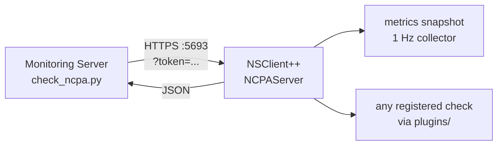

# Active Monitoring with NCPA

**Goal:** Configure NSClient++ to answer the Nagios Cross-Platform Agent (NCPA) API, so a Nagios Core or Nagios XI server can poll it with the stock `check_ncpa.py` plugin and the XI NCPA wizard — without replacing the agent or rewriting any check definitions.

<!-- @formatter:off -->
!!! tip
    NCPA is the right choice when your monitoring server already speaks it — an
    existing XI installation, or a fleet where some hosts run the Nagios agent
    and some run NSClient++. If you are starting fresh and the monitoring server
    can reach the agent directly, [NRPE](nrpe.md) is the more common pairing for
    NSClient++, and the [REST API](prometheus.md) is the richer one.
<!-- @formatter:on -->

---

## How NCPA Works

NCPA is **active, pull-style over HTTPS**: the monitoring server issues a `GET` to the agent on port `5693`, naming a node of the agent's tree and (for a check) the thresholds to apply. The agent runs the check locally and answers a small JSON document that the plugin turns into a Nagios result.



Two request shapes matter:

- **List mode** (`-l`) walks a subtree and answers it as JSON. This is what the XI wizard uses to discover what a host can report.
- **Check mode** (`-w` / `-c`) answers `{"returncode": 0, "stdout": "OK: ..."}`, which the plugin prints and exits with.

Authentication is a single shared **token** sent in the query string, over TLS.

---

## Prerequisites

Enable the `NCPAServer` module and give it a token:

```ini
[/modules]
NCPAServer = enabled

[/settings/NCPA/server]
token = a-long-random-shared-secret
allowed hosts = 192.168.0.10
```

Or activate from the command line:

```
nscp settings --activate-module NCPAServer --add-defaults
```

The server will not start without a TLS certificate — it refuses rather than putting the token on the wire in clear on every check. It defaults to the same `${certificate-path}/certificate.pem` the WEB server uses, so on a host that already runs the web server there is nothing to provide. To generate one:

```
nscp nrpe install --certificate ${certificate-path}/certificate.pem
```

<!-- @formatter:off -->
!!! warning "The token is the whole authentication story"
    There is no user name and no second factor: anyone who can reach port 5693
    with the token can run every check the `plugins` setting exposes. Use a long
    random value, keep `allowed hosts` narrowed to your monitoring servers, and
    rotate it through `backup token` rather than by editing `token` in place.
<!-- @formatter:on -->

---

## Step 1 — Check it from the command line

Fetch the whole tree to confirm the listener and the token:

```
check_ncpa.py -H 192.168.0.5 -t a-long-random-shared-secret -l
```

Then run a real check:

```
check_ncpa.py -H 192.168.0.5 -t a-long-random-shared-secret -M cpu/percent -w 80 -c 90
```

```
OK: Percent was 1.20 %, 0.80 %, 2.10 %, 0.40 % | 'percent_0'=1.20%;80;90; 'percent_1'=0.80%;80;90; 'percent_2'=2.10%;80;90; 'percent_3'=0.40%;80;90;
```

A few more that map straight onto what the agent already collects:

| What                   | Command                                                                   |
|------------------------|---------------------------------------------------------------------------|
| Memory in use          | `-M memory/virtual -w 80 -c 90`                                           |
| Swap in use            | `-M memory/swap -w 50 -c 80`                                              |
| Disk on `/`, in GiB    | `-M disk/logical/\| -u Gi -w 80 -c 90`                                    |
| Disk on `C:`           | `-M disk/logical/C:\| -w 80 -c 90`                                        |
| Interface throughput   | `-M interface/eth0 -w 10000000`                                           |
| Uptime                 | `-M system/uptime -w 300:`                                                |
| A service              | `-M services -q "service=sshd,status=running"`                            |
| Processes by name      | `-M processes -q "name=nginx" -w 1: -c 1:`                                |

<!-- @formatter:off -->
!!! note "Mount points are spelled with a pipe"
    NCPA encodes a mount point by replacing every run of slashes and backslashes
    with `|`, so `/` is `|`, `/var/log` is `|var|log` and `C:\` is `C:|`. The
    pipe needs escaping in most shells.
<!-- @formatter:on -->

---

## Step 2 — Reach every NSClient++ check through `plugins/`

The `plugins` node is what makes this more than a compatibility shim: it exposes every registered check, alias and external script by name, and returns its output unchanged.

```
check_ncpa.py -H 192.168.0.5 -t a-long-random-shared-secret -M plugins/check_uptime
```

To pass arguments you must opt in, because a caller that can shape a check's arguments can ask the agent rather more than you meant to offer:

```ini
[/settings/NCPA/server]
allow arguments = true
```

Each `-a` token then becomes one path segment and reaches the check as one `key=value` token:

```
check_ncpa.py -H 192.168.0.5 -t <token> -M plugins/check_drivesize -a "drive=C: warning=used>80% critical=used>90%"
```

If you would rather not open that up, narrow what is callable instead and leave arguments off:

```ini
[/settings/NCPA/server]
plugins = check_uptime,check_eventlog_errors,check_backup_ran
allow arguments = false
```

—where the last two are [external scripts](external-scripts.md) or [aliases](nrpe.md) you defined with the arguments already baked in. That combination gives the monitoring server exactly the checks you chose and no way to vary them.

---

## Step 3 — Define the checks in Nagios Core

```
define command {
    command_name    check_ncpa
    command_line    $USER1$/check_ncpa.py -H $HOSTADDRESS$ -t '$USER100$' $ARG1$
}

define service {
    use                     generic-service
    host_name               nsclient-host
    service_description     CPU Usage
    check_command           check_ncpa!-M cpu/percent -w 80 -c 90 -q aggregate=avg
}

define service {
    use                     generic-service
    host_name               nsclient-host
    service_description     Memory Usage
    check_command           check_ncpa!-M memory/virtual -w 80 -c 90
}

define service {
    use                     generic-service
    host_name               nsclient-host
    service_description     Disk Usage
    check_command           check_ncpa!-M disk/logical/\| -w 80 -c 90
}

define service {
    use                     generic-service
    host_name               nsclient-host
    service_description     SSH Service
    check_command           check_ncpa!-M services -q "service=sshd,status=running"
}
```

Put the token in a resource macro (`$USER100$` in `resource.cfg`) rather than in the service definitions — `resource.cfg` is not world-readable and is not included in the config Nagios serves through its web interface.

`-q aggregate=avg` on the CPU check collapses the per-core list to one average, which is usually what you want on a many-core machine: without it a single busy core makes the whole check CRITICAL.

---

## Step 4 — Nagios XI, via the NCPA wizard

The XI **NCPA** configuration wizard works against this agent unchanged:

1. **Configure → Run a configuration wizard → NCPA.**
2. Enter the agent's address and the token. The wizard fetches `/api` and lists what the host reports.
3. Pick the metrics you want. CPU, memory, disk, interfaces, services and processes all appear, and each becomes a service using the same `check_ncpa` command as above.
4. Finish and apply.

The wizard reads `system/agent_version` to decide what the agent supports. The node is always present, even with `expose version = false` — that setting answers a placeholder rather than removing the node, so discovery keeps working when you would rather not publish the exact build.

---

## Running NCPA and the REST API side by side

`NCPAServer` is a separate module with its own port, its own token and its own allow-list, so it does not require the WEB server and does not expose it. Enabling both is the normal arrangement on a host that is polled by Nagios and scraped by Prometheus:

```ini
[/modules]
NCPAServer = enabled
WEBServer = enabled

[/settings/NCPA/server]
token = a-long-random-shared-secret
allowed hosts = 192.168.0.10

[/settings/WEB/server]
port = 8443
allowed hosts = 192.168.0.20
```

Both default to the same certificate, so one certificate serves both listeners.

---

## Troubleshooting

| Symptom                                                              | Cause                                                                                                        |
|----------------------------------------------------------------------|---------------------------------------------------------------------------------------------------------------|
| `CRITICAL: Incorrect credentials given.`                             | Wrong token, or no `token` configured on the agent. The agent log says which.                                  |
| `UNKNOWN: An error occurred connecting to API. (HTTP error: '403')`  | The caller's address is not in `allowed hosts`, or it has been rate-limited after repeated bad tokens.         |
| The server never starts and the log mentions the certificate         | No TLS certificate at the configured path. Provide one, or set `allow insecure = true` to accept cleartext.    |
| `UNKNOWN: The node (...) requested does not exist.`                  | A path typo, or a node whose data the agent has not collected yet — the collector needs a second after start.  |
| `UNKNOWN: Arguments are not allowed.`                                | `-a` was used while `allow arguments = false`.                                                                 |
| A check returns 0 for everything right after a restart               | Expected for `-d` (delta) checks: the first poll has no previous sample to difference against.                 |

Turn on the chatty log levels while debugging:

```ini
[/settings/NCPA/server/log]
info = true
debug = true
```

---

## See Also

- [Active Monitoring with NRPE](nrpe.md) — the other active-check protocol
- [External Scripts](external-scripts.md) — what `plugins/` exposes beyond the built-in checks
- [Prometheus Scraping](prometheus.md) — the REST API on the same agent
