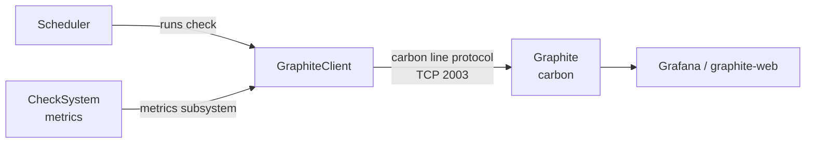

# Passive Monitoring with Graphite

**Goal:** Have NSClient++ push performance data and system metrics to a
[Graphite](https://graphiteapp.org/) (carbon) backend for graphing and
trending — on the agent's own schedule, without the monitoring server polling
each machine.

<!-- @formatter:off -->
!!! tip "Graphite vs. NSCA / NRDP / Prometheus"
    Graphite is a **time-series / graphing** backend, not a Nagios-style
    alerting server. Pick by what you actually want:

    - **Graphite** — push numeric perfdata + system metrics for dashboards and
      trending (Grafana, graphite-web). *(this page)*
    - **NSCA / NSCA-NG / NRDP** — push pass/warn/crit check *results* to a
      Nagios/Icinga core for alerting.
      [NSCA scenario](passive-monitoring-nsca.md).
    - **Prometheus** — let Prometheus *scrape* the agent instead of the agent
      pushing. [Prometheus scenario](prometheus.md).

    Graphite and an alerting protocol are not mutually exclusive — the
    Scheduler can fan the same check out to several channels at once.
<!-- @formatter:on -->

---

## How Graphite Submission Works

Graphite's carbon receiver speaks a trivial **plaintext line protocol** over
TCP (default port `2003`): one metric per line, `path value timestamp`. There
is no handshake, no acknowledgement, and no authentication — the agent simply
opens a TCP connection and writes lines.

NSClient++ pushes two distinct kinds of data into Graphite:



1. **Check perfdata & status** — the Scheduler runs a check and reports the
   result to the `GRAPHITE` channel; GraphiteClient turns each perfdata value
   into a metric line (and, optionally, the status code into its own line).
2. **System metrics** — `CheckSystem` produces CPU / memory / etc. metrics
   that the core metrics subsystem hands to GraphiteClient automatically on a
   timer. No scheduler entry is needed for these.

<!-- @formatter:off -->
!!! warning "Carbon is unauthenticated cleartext"
    The carbon plaintext protocol has no encryption and no authentication —
    anyone who can reach port `2003` can write arbitrary metrics. Treat it like
    any other internal telemetry sink: keep it on a trusted network segment and
    firewall the port to your agents. Do not expose carbon to the public
    internet. NSClient++ can encrypt its side of the link with TLS to a
    TLS-terminating proxy — see [Encrypting the connection with TLS](#encrypting-the-connection-with-tls).
<!-- @formatter:on -->

---

## Prerequisites

Enable these modules in `nsclient.ini`:

```ini
[/modules]
CheckSystem    = enabled   ; produces system metrics + check_cpu / check_memory
Scheduler      = enabled   ; runs checks on a timer
GraphiteClient = enabled   ; pushes metrics/perfdata to carbon
```

You also need a Graphite/carbon instance reachable on its plaintext port
(`2003` by default). For a quick local trial you can run the upstream image:

```
docker run -d --name graphite -p 2003:2003 -p 8080:80 graphiteapp/graphite
```

Carbon then listens on `2003` (line protocol) and graphite-web on `8080`.

---

## Step 1 — Verify the Connection

Before wiring up the scheduler, push a single test result from the agent:

```
nscp graphite --host <graphite-server> --port 2003 ^
    --command "test_metric" ^
    --result 0 ^
    --message "hello from NSClient++"
```
<!-- @formatter:off -->
!!! note
    The `^` is the Windows **Command Prompt** line-continuation character. In
    PowerShell use a backtick (`` ` ``) instead, or put it on one line.
<!-- @formatter:on -->

Because carbon never acknowledges anything, a "success" from the agent only
means the bytes were written to the socket. To actually *see* what arrived,
run a throwaway listener on the carbon host while you submit:

```
nc -lk 2003
```

You should see a line like:

```
nsclient.my-windows-host.test_metric.status 0 1714973400
```

If nothing arrives, the connection isn't reaching carbon — check `address` /
`port`, firewalls, and that carbon's line receiver is actually enabled.

---

## Step 2 — Configure the Target

```ini
[/settings/graphite/client/targets/default]
address       = <graphite-server>:2003
; --- what to send ---
send perfdata = true    ; emit a line per perfdata value (default true)
send status   = true    ; emit the numeric status code as its own line (default true)
; --- where to put it (Graphite path templates) ---
path          = nsclient.${hostname}.${check_alias}.${perf_alias}
status path   = nsclient.${hostname}.${check_alias}.status
metric path   = nsclient.${hostname}.${metric}
timeout       = 30
```

`address` accepts `host:port`; you can also split it into separate `host` and
`port` keys. The port defaults to `2003`.

### Path templates

Graphite organises everything into a dotted hierarchy. The three path
templates control where each kind of data lands. Keep the leading segment
(`nsclient.` above) consistent so all agents land under one subtree.

| Setting       | Used for                              | Default                                             |
|---------------|---------------------------------------|-----------------------------------------------------|
| `path`        | one line per check **perfdata** value | `nsclient.${hostname}.${check_alias}.${perf_alias}` |
| `status path` | the check's numeric **status** code   | `nsclient.${hostname}.${check_alias}.status`        |
| `metric path` | **system metrics** from CheckSystem   | `nsclient.${hostname}.${metric}`                    |

| Variable         | Expands to                                                |
|------------------|-----------------------------------------------------------|
| `${hostname}`    | the sending host (see [Step 5](#step-5-set-the-hostname)) |
| `${check_alias}` | the schedule alias / check name                           |
| `${perf_alias}`  | the perfdata label (e.g. `load`, `used`)                  |
| `${metric}`      | the dotted metric key, e.g. `system.cpu.core_0.total`     |

<!-- @formatter:off -->
!!! note "Characters that aren't valid in a Graphite path"
    Spaces, newlines, `;`, `(`, `)`, `[`, `]`, `%`, and `\` are scrubbed to
    keep one metric per line and avoid carbon's tag separator — a check alias
    of `CPU Load` becomes `CPU_Load`, and `%` becomes `percent`. Pick aliases
    that read well after scrubbing.
<!-- @formatter:on -->

### Encrypting the connection with TLS

Carbon's line receiver is plaintext, so the encryption is done by a
**TLS-terminating proxy in front of carbon** — `stunnel`, `nginx stream`, or
`carbon-relay-ng` (which has native TLS ingest). The agent connects with TLS to
the proxy; the proxy decrypts and forwards plaintext to carbon on localhost.

NSClient++ can be the TLS client side of that link:

```ini
[/settings/graphite/client/targets/default]
address     = graphite.example.com:2003
ssl         = true                       ; off by default
verify mode = peer-cert                  ; validate the server cert chain + hostname
ca          = ${certificate-path}/ca.pem ; CA that signed the proxy's cert
; --- optional, for mutual TLS if the proxy requires a client cert ---
; certificate     = ${certificate-path}/agent.pem
; certificate key = ${certificate-path}/agent.key
```

<!-- @formatter:off -->
!!! warning "Verification is on by default — and fails closed"
    When `ssl = true`, `verify mode` defaults to `peer`, so the proxy's
    certificate chain **and** hostname are checked against `ca`. If the chain or
    hostname doesn't verify, the agent refuses to send (it does not fall back to
    plaintext). Set `verify mode = none` only for throwaway testing — it accepts
    any certificate and re-opens the MITM hole TLS was meant to close.
<!-- @formatter:on -->

A minimal `stunnel` server config that fronts a local carbon:

```ini
[graphite-tls]
accept  = 2003
connect = 127.0.0.1:2013     ; carbon's real plaintext line receiver
cert    = /etc/stunnel/graphite.pem
```

(Point carbon's `LINE_RECEIVER_PORT` at `2013` so `2003` is the TLS front door.)

---

## Step 3 — Configure the Scheduler

The Scheduler runs your checks and reports each result to a **channel**. Point
that channel at `GRAPHITE` (GraphiteClient's default channel).

```ini
[/settings/scheduler/schedules/default]
channel  = GRAPHITE   ; send results to GraphiteClient
interval = 1m         ; how often to run each check
report   = all        ; push regardless of status (OK / WARN / CRIT)

[/settings/scheduler/schedules]
; Format: alias = check_command [arguments...]
cpu    = check_cpu
memory = check_memory
disk_c = check_drivesize drive=C: "warn=free < 20%" "crit=free < 10%"
```

Each schedule's alias becomes the `${check_alias}` segment of the metric path,
and every perfdata value the check emits becomes its own metric line under it —
so `check_cpu` lands at `nsclient.<host>.cpu.<perf_alias>` for each load
window.

<!-- @formatter:off -->
!!! note
    `report = all` matters here: with the default narrower filter, an OK check
    would not be pushed and your graphs would only get data points when
    something is wrong. For trending you almost always want `all`.
<!-- @formatter:on -->

For cron-style schedules, real-time channels (CheckEventLog / CheckLogFile),
short-form vs. long-form, and per-schedule overrides see
[Passive Monitoring → Step 2 — Configure the Scheduler](passive-monitoring-nsca.md#step-2-configure-the-scheduler).
The scheduler machinery is shared; only the `channel` differs.

---

## Step 4 — System Metrics (no scheduler entry needed)

Separately from scheduled checks, NSClient++ has an internal **metrics
subsystem**: modules like `CheckSystem` continuously *produce* metrics (CPU
per core, physical/cached/swap memory, …), and GraphiteClient *consumes* them.
Once both modules are loaded and a target is configured, these flow to carbon
automatically — you do **not** add them to the Scheduler.

The push cadence is the core metrics interval:

```ini
[/settings/core]
metrics interval = 10s    ; default; how often collected metrics are flushed
```

These land on the `metric path`, e.g.:

```
nsclient.my-host.system.cpu.core_0.total 7 1714973400
nsclient.my-host.system.mem.physical.used 5123456789 1714973400
```

If you only want scheduled-check perfdata and not the firehose of system
metrics, simply don't load `CheckSystem` (or load it only for the specific
`check_*` commands you schedule).

---

## Step 5 — Set the Hostname

NSClient++ stamps every metric path with the sending host. By default it uses
the computer name, which may not be how you want it keyed in Graphite.

```ini
[/settings/graphite/client]
hostname = auto                       ; computer name (default)
; hostname = win-server-01            ; or a fixed value
; hostname = ${host_lc}.${domain_lc}  ; or built from system variables
```

| Variable       | Meaning                            |
|----------------|------------------------------------|
| `${host}`      | computer name (mixed case)         |
| `${host_lc}`   | lowercase                          |
| `${host_uc}`   | uppercase                          |
| `${domain}`    | domain name                        |
| `${domain_lc}` | domain lowercase                   |
| `${domain_uc}` | domain uppercase                   |

Dots in the hostname become Graphite hierarchy separators, so
`${host_lc}.${domain_lc}` nests each host under its domain in the tree.

---

## Step 6 — Restart NSClient++

```
net stop nscp
net start nscp
```

On Linux:

```
sudo systemctl restart nscp
```

Within one scheduler interval (and one `metrics interval` for system metrics)
the agent starts writing to carbon, and the new metrics appear in the Graphite
tree.

---

## Complete Configuration Example

```ini
[/modules]
CheckSystem    = enabled
Scheduler      = enabled
GraphiteClient = enabled

[/settings/core]
metrics interval = 10s

[/settings/graphite/client]
hostname = ${host_lc}.${domain_lc}

[/settings/graphite/client/targets/default]
address       = 10.0.0.5:2003
send perfdata = true
send status   = true
path          = nsclient.${hostname}.${check_alias}.${perf_alias}
status path   = nsclient.${hostname}.${check_alias}.status
metric path   = nsclient.${hostname}.${metric}

[/settings/scheduler/schedules/default]
channel  = GRAPHITE
interval = 1m
report   = all

[/settings/scheduler/schedules]
cpu    = check_cpu
memory = check_memory
disk_c = check_drivesize drive=C: "warn=free < 20%" "crit=free < 10%"
```

---

## Troubleshooting

Graphite submission is fire-and-forget — the agent doesn't get an
acknowledgement, so a misconfigured client looks fine from NSClient++'s side
and silent on the carbon side. Work from the wire inward:

1. **Listen on the carbon host.** Stop carbon briefly (or use a spare port)
   and run `nc -lk 2003`, then submit with `nscp graphite --host ...`. If lines
   appear here but not in graphite-web, the problem is carbon/whisper
   retention, not NSClient++.
2. **Run the agent in test mode** to watch the client side as the scheduler
   fires:
   ```
   net stop nscp
   nscp test
   ```
   Trace lines show each connection and the metric lines being written.
3. **No data points until something breaks?** You left `report` at its
   narrower default — set `report = all` so OK results are pushed too.
4. **Metrics land under the wrong tree / weird names?** Check the `${hostname}`
   expansion and remember the path scrubbing (spaces → `_`, `%` → `percent`).
   A `check_alias` with spaces is the usual surprise.
5. **System metrics missing but scheduled perfdata works?** `CheckSystem` must
   be loaded (it's the producer) and `metrics interval` must have elapsed at
   least once.

---

## Visualizing the Data

Graphite stores the series; you graph them with **graphite-web** (bundled) or,
more commonly, **Grafana** pointed at the Graphite data source. Your agents'
metrics live under whatever prefix you chose, e.g. `nsclient.*`:

```
nsclient.win-server-01.cpu.load
nsclient.win-server-01.system.mem.physical.used
```

Use Graphite functions (`scale`, `summarize`, `nonNegativeDerivative`, …) or
Grafana transformations to turn the raw series into the dashboards you want.

---

## Next Steps

- [Prometheus Scraping](prometheus.md) — the pull-based alternative for metrics.
- [Passive Monitoring (NSCA/NRDP)](passive-monitoring-nsca.md) — push pass/warn/crit
  *results* to a Nagios/Icinga core for alerting (can run alongside Graphite).
- [Reference: GraphiteClient](../reference/client/GraphiteClient.md) — every
  setting in detail.
- [Reference: Scheduler](../reference/generic/Scheduler.md) — full scheduler reference.
