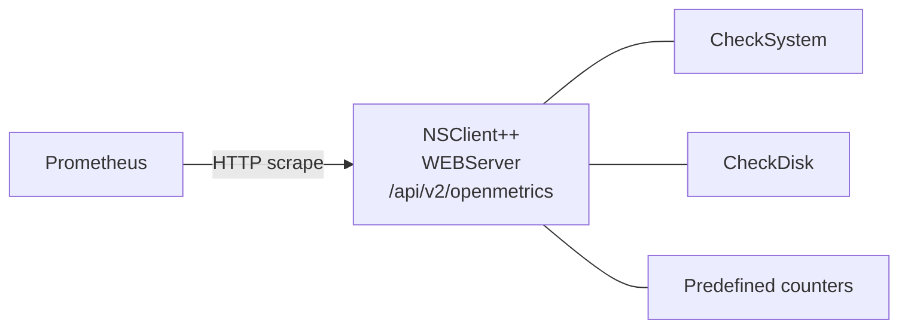

# Exposing Metrics to Prometheus

**Goal:** Let a Prometheus server scrape NSClient++'s built-in metrics (CPU,
memory, uptime, network, temperature, predefined performance counters, …) so
they appear alongside everything else in Grafana / Alertmanager.

This works the same on **Windows and Linux** — the same modules, endpoint,
user/role setup and scrape configuration apply on both. The platforms differ
only in which metric families they emit (see
[Available Metrics](#available-metrics) below).

This scenario is the **inverse** of the rest of the integration scenarios:
NRPE/NSCA/NRDP/Icinga 2 *send check results* to a monitoring server, but
Prometheus *scrapes raw metrics* on its own schedule. The two patterns are
complementary — you can run both on the same agent.

---

## How It Works

NSClient++'s `WEBServer` module exposes an OpenMetrics endpoint at:

```
GET https://<agent>:8443/api/v2/openmetrics
```

Authenticated requests return the current metrics as an OpenMetrics text
exposition. Prometheus is configured to scrape that URL on its usual interval
(15s, 30s, 1m, …).



Metrics are aggregated by `WEBServer` from whichever modules happen to be
loaded — load `CheckSystem` to get CPU/memory/uptime/network, load `CheckDisk`
to add drive metrics, and so on.

---

## Prerequisites

```ini
[/modules]
WEBServer   = enabled    ; serves the /api/v2/openmetrics endpoint
CheckSystem = enabled    ; provides CPU / memory / uptime / network metrics
CheckDisk   = enabled    ; (optional) drive metrics
```

You also need:

- A reachable IP/hostname and TCP `8443` open from the Prometheus server.
- Credentials for the scrape (see Step 2 below).

---

## Step 1 — Enable the Web Server

If you haven't already, run the helper:

```
nscp web install
```

This sets a password, opens `8443` from `127.0.0.1`, and writes the role
configuration. Restart the service:

```
nsclient service --restart
```

For the full setup (TLS certificate, custom port, allowed hosts), see
[Web Interface](../setup/web-interface.md) — the Prometheus endpoint shares
the same web server, so anything that page covers applies here too.

---

## Step 2 — Create a Scrape User

Reading the OpenMetrics endpoint requires the `openmetrics.list` grant. The
built-in `full` role has `*` (everything), so the `admin` user can scrape
without further configuration — but a dedicated user is better practice.

The WEB module ships a `metrics` role for exactly this
(`public,metrics.list,openmetrics.list,login.get`): it reads
`/api/v2/openmetrics` and `/api/v2/metrics` and can do nothing else — in
particular it cannot run checks.

```ini
[/settings/WEB/server/users/prometheus]
role     = metrics
password = <strong-random-password>
```

Or from the command line:

```commandline
$ nscp web add-user prometheus --role metrics --password "<strong-random-password>"
```

A monitoring server that both runs checks and scrapes can use `monitoring`
instead, which holds the two metrics grants as well.

Restart NSClient++ for the new user to take effect.

---

## Step 3 — Verify the Endpoint

From the agent (or anywhere allowed to reach it):

```
curl -k -u prometheus:<password> https://<agent>:8443/api/v2/openmetrics
```

Expected output is an OpenMetrics document: a `# TYPE` line per family, one
`<name> <value>` sample per line, and a closing `# EOF`. On a Windows host:

```text
# TYPE system_mem_commited_avail gauge
system_mem_commited_avail 12592123904
# TYPE system_mem_commited_total gauge
system_mem_commited_total 17175158784
# TYPE system_mem_commited_percent gauge
system_mem_commited_percent 73
# TYPE system_cpu_total_idle gauge
system_cpu_total_idle 95
# TYPE system_cpu_core_0_idle gauge
system_cpu_core_0_idle 93
# TYPE system_uptime_ticks_raw gauge
system_uptime_ticks_raw 84135
# EOF
```

On a Linux host:

```text
# TYPE system_cpu_total_idle gauge
system_cpu_total_idle 97.8293
# TYPE system_cpu_total_user gauge
system_cpu_total_user 1.19519
# TYPE system_mem_physical_total gauge
system_mem_physical_total 16554000000
# TYPE system_mem_swap_percent gauge
system_mem_swap_percent 26
# TYPE system_network_eth0_received gauge
system_network_eth0_received 343
# EOF
```

Metric names are rewritten to the OpenMetrics grammar: `.` and any other
character outside `[a-zA-Z0-9_]` becomes `_`, a run of them collapses to one,
`%` becomes the word `percent`, and a name that would not start with a letter
borrows a `metric_` prefix. The mapping is deterministic, so the same reading
always lands on the same series. See the [REST metrics
reference](../api/rest/metrics.md#metric-names) for the full table.

If you get HTTP 401, the credentials or role grant are wrong; if you get a
TLS error, see "TLS / self-signed certificate" below.

---

## Step 4 — Configure Prometheus

Add a scrape job to `prometheus.yml`:

```yaml
scrape_configs:
  - job_name: nsclient
    scrape_interval: 30s
    metrics_path: /api/v2/openmetrics
    scheme: https
    tls_config:
      # NSClient++ generates a self-signed cert by default. Either point
      # `ca_file` at the CA you used for `nscp web install --certificate`,
      # or set `insecure_skip_verify: true` for a quick start (not for
      # production).
      insecure_skip_verify: true
    basic_auth:
      username: prometheus
      password: <strong-random-password>
    static_configs:
      - targets:
          - win-server-01.example.com:8443
          - linux-server-01.example.com:8443
```

Windows and Linux agents can share the same scrape job — the endpoint, port
and authentication are identical.

Reload Prometheus and check **Status → Targets** — the job should go green
within one scrape interval.

---

## Available Metrics

The exact set depends on which modules are loaded and on the platform.
Available on **both platforms** from `CheckSystem`:

| Family prefix              | Examples                                                                         |
|----------------------------|----------------------------------------------------------------------------------|
| `system_cpu_*`             | `system_cpu_total_idle`, `..._user`, `..._kernel`, plus per-core variants        |
| `system_mem_*`             | families differ per platform — see below                                        |
| `system_uptime_*`          | `system_uptime_ticks_raw`, `system_uptime_boot_raw`                              |
| `system_network_<nic>_*`   | `received`, `sent`, `total` (bytes/s per interface)                              |
| `system_temperature_*`     | thermal sensors (WMI/ACPI on Windows, sysfs thermal/hwmon on Linux)              |
| `system_battery_*`         | charge/health, on machines that have a battery                                   |
| `system_cpu_frequency_*`   | current/max clock per core, where exposed                                        |
| `system_process_history_*` | per-executable `times_seen` / `currently_running` (opt-in, below)                |

Add `CheckDisk` (either platform) and you also get `disk_io_<device>_*`
(throughput, IOPS, queue length, busy time) and `disk_free_<drive>_*`
(total/free/used and percentages).

The instance (the NIC, drive or executable) is part of the family name, not a
label, so each one is its own metric family. A Grafana variable or a `sum by
(...)` over them is not possible yet.

Platform differences to be aware of:

- **Memory families** follow what the OS exposes: Windows publishes
  `commited` / `physical` / `page` / `virtual`, Linux publishes `physical` /
  `cached` / `swap`.
- **Per-core CPU naming**: Linux normalises core names to `core_0`, `core_1`,
  …; Windows names them `core 0` (with a space). The space is rewritten on the
  OpenMetrics endpoint, so both platforms scrape as `system_cpu_core_0_*`; the
  JSON endpoints still show the platform's own spelling.
- **PDH counters** (`system_metrics_*`) are Windows-only: predefine them in
  `[/settings/system/windows/counters/<name>]` (see
  [Performance Counter (PDH) Monitoring](counters.md)) and they appear on the
  endpoint automatically. There is no Linux equivalent.
- **Process history** is opt-in on both platforms — set
  `process history = true` under `[/settings/system/windows]` or
  `[/settings/system/unix]` respectively.
- **Hardware metrics** (temperature, battery, CPU frequency) depend on what
  the host exposes: virtual machines and WSL typically publish none, which is
  normal.

---

## Common Gotchas

### Metric names changed in 0.22

Up to 0.21 the endpoint emitted the JSON keys verbatim, so names carried dots,
spaces and colons (`system_mem_commited.avail`, `system_cpu_core 0.idle`) and
the documented workaround was to rewrite them with `metric_relabel_configs`.
The agent does that itself now, by the rules above, so **drop any
`metric_relabel_configs` block that was rewriting dots** — it no longer matches
anything, and a rule that rewrote `(.*)\.(.*)` to `${1}_${2}` is exactly what
the agent already applied.

A dashboard, recording rule or alert written against the old names does need
updating. To buy time for that, put the old body back:

```ini
[/settings/WEB/server]
openmetrics format = legacy
```

This reproduces the pre-0.22 exposition byte for byte. It is deprecated and
will be removed in a future release, so treat it as a migration window rather
than a setting to leave in place.

### TLS / self-signed certificate

Out of the box `nscp web install` generates a self-signed certificate.
Production options:

- Point Prometheus' `ca_file` at your internal CA and replace the cert with
  one signed by it (the `nscp web install --certificate ...` flag, or the
  cert-management UI in the web interface).
- Or use `insecure_skip_verify: true` in `tls_config` — fast to set up but
  doesn't authenticate the agent. Acceptable on a private network you trust;
  not on the open internet.

### `allowed hosts` blocks the scrape

Without an explicit allow list, the WEBServer accepts only `127.0.0.1`. If
Prometheus runs on a different host, add it:

```ini
[/settings/default]
allowed hosts = 127.0.0.1, 10.0.0.0/24
```

Or per-module under `[/settings/WEB/server]`.

### No `# HELP` lines, and `promtool` still warns

Every family carries a `# TYPE ... gauge` line and the body ends with `# EOF`,
so the document parses as OpenMetrics 1.0. What is still missing is the
descriptive metadata: no module declares a help text or a unit for its metrics
yet, so no `# HELP` or `# UNIT` lines are emitted and everything is typed as a
gauge — including the handful of readings that are really monotonic counters.

That has one visible consequence. `promtool check metrics` lints naming
conventions as well as syntax, and a gauge whose key already ends in `total` or
`count` (`system_network_eth0_total`, `system_os_updates_count`) carries a
suffix reserved for counters and summaries, so it reports one warning per such
family. Prometheus itself scrapes them without complaint. Typing those metrics
as counters is what clears the warnings, and that arrives with the metadata
work rather than with a rename it would immediately undo.

### Strings are skipped

Some bundles include string-typed entries (e.g. `system_uptime_uptime` is the
human-readable "1d 12:30"). These don't appear on the OpenMetrics endpoint —
only numeric gauges do. Use the JSON `/api/v2/metrics` endpoint if you need
the strings.

---

## Next Steps

- [Web Interface](../setup/web-interface.md) — full WEBServer setup including
  TLS, port, and user/role management.
- [Performance Counter (PDH) Monitoring](counters.md) — predefine custom PDH
  counters; they appear on the OpenMetrics endpoint automatically.
- [REST API](../api/rest/index.md) — the same web server also exposes
  `/api/v2/queries`, `/api/v2/metrics` (JSON), logs, and module management.
- [Reference: WEBServer](../reference/generic/WEBServer.md) — every web
  server setting in detail.
