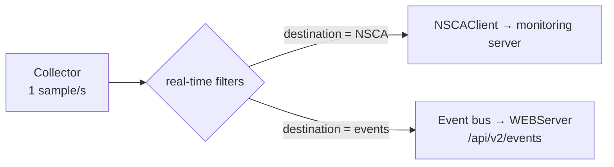

# Real-Time System Monitoring

**Goal:** React to CPU, memory, and process conditions the moment they occur —
without waiting for the monitoring server's next polling interval — by letting
NSClient++ evaluate filters continuously and push a message only when
something matches.

Real-time checks are supported on **Windows and Linux** with the same
configuration keys, filter language, and destinations. The only difference is
the settings path: `[/settings/system/windows/...]` on Windows,
`[/settings/system/unix/...]` on Linux.

---

## How It Works

The `CheckSystem` module runs a background collector that samples the system
once per second. Real-time filters are evaluated against every sample; when a
filter matches, the result is sent to the configured `destination` — a
passive-monitoring channel (NSCA, NRDP, …) or the internal event bus.



Three filter families are available on both platforms:

| Section              | Evaluates                          | Useful keywords                          |
|----------------------|-------------------------------------|-------------------------------------------|
| `real-time/cpu`      | CPU load over a time window         | `load`, `core`, `time`                   |
| `real-time/memory`   | memory usage per type               | `used`, `free`, `size`, `type`           |
| `real-time/process`  | every running (matched) process     | `exe`, `state`, resource columns         |

Windows additionally has `real-time/checks` (legacy generic filters) and the
separate real-time Event Log monitoring covered in
[Event Log Monitoring](event-log.md).

---

## Prerequisites

```ini
[/modules]
CheckSystem = enabled    ; the collector + real-time filters
NSCAClient  = enabled    ; if sending to a monitoring server (or NRDP, …)
WEBServer   = enabled    ; if using destination = events (REST)
```

---

## Example 1 — Alert When CPU Is High for 5 Minutes

The section entry's value is the filter expression; the child section holds
the details. On Linux:

```ini
[/settings/system/unix/real-time/cpu]
high_cpu = load > 80

[/settings/system/unix/real-time/cpu/high_cpu]
time        = 5m
destination = NSCA
```

On Windows the same filter lives under
`[/settings/system/windows/real-time/cpu]` /
`[.../real-time/cpu/high_cpu]` — everything else is identical.

`time` selects the averaging window (default `1m`); the filter fires when the
average load over that window exceeds 80%. Use `times = 1m, 5m, 15m` to
evaluate several windows from one filter.

---

## Example 2 — Alert on Low Memory

```ini
[/settings/system/unix/real-time/memory]
low_memory = used > 90%

[/settings/system/unix/real-time/memory/low_memory]
destination = NSCA
```

By default the `physical` memory type is evaluated. On Linux, `type` can be
`physical`, `cached`, or `swap`; on Windows the families follow what the OS
exposes (physical, committed, …):

```ini
[/settings/system/unix/real-time/memory/low_memory]
types       = physical, swap
destination = NSCA
```

---

## Example 3 — Watch Specific Processes

Process filters evaluate every **running** process each second, optionally
restricted to a named set:

```ini
[/settings/system/unix/real-time/process]
watch_backup = exe like 'backup'

[/settings/system/unix/real-time/process/watch_backup]
processes   = backup-job, rsync
destination = NSCA
```

On Windows, list the executable names including the extension
(`processes = backup-job.exe, rsync.exe`).

<!-- @formatter:off -->
!!! note
    A process that is **not** running produces no rows, so a real-time
    process filter cannot by itself alert on a *missing* process. For
    "alert when X died", schedule a regular `check_process` (which
    synthesizes not-running rows) via the Scheduler +
    [passive monitoring](passive-monitoring-nsca.md) instead.
<!-- @formatter:on -->

---

## Destination: The Event Bus (REST)

Instead of a monitoring channel, `destination = events` publishes each match
on the internal event bus. The WEBServer buffers those events and serves them
on the REST API — handy for dashboards or for scraping recent incidents
without a full passive-monitoring pipeline:

```ini
[/settings/system/unix/real-time/cpu]
rt_cpu = load > 80

[/settings/system/unix/real-time/cpu/rt_cpu]
destination = events
```

```
curl -k -H "Authorization: Bearer <key>" https://<agent>:8443/api/v2/events
```

```json
[
  {
    "index": 4412,
    "event": "system.cpu:rt_cpu",
    "date": "2026-Jul-03 13:34:02",
    "data": { "core": "total", "load": "93", "time": "1m", "user": "80", "kernel": "13", "idle": "7" }
  }
]
```

Events are named `<family>:<alias>` (`system.cpu`, `system.memory`,
`system.process`). `DELETE /api/v2/events` drains the buffer (get-and-clear).

---

## Tuning

All filter families share these keys in the child section:

| Key             | Purpose                                                                  |
|-----------------|---------------------------------------------------------------------------|
| `filter`        | The match expression (same as the section entry's value)                 |
| `warning` / `critical` | Escalate severity when these match                                |
| `destination`   | Channel (`NSCA`, `NRDP`, …) or `events`                                  |
| `silent period` | Suppress repeat notifications after a match                              |
| `maximum age`   | Re-submit an OK/"empty" message when nothing has matched for this long   |
| `empty message` | The text used for that OK re-submission                                  |
| `top syntax` / `detail syntax` | Message formatting, as in regular checks                   |

---

## Platform Differences

- **Settings path**: `/settings/system/windows` vs `/settings/system/unix` —
  everything below `real-time/` is the same.
- **Process names**: Linux matches executable basenames (`sshd`), Windows
  matches image names (`sshd.exe`).
- **Memory types**: Linux exposes `physical` / `cached` / `swap`; Windows
  follows its own families (physical, committed, …).
- **Extra Windows-only real-time sources**: the Event Log
  ([Event Log Monitoring](event-log.md)) and the legacy `real-time/checks`
  section.

---

## Next Steps

- [Passive Monitoring (NSCA/NRDP)](passive-monitoring-nsca.md) — set up the
  channel real-time results are delivered to
- [Prometheus Scraping](prometheus.md) — the same collector also feeds the
  metrics endpoints
- [Checks In Depth: Filters](../concepts/checks.md#3-filters-choosing-what-to-check) —
  the filter expression language
