# Using the Web Interface

**Goal:** Enable the built-in web server, log in to the management UI, and use it to inspect status, run queries, change settings, and manage TLS certificates.

---

## Prerequisites

The web UI lives in the `WEBServer` module. The `nscp web install` helper
below will enable it automatically, but if you prefer to do it by hand:

```ini
[/modules]
WEBServer = enabled
```

You also need a password for the `admin` user (set during install or with
`nscp settings --path /settings/default --key password --set ...`) and the
machine must be reachable on port `8443` from your browser.

---

## Enabling the Web Server

The web server requires a bit of configuration.
To make this simple there is a command line tool which can set this configuration for you.
```
nscp web install
WARNING: No password specified using a generated password
Enabling WEB access from 127.0.0.1
Point your browser to http://localhost:8443
Login using this password RANDOM_PASSWORD
```

What this does is add the following configuration:

```ini
[/settings/WEB/server/roles]
legacy = legacy,login.get
client = public,info.get,info.get.version,queries.list,queries.get,queries.execute,login.get,modules.list
full = *
view = *

[/settings/WEB/server/users/admin]
role = full

[/settings/default]
password = gKn6egFIKgo38bu6ZPN06d6pUueYVy1M
allowed hosts = 127.0.0.1

[/modules]
WEBServer = enabled

[/settings/WEB/server]
port = 8443
```

Next up we need top restart NSClient++: 


```commandline
nsclient service --restart
```

After this we can access the web interface you can open a web browser and navigate to `https://localhost:8443/`.
Then you are met with a scary looking dialog (in your language) about an untrusted certificate:
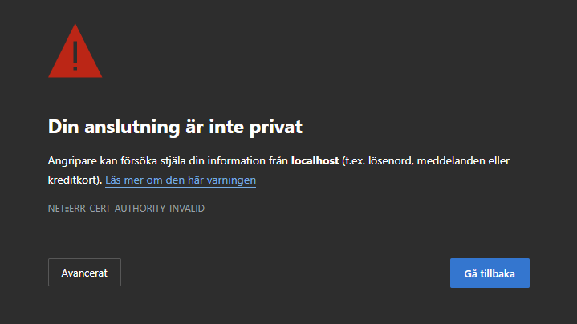

This is normal and due to the fact that to use TLS (HTTPS) NSClient++ generates a self-signed certificate on startup.
If you have a CA in your organization or you can use a tool like `mkcert`to easiily generate a cutom certificate.
We will cover this later in this guide.

Next up we need to login:

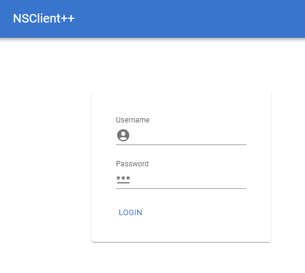

Here you can login with the username `admin` and the password you set during installation.
If you do not remember the password you can reset it using the command line:

```
nscp settings --path /settings/default --key password --set your_password
```
Once you have logged in you will be presented with the NSClient++ web interface.

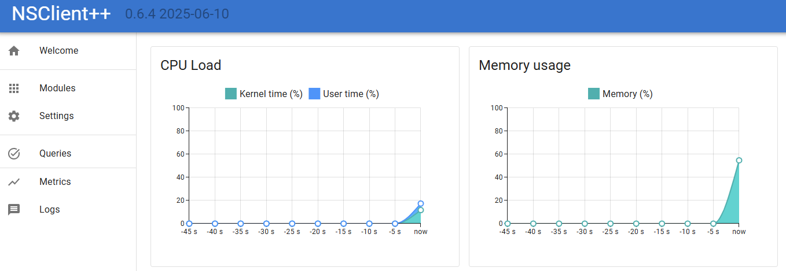

> If you fail to log in, ensure you are not running a service in the background, or that you have restarted since changing the password.


## Checking things from the Web Interface

The next step is to start checking things.
NSClient++ is a monitoring agent and as such it is designed to check various aspects of your system.
This is done using modules which provide various checks and commands.
Modules can be loaded and unloaded at runtime and they provide various features and functionality.

If we click on `Queries` in the web interface we will see a list of available queries.
In the list you will find `check_cpu` so lets try it out.

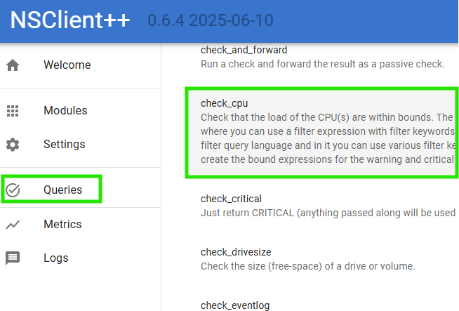

Then you are met with a screen which looks a bit like this:
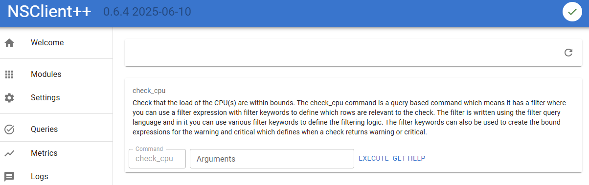

Here we can:

* Click `Execute` to run the check.
* Click `Get Help` to get help on how to use the check.
* Enter `Arguments` to pass arguments to the check.

Let start by click `Execute` and see what happens.

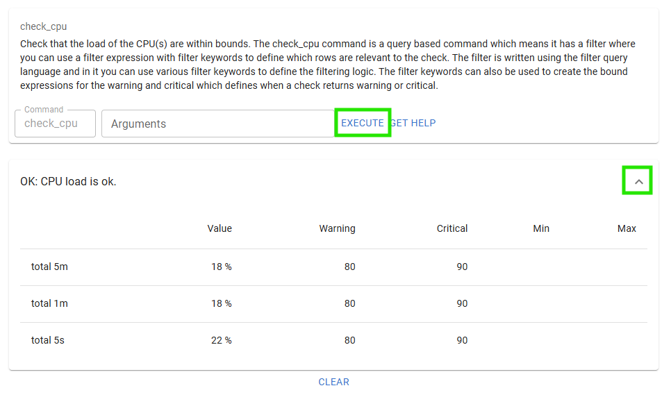

If you click the `Expand` chevron you will also see the performance data from the check.

Next up lets click `Get Help` to see how to use the check.
At the very end you can find the `cores` options, so lets try that out.

Enter `cores`in the arguments field and click `Execute` again.
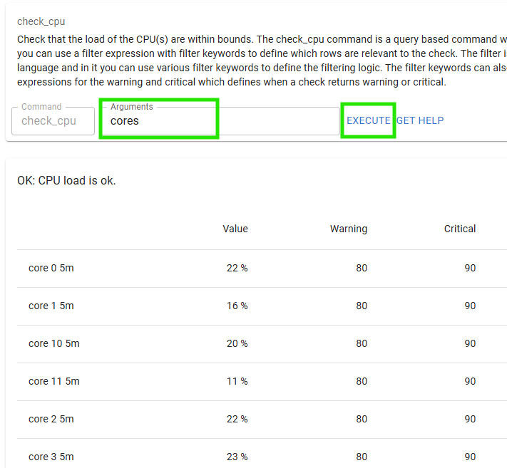

And there you have it the CPU load for each core.


## Loading modules via Web Interface

Before we loaded a module using the command line.
Now we will load a module using the web interface.
To do this we will click on `Modules` in the web interface.
Here you will see a list of available modules.
Click the `CheckNet` module to configure that module.

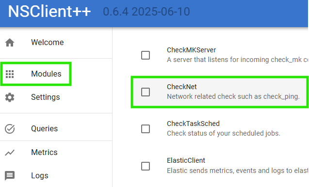

Here we can see that the module is neither loaded nor enabled.

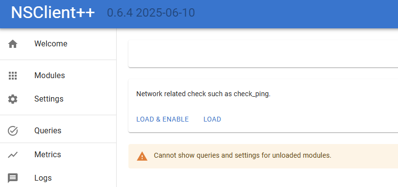

A quick word about the difference between loaded and enabled.

* Loaded means that the module is loaded into memory and can be used.
* Enabled means that the module is configured to be loaded when NSClient++ starts.

Normally you want the module to be both loaded and enabled.
So lets click the `Load & Enable` button to load the module.

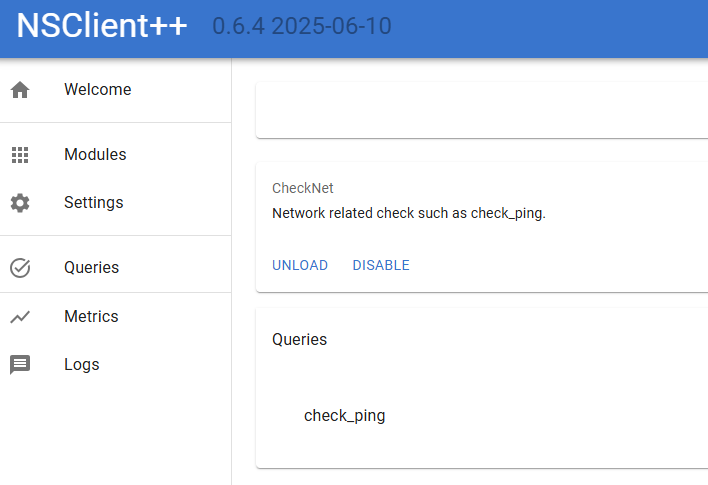

Now we can see the queries provided by the module.
Lets try out the `check_ping` query which checks the ping response time to a host.

As you noticed this is the same dialog as we saw before when we executed the `check_cpu` query.
So lets try it out by entering `host=nsclient.org` in the `Arguments` field and clicking `Execute`.

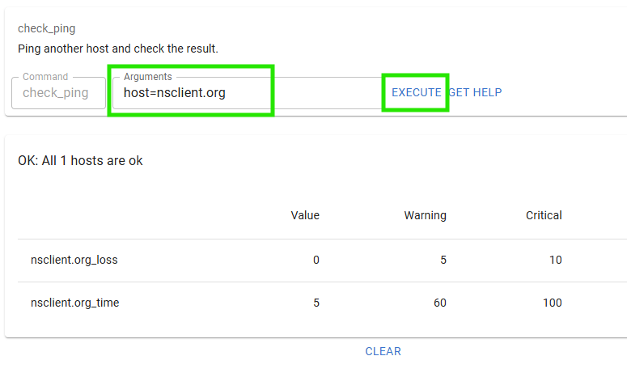

## Configuration via Web Interface

The web interface also allows you to configure NSClient++.
To do this you can use the `Settings` tab but a simpler way is to use the settings widget on the module dialog as that only have settings relevant for a given module so that is what we will do.
So lets click `Modules` in the web interface and then click on the `WEBServer` module.

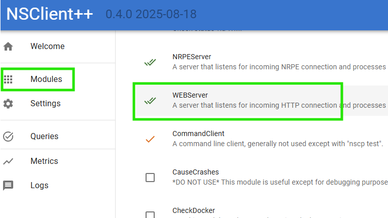.

Once you are here Click `Settings` and then expand `/settings/WEB/server` to show the port setting.

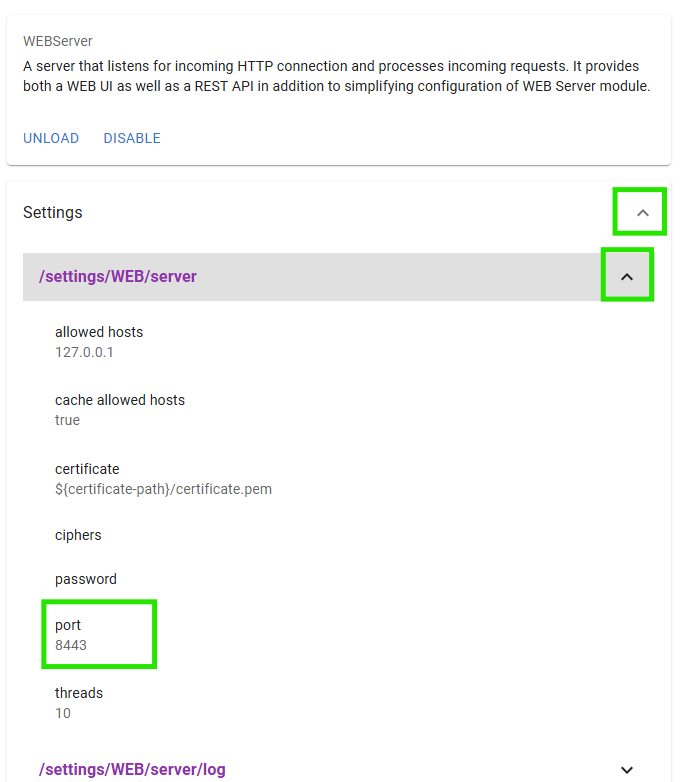

You should now be able to change the `port` to `1234` and click save:

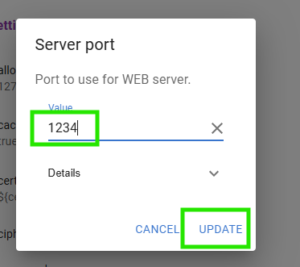

After this you should get a popup asking you to save and update the settings.

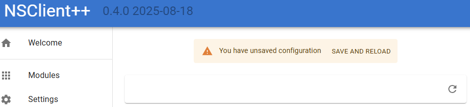

If you click `Save and reload` the service will restart and the web server will now be served on port 1234 instead.
So navigate to `http://localhost:1234/` and you should see the web interface again.


## Adding certificates to NSClient++

By default, NSClient++ generates a self-signed certificate on startup.
This is fine for testing but in a production environment you will want to use a certificate signed by a trusted CA.
As we do not have a CA in this example we will create our own CA using the `mkcert` tool to simulate CA here.
First we need to install `mkcert`.
You can find the installation instructions on the [mkcert GitHub page](https://github.com/FiloSottile/mkcert).
Once you have installed `mkcert` you can create a CA and generate a certificate for localhost.

```
mkcert -install
mkcert localhost -cert-file c:\program files\nsclient++\security\server.pem, -key-file c:\program files\nsclient++\security\server.key
```

> **NOTICE** This will install the root certificate on your local machine.

This will install the root certificate and generate two certificates `server.pem` and `server.key`.
Next we need to configure NSClient++ to use these files.
We can do this using the command line (or you can use `nscp web install` as we did above):

```
nscp settings --path /settings/WEB/server --key certificate --set "${certificate-path}\server.pem"
nscp settings --path /settings/WEB/server --key "certificate key" --set "${certificate-path}\server.key"
```

If we restart NSClient++:

```
nscp service --restart
```

We should now have a valid certificate when we visit the web interface on `https://localhost:8443/`.

If you wish to remove the root certificate you can do so using:

```
mkcert -uninstall
```

## Using `check_nsclient` Command

`check_nsclient` validates the NSClient++ TLS certificate against a CA file
you pass with `--ca`. The simplest choice is the bundle NSClient++ already
maintains for you — `windows-ca.pem` contains every Windows trusted root,
including the `mkcert` CA we just installed:

```commandline
$ check_nsclient nsclient auth login --password PASSWORD --ca "c:\program files\nsclient++\security\windows-ca.pem"
Successfully logged in

# or, if you don't care about validating the certificate:
$ check_nsclient nsclient auth login --password PASSWORD --insecure
Successfully logged in
```

This command will connect to a local NSClient instance and authenticate using the provided password and CA certificate.
The password and key will be store in your local credential store.
To logout (and remove password and key from credential store) you can run:

```
check_nsclient nsclient auth logout
```

Next up we can try to connect using the ping command:

```
check_nsclient nsclient check ping
Successfully pinged NSClient++ version 0.4.0 2026-01-10
```

This tool can also be used to connect to remote NSClient++ instances by providing the `--url` option:
```commandline
$ check_nsclient nsclient auth login --help
Login and store token

Usage: check_nsclient.exe nsclient auth login [OPTIONS] --password <PASSWORD> [ID]

Arguments:
  [ID]  Profile ID to store the token under [default: default]

Options:
      --url <URL>            NSClient++ URL [default: https://localhost:8443]
      --username <USERNAME>  Username to login with [default: admin]
      --password <PASSWORD>  Password to login with
      --insecure             Allow insecure TLS connections (i.e. dont validate certificate)
      --ca <CA>              CA File to use for TLS connections
  -h, --help                 Print help
```

One of the benefits of the `check_nsclient` tool apart from having a CLI interface where you can manage NSClient is that it also has an interactive client you can use:

```commandline
$ check_nsclient nsclient client
```

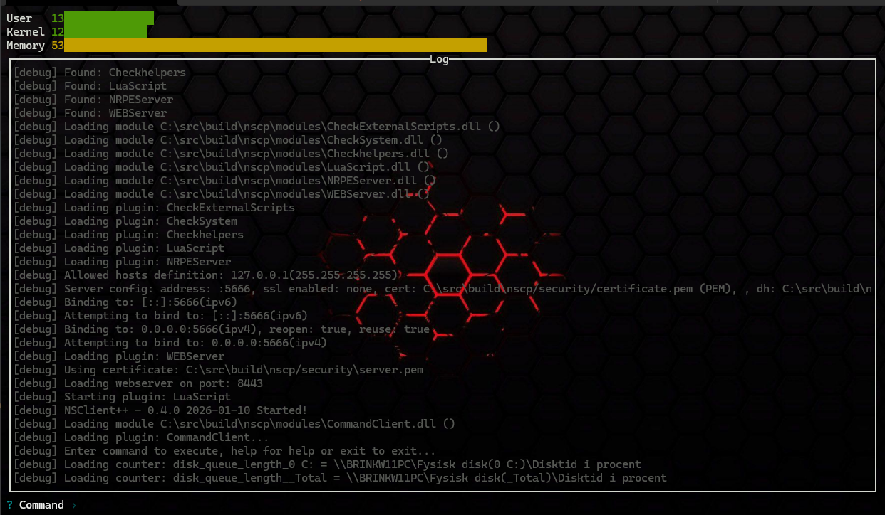

In this client you can execute queries, check status, see log and so on and so fort.

---

## Next Steps

- [Active Monitoring with NRPE](nrpe.md) — wire NSClient++ up so a Nagios-style server can poll it
- [Passive Monitoring (NSCA/NRDP)](passive-monitoring-nsca.md) — push results to your monitoring server on a schedule
- [Reference: WEBServer](../reference/generic/WEBServer.md) — every web server setting in detail
