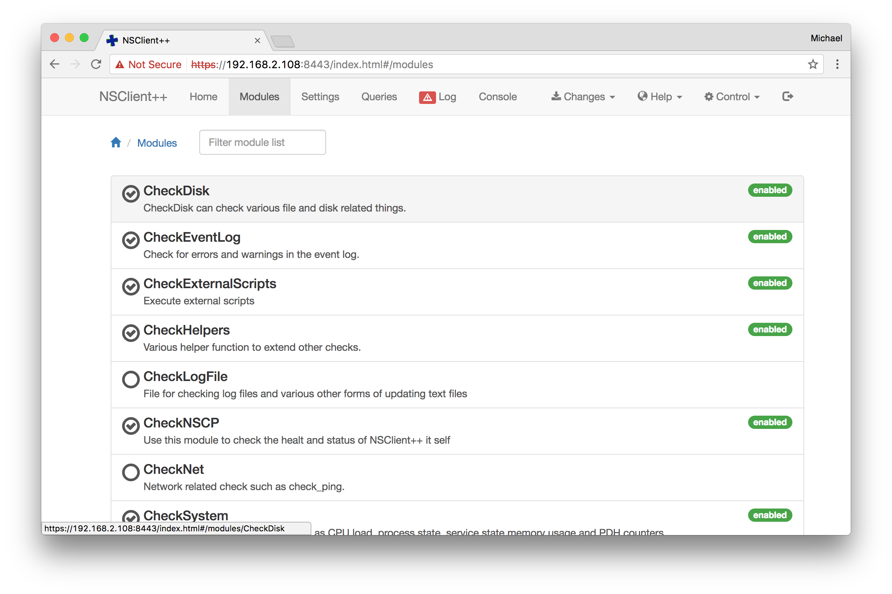
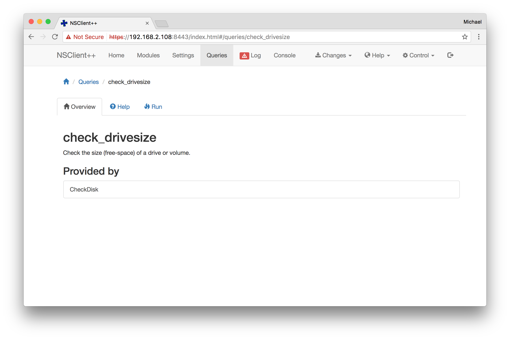
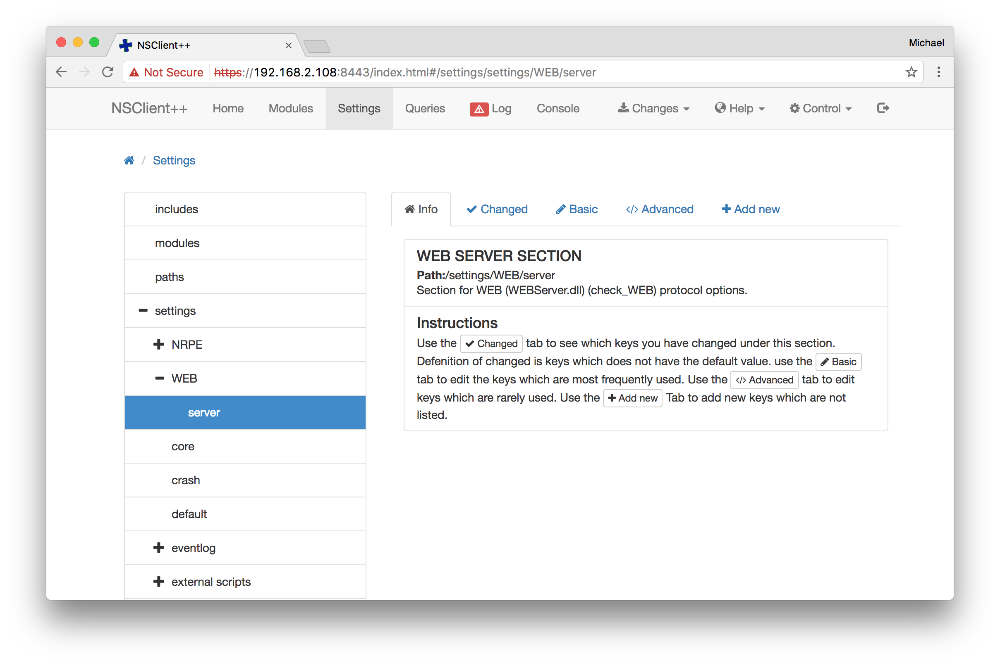
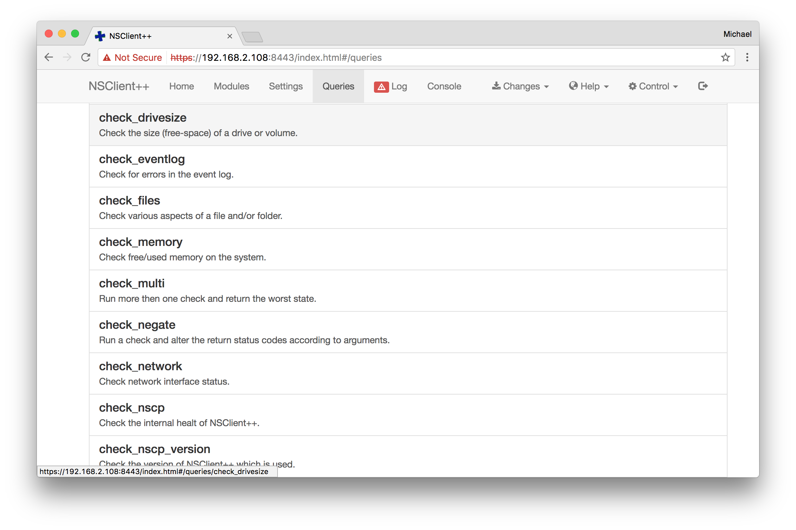
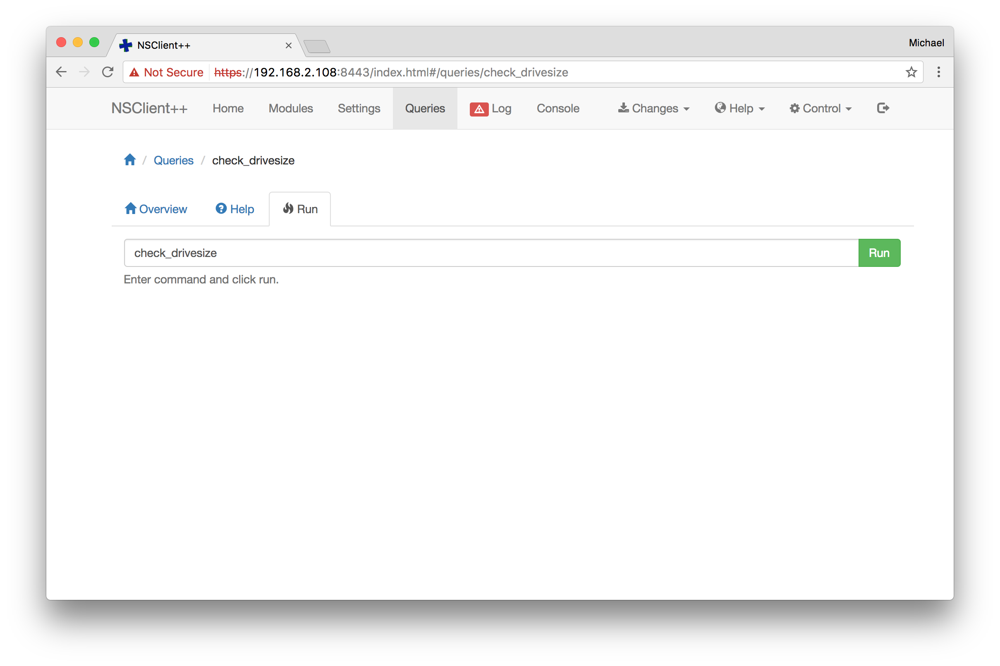
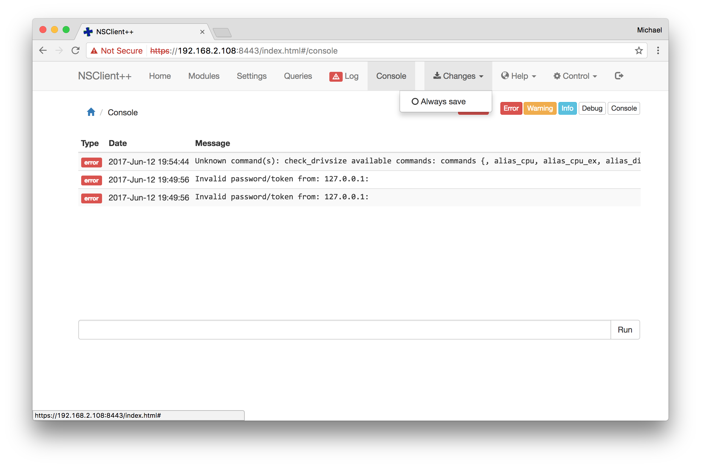
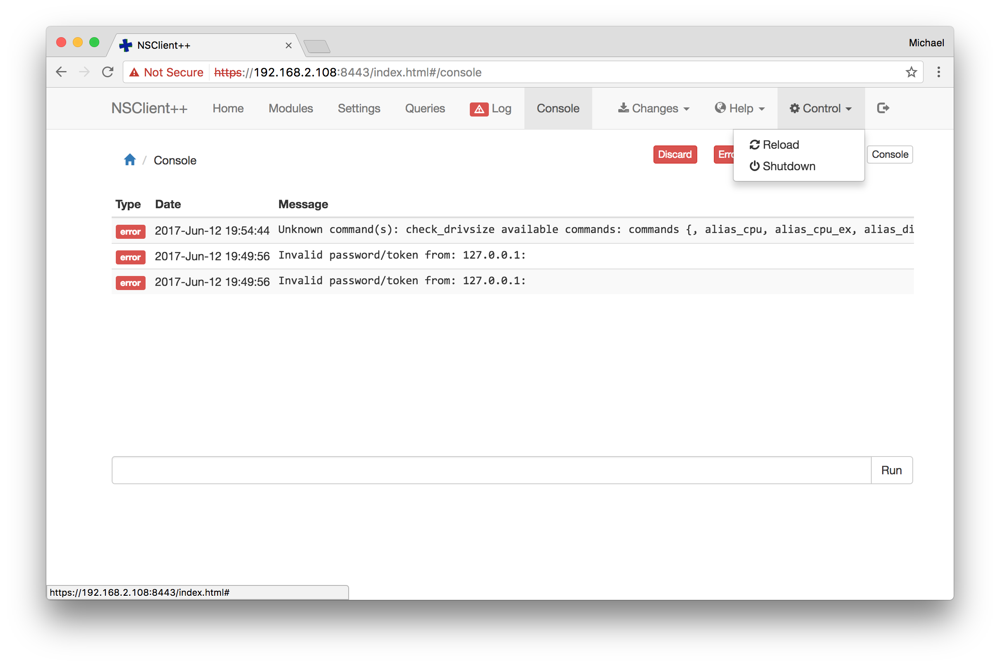

# Web Interface

You can also access the web interface by using your favorite browser.

The `Home` screen greets you with a metrics overview.

## Modules

You can list all (enabled) modules.

Each module provides an overview, settings, templates and queries.

You can list and select queries provided by this module.

Selecting the query jumps to the `Queries` tab and allows you to run the query immediately.

## Settings

Navigate into the settings tree and modify specific attributes. You need
to save changes and reload the service afterwards.

## Queries

Navigate into the queries tree and execute specific commands.

## Log

This is helpful in case you have trouble with executing checks, or
denied remote access.

## Changes

Save changes after modifications.

## Control

Reload the NSClient++ service after configuration changes.

