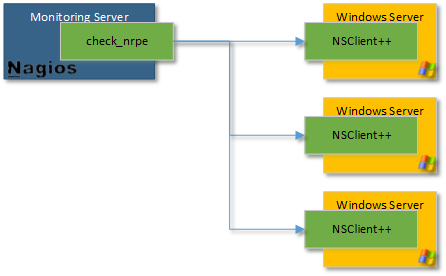
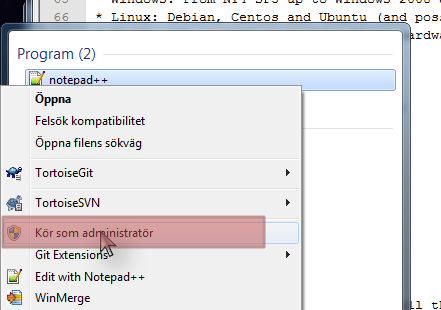
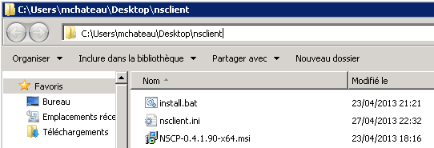

##########################
 NSClient++ Core Tutorial
##########################

:Author: Mathieu Chateau

Back to the basics
==================

How it works
------------

Nsclient++ (nscp) is an agent that must be deployed on servers to be monitored. It eliminates snmp needs and goes much beyond "so called agentless" schemes like wmi by allowing execution of scripts and programs locally and returning results.

.. note::
  This program is useless alone and requires a monitoring solution like Nagios/Icinga/Neteye/Op5.
  Nagios is the primary solution used by nsclient++, but NSclient++ aims to be open and as such supports many protocols so it can be integrated with various other monitoring solutions.

To facilitate NSClient++ support a series of protocols:

======== ======== ======================================================================================
Protocol Paradigm Comments
======== ======== ======================================================================================
NRPE     Active   Protocol used by Nagios to speak with agent like nsclient++
NSCA     Passive  Protocol used with Nagios so agent can speak to Nagios (reverse way of communication)
NSCP     Multiple Nsclient++ own protocol (still under development)
dNSCP    Multiple High performance distributed version of NSCP for high volume traffic.
NRDP     Passive  Replacement for NSCA
check_mk Active   Protocol utilized by the check_mk monitoring system
Syslog   Passive  Protocol primarily designed for submitting log records
Graphite Passive  Real-time graphing
SMTP     Passive  Communicate with nsclient++ through mails. More of a toy currently
======== ======== ======================================================================================

.. note:: 
  You must choose at least one of these protocols to use nsclient++. They can be enabled/disabled independently.

In this document, we will cover NRPE and NSCA, as well as show how it is integrated with Nagios. If you have other protocols or monitoring solutions the general concepts can be easily adapted to any of the other supported protocols.

Nsclient++ allows many ways to check your system:
* Get System health (cpu, disks...)
* Get performances counters
* Get WMI query
* Check Log file
* Check scheduled task
* Execute:

** powershell scripts
** VB Scripts (.VBS)
** Executable files
** Batch (.BAT) files

Requirements
------------

To use NSClient++ you need a monitoring system deployed in your network many people use Nagios, Icinga, Neteye or Op5 but stricctly speaking NSClient++ is designed to work with any monitoring tool which can execute external scripts or support any of the standard protocols.

Supported OS
************

NSClient++ was original design to run only on Windows but since 0.4.1 is can be used on Linux as well.
But currently most modules are Windows only thus the benefit on other operatingsystems are limited.

**Windows:**

NSClient++ should run on the following operating systems:
 * Windows: From NT4 SP5 up to Windows 2008 and Windows 7 and 2012
 * Linux: Debian, Centos and Ubuntu (and possibly others as well)
 * Win32, x64 as well as various Linux hardware as well.

**Linux:**

NSClient++ can be built and deployed on:
 * Debian
 * Centos
 * Redhat
 
Configuration: Introduction
===========================

Introduction
------------

Before rushing on the binaries and install them, you must spend 15m in making the config file.

.. warning::
   We do recommend that you do not skip this step, as you will have issues later and get frustrated... What is 15minutes compared to a great monitoring solution?
   If you still can't afford these 15 minutes, take the config example in this doc

One important thing to understand when it comes to NSCLient++ configuration is that while most people use ini-files it is not the only posibility other options include registry and remote files. But for the reminder of this tutorial we only consider ini files since it is the normal and simplest way.

Editing
-------

Nsclient++ config file is in the well-known INI Format. To edit it you can use any text editor such as notepad. Using advanced editors such as notepad++ you can also achive syntax coloring so that is preferable. 

Also note that on Windows (after Vista) the ini file is residing in a protected space and thus you need to launch the editor as adminisrator to edit the files.

Sections
--------

Like in all INI, section start with a name between "[]". The first section is [/modules].
In general NSClient++ has a hierarcical settings structure much like a filesystem. THis means that everything under /settings is related to settings and so on and so forth.

* Sections do not have an explicit end. When a new section start, the previous one end. 
* Sections can be empty
* Sections generally starts with either (if they dont, you probably have an older version):

** /modules
** /settings/
  
.. code-block:: ini

   [/modules]
   ; ...
   
   [/settings/...]
   ; ...

Comments
--------

Comments are line starting by a semi-colon ";"

.. code-block:: ini

   ; This is a comment, which appears in green on notepad++. Colors helps me a lot!

Values
------

Values are in the following format: key = value

.. code-block:: ini

   foo = bar ; Give foo the value bar

Configuration: Configuring
==========================

To make you configuration you first need to decide which modules you want then and configure each one of them in turn.
We will start the same why by pressenting the various modules you can use and covering how to configure some of them.

Modules
-------

Here are the available modules. Each module get loaded if enabled. You can enable all and use only one, but that may open doors for nothing and add load on your systems.
There are a few ways you can enable modules, setting the value to 1, true and enabled are all correct but enabled is preferd like so:

.. code-block:: ini

   [/modules]
   NRPEServer = enabled

There is an advanced topic when it comes to modules and that is loading the same module multiple times.
This is not common but since it changes the syntax we mention it for compleation. When a module is loaded multiple times it is given an alias as a key (since key names have to be unique) and thus the syntax changes into this:

.. code-block:: ini

   [/modules]
   nrpe1 = NRPEServer
   nrpe2 = NRPEServer
   nrpe3 = NRPEServer

.. note::
   Moules in bold below are commonly used with nagios Nagios.
   
========================= ========== =============== ========================================================================================================================================================
Module                    Has Config Requires Config Comment
========================= ========== =============== ========================================================================================================================================================
CauseCrashes                                         Dont use this unless you want to tes the crash restart/submission tool. It will crash NSClient++
**CheckDisk**                                        Can check various file and disk related things. The current version has commands to check Size of hard drives and directories
**CheckEventLog**         X                          Check for errors and warnings in the event log. This is only supported through NRPE so if you plan to use only NSClient this won't help you at all
**CheckExternalScripts**  X          X               A simple wrapper to run external scripts and batch files
**CheckHelpers**                                     Various helper function to extend other checks. This is also only supported through NRPE
CheckLogFile              X                          Check text files (usually log files) for patterns.
**CheckNSCP**                                        Check the state of the agent
**CheckSystem**           X                          Various system related checks, such as CPU load, process state, service state memory usage and PDH counters
CheckTaskSched                                       Check states of scheduled tasks. Both module are exclusive (must choose one or the other). The second is only for Vista and upper (new task scheduler)
**CheckTaskSched2**                                  Same as CheckTaskSched but targeted at Windows Vista and beyond.
CheckWMI                                             Make WMI Query
DotnetPlugins             X          X               Plugin to load and manage plugins written in dot net
GraphiteClient            X          X               Act as a Graphite Client over Graphite protocol
LUAScript                 X          X               Extend NSClient++ with internal Lua scripts.
NRDPClient                X          X               Act as a NRDP Client over NRDP protocol
NRPEClient                X          X               Act as a NRPE Client over NRPE protocol
**NRPEServer**            X          X               A simple server that listens for incoming NRPE connection and handles them.
NSCAClient                X          X               Passive check support over NSCA protocol
NSClientServer            X          X               A simple server that listens for incoming NSClient (check_nt) connection and handles them
NSCPClient                X          X               A simple client for checking remote NSCP servers.
NSCPServer                X          X               A simple server that listens for incoming NSCP connection and handles them
PythonScript              X          X               Execute internal script written in Python (requires python 2.7 to be installed)
Scheduler                 X          X               A scheduler which schedules checks at regular intervals
SimpleCache                                          Caches results for later checking
SimpleFileWriter                                     Write results to a file or pipe similar to NSCA
========================= ========== =============== ========================================================================================================================================================

.. note::
   This is the only difficult part. You must tell nsclient++ how to behave for the modules you want it to run. We will cover here the most needed modules, which are in bold in previous chapter.

Default settings
----------------

If you omit some settings per protocol, default values will be used. Here are the recommended default value section:

.. code-block:: ini

   [/settings/default]
   allowed hosts = IP.OF.YOUR.MONITORING.HOST
   cache allowed hosts = true
   password = CHECK_NT PASSWORD
   timeout = 90

NRPE Server
-----------

.. note::
   This module is used by the check_nrpe on Nagios.

All you need to configure is who is allowed to connect as well how to handle arguments.
For security reasons arguments are not allowed the idea is that a "dumb" monitoring agent is less dangerous then one which can be controlled remotely.
The drawback to not allowing argument is that you need to configure **everything** in nsclient.ini on every single host which can obviously be cumbersome. 
The other option is to allow arguments but **it is important to conside rhte securoty implications** before doing so.

For a detailed guide on how to setup NRPE with NSClient++ step by step including debugging and testing see :ref:`tutorial_nagios_nrpe`.

A less restrictive configuration is shown here where we have **allowed** all kinds of arguments for simplicity.

.. warning::
   This has security implications!

.. code-block:: ini

   [/settings/NRPE/server]
   allow arguments = true
   allow nasty characters = true
   allow arguments=true
   ;allowed hosts = IP.OF.YOUR.MONITORING.HOST
   ;port = 5666

NSCA Client
-----------

.. note::
   This is used by NSCA server on Nagios.

Another way to configure monitoring is to use what is commonly referd to as *passive monitoring*. 
This means that NSClient++ will periodically phone home when it has something to report much like SNMP traps.
The main difference is that Nagios is just waiting for these informations and so doesn't poll for them. 
This can avoid a lot of load by not polling for nothing. Load is also distributed on all hosts and not Nagios centric.

For a detailed guide on how to setup NSCA with NSClient++ step by step including debugging and testing see :ref:`tutorial_nagios_nsca`.

.. code-block:: ini

   [/settings/NSCA/client]
   channel = NSCA
   hostname = auto

   [/settings/NSCA/client/targets/default]
   address = address = nsca://IP.OF.YOUR.MONITORING.HOST:5667
   encryption= aes256
   password = Password_Which_Must_Be_Identical_On_NSCA_Server_On_Nagios
   timeout = 90

   
External scripts
----------------

.. note::
   This allow to call arbitrary program/script through any protocol and get result back. 

Using external script is the easiest way to extend NSClient++ and it. 
Alias allows you to shorten commands sent by preparing command line with both dynamics and static arguments.

For a detailed guide on how to setup External Scripts with NSClient++ step by step including debugging and testing see :ref:`how_to_external_scripts`.

.. code-block:: ini

   [/settings/external scripts]
   allow arguments = true
   allow nasty characters = true
   timeout = 90
   
   [/settings/external scripts/wrappings]
   bat = scripts\\%SCRIPT% %ARGS%
   ps1 = cmd /c echo scripts\\%SCRIPT% %ARGS%; exit($lastexitcode) | powershell.exe -command -
   vbs = cscript.exe //T:90 //NoLogo scripts\\lib\\wrapper.vbs %SCRIPT% %ARGS%
   exe = cmd /c %SCRIPT% %ARGS%
   
   [/settings/external scripts/alias]
   alias_cpu = checkCPU warn=80 crit=90 time=5m time=1m time=30s
   alias_cpu_ex = checkCPU warn=$ARG1$ crit=$ARG2$ time=5m time=1m time=30s
   ; ...skipping lines as we do provide LOT of alias for you...
   alias_updates = check_updates -warning 0 -critical 0
   alias_volumes = CheckDriveSize MinWarn=10% MinCrit=5% CheckAll=volumes FilterType=FIXED
   alias_volumes_loose = CheckDriveSize MinWarn=10% MinCrit=5% CheckAll=volumes FilterType=FIXED ignore-unreadable
   
   [/settings/external scripts/scripts]
   check_openmanage = scripts/check_openmanage.exe
   
   [/settings/external scripts/wrapped scripts]
   check_updates=check_updates.vbs $ARG1$ $ARG2$

Eventlogs
---------

.. note::
   Eventlogs are a great source of informations for monitoring. Allow real-time monitoring and extended filtering. 
   As the subject itself is a bit complicated, start basic by grabbing all and exclude after.

.. note::
   As it's hard to poll all servers all the time, we prefer real time way by notifying Nagios through NSCA when something happens.

.. code-block:: ini

   [/settings/eventlog]
   buffer size = 131072
   debug = false
   lookup names = true
   syntax = 
 
Deploy massively & Manage
=========================

Tools to deploy
---------------

Deploying nsclient++ and updating config file/plugins will be a major pain if not automated. We provide here guidance and free tool to deploy to all your Windows. 
Of course you may have already a solution like SCCM or LanDesk, which is no problem. All these tools does the same job:

 * remote copying files
 * Execute binaries or script
 * Watch for output error code
 * Return result.

If you don't already own this tool, then we recommend to use the free version of PDQ Deploy.
Yes, it's really free, only limited to 8 computers at same time. Yes, it's graphical and works great, even on Windows Core 2012. 
It can deploy both domain joined and workgroup, only need to provide credentials and source computer must have windows share access (firewall).

.. note::
   You will need these tools after the initial setup, to maintain agents. So this won't be a single one shot. 
   Except if you have less than 10 servers to monitors, we heavily recommend you to have a similar solution.

PDQ Deploy install
------------------
.. note::
   Just a basic "Next...Next" install. Just be sure to keep on the free version when asked.

Silent install
--------------

Installation is as simple as this script:
 * Silent installation through nsclient++ MSI
 * Copy the nsclient.ini built earlier
 * Restart nsclient++ Windows Services to make it read the file.
 
.. code-block:: bat

   @echo off
   msiexec /i NSCP-0.4.1.90-x64.msi /passive /norestart ADDLOCAL="ALL" REMOVE="Documentation,NSCPlugins,NSCAPlugin,SampleScripts"
   xcopy nsclient.ini "%ProgramFiles%\NSClient++\nsclient.ini" /q /y
   net stop nscp
   net start nscp

.. note::
   This example covers windows in 64 bit. If you have x86 Windows, you need either 2 packages or add intelligence to install the good one. 
   
Successfully tested on:
* Windows Server 2003
* Windows Server 2008 R2 (core and GUI)
* Windows Server 2012 (core and GUI)

Be sure to provide a folder with the MSI, built ini and bat file:

Just create a package on PDQDeploy:

Check the include entire Directory checkbox:

.. image:: images/pdq_package.png
 
On PDQ Deploy, target list can be:
 * Arbitrary list
 * Text file
 * Active Directory containers
 * ...

As with any tool, respect the best practice:
 * Deploy successfully to just one host
 * Then deploy to more hosts, doing bigger and bigger deployment based on success rate.

Update nsclient++ config and plugins
------------------------------------

Soon enough you will want to deploy a modified version of nsclient++ config, or add plugins/scripts.
Just create folder with the current ini file and this bat file:

.. code-block:: bat

   @echo off
   xcopy nsclient.ini "%ProgramFiles%\NSClient++\nsclient.ini" /q /y 
   xcopy *.ps1 "%ProgramFiles%\NSClient++\scripts" /q /y 
   powershell Set-ExecutionPolicy remotesigned -Confirm:$false
   net stop nscp
   net start nscp

What it does:
 * Copy nsclient.ini over
 * Copy all PowerShell scripts to the scripts folder (can be any files, just avoid including the ini and bat itself)
 * Set the PowerShell policy to RemoteSigned.
 * Restart the agent to make it read the new ini file

Security
========

Account running nsclient++
--------------------------

By default, the Windows service run as Local System. 
This is simple (no access denied issue), but may lead to security issue if a breach appears (in nsclient++ or in your scripts). 
As with others solutions, like Microsoft SCOM, you can restrict nsclient++ power by using a Windows account.

Needed right will depend on what you want to monitor, but as a basis, you will need an account:
 * Member of the local Windows group Performance Monitor Users. Needed to collect performance counters
 * Log on as a service grant. Granted when you set the account, but should be applied through GPO to remain consistent.

.. note:: 
   Power users group is a no go, it still there but does nothing on vista and upper. On XP and 2003, it nearly means admin right, which is contrary to the target.

.. note:: 
   Using a domain account is also useful for specific monitoring, like for SharePoint.
   
.. note:: 
   You can use `Process monitor <http://technet.microsoft.com/en-us/sysinternals/bb896645.aspx>` to get access denied logs.

Securing communication
----------------------

.. note:: 
   Encryption depend heavily on which communication protocol you need. For NSCA, you will need a shared passphrase and a common encryption protocol (AES in our examples).

.. note:: 
   You can restrict hosts allowed to speak to nsclient++ from the config file. This add security to firewall rules, by also restricting access within the same network.
 
Nagios integration
==================

Dry runs
--------

Useless to go further if basics health tests fails. Here are the basics steps to pass before going further:

+-----------------------------+-----------------------------------------------------------------------------+
| Where to check              | Action                                                                      |
+=============================+=============================================================================+
| Windows server to monitor   | Check that nsclient++ Windows service is started                            |
|                             | Check nsclient.log for errors                                               |
|                             | Execute some dry test:                                                      |
|                             | * nscp.exe client --query alias_disk                                        |
|                             | * nscp.exe client --query alias_event_log                                   |
|                             | * nscp.exe sys --list                                                       |
+-----------------------------+-----------------------------------------------------------------------------+
|Monitoring server (Nagios...)| Check that monitoring server can reach the remote TCP port (if not udp)     |
+-----------------------------+-----------------------------------------------------------------------------+

Check command
-------------

**TODO**

Examples
--------

**TODO**

Performance counters
--------------------

**TODO**

PowerShell scripts
------------------

**TODO**
 
Extending NSClient++
====================
NSClient++ is designed to be open ended and allow you to customize it in any way you design thus extensibility is a core feature.
 * ExternalScripts responds to queries and are executed by the operating system and the results are returned as-is. 
   This is generally the simplest way to extend NSClient++ as you can utilize whatever infrastructure or skill set you already have.
 * LuaScripts are internal scripts which runs inside NSClient++ and performs various tasks and/or responds to queries. 
   This is the best option if you want to allow the script to run on any platform with as little infrastructure as possible.
 * PythonScripts are internal scripts which runs inside NSClient++ and performs various tasks and/or responds to queries. 
   Python is an easy and powerful language but it requires you to also install python which is often not possible on server hardware.
 * .Net modules similar to Native modules below but written on the dot-net platform. This allows you to write components on top of the large dot-net ecosystem.
 * Modules are native plugins which can extend NSClient++ in pretty much any way possible. This is probably the most complicated way but gives you the most power and control.

When things goes bad
====================

Network communication
---------------------

Log file
--------

Plugins
-------

Performances counters
---------------------

 
Appendices
==========

Config examples
---------------

