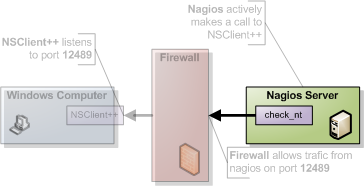
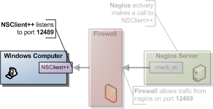

==========================================
Using NSClient++ from nagios with check_nt
==========================================

.. image:: images/nagios-active-nsclient.png

**NOTICE** The check_nt client support is available for compatibility mode and it is not recommended unless you already have an infrastructure around it. There are several features you will not be able to use with this scheme. I would recommend using NRPE instead.

This is the simplest and most locked in way to use NSClient++ you are limited to a handful of checks and there is no way to exploit the power of NSClient++ from here. The good though is that it is very simple to use and setup so it might be a good way to start.
It is also the "only" way to have password protection. But note that since there is no encryption the password is sent as clear text so if you are compromised it will be easy to find.
Also since check_nt is distributed in the "normal plugin kit" you undoubtedly already have everything you need on the nagios side.

Nagios have their own guide for setting this up here `http://nagios.sourceforge.net/docs/3_0/monitoring-windows.html`

1. Nagios command line
**********************

Using check_nt from the command line of your Nagios server is usually the bast place to start. If you are not familiar with it I would recommend you try this out as it will save you a lot of time when you are getting started or trying out new things. It is a good way to eliminate errors and you wont have to bother with restarting/waiting on Nagios when you need to make changes.
To access NSClient++ from the Nagios server via the NSClient protocol you use a program (comes with the default plugins) called check_nt.

.. code-block:: bat

  check_nt -H <client ip> -p <port> -v <command> ...

- client ip = the IP of the server you want to monitor (i.e. where NSClient++ i installed).
- port = the port you are using for the NSClientListener (defaults to 12489)
- command = is the various things you can monitor.
   The various commands all take different additional arguments which are all showed in the help.

To check the CPU load you can for instance run the following (assuming your windows server has 10.0.0.1 as ip address)

.. code-block:: bat

  check_nt -H 10.0.0.1 -p 12489 -v CPULOAD -w 80 -c 90 -l 5,80,90,10,80,90
  CPU Load 0% (5 min average) 0% (10 min average)|'5 min avg Load'=0%;80;90;0;100 '10 min avg Load'=0%;80;90;0;100

If you instead got any of the following don't worry, it is because your NSClient++ is not configured properly and, we will solve that in the next section.

.. TODO: code-block:: text

  CRITICAL - Socket timeout after 10 seconds
  Return code of 139 is out of bounds

2. NSClient++ configuration
***************************

The first thing you need to do is decide which modules you want to use. NSClient++ is modular by design this means you only use the features you want (and if you want you can use all of them). The modules can be roughly divided into two kinds.

#. check commands
#. protocols (and utility modules).

The first kind is the one you *use* it responds to your commands and "finds" monitored data for you.
The second kind is the one that allows you to talk to the first kind.
When it comes to modules for the NSClient mode you will need the following:

============== ===================================================== =========================
Module         Description                                           Commands
============== ===================================================== =========================
CheckSystem    Handles many system checks                            CPU, MEMORY, COUNTER etc
CheckDisk      Handles Disk related checks                           USEDDISKSPACE
NSClientServer Listens and responds to incoming requests from nagios N/A
============== ===================================================== =========================

To enable modules you edit the /modules section in the nsclient.ini file and your section should look something like this:

.. code-block:: ini

  [/modules]
  CheckSystem=enabled
  CheckDisk=enabled
  NSClientServer=enabled

The other things you need to configure is who is allowed to ask questions (which ip addresses) this is done either under the `Settings <Settings>`_ section (globally) or under the `NSClient <NSClient>`_ (locally). I would recommend using the `Settings <Settings>`_ section as it will simplify things when you start using NRPE. The keys you need to change are allowed_hosts and password. And the value should be:

- allowed hosts = A list of addresses that is allowed to ask questions (i.e. your nagios ip).
- password = The password to use.

The result should look like this (assuming you don't use a password and the nagios ip address is 10.0.0.2):

.. code-block:: ini

  [/settings/default]
  ;password=secret-password
  allowed hosts=10.0.0.2

Notice that since you don't use a password that key is commented out (;).

allowed hosts
-------------

If you do not configure the allowed hosts directive correctly you might get this in Nagios:

.. code-block:: text

  Return code of 139 is out of bounds

And if you check nsclient.log you would see:

.. code-block:: text

  2013-03-20 17:23:50: e:D:\source\nscp\trunk\include\check_nt/server/protocol.hpp:65: Rejected connection from: ::ffff:10.83.14.251

trying it
---------

**Don't forget to restart NSClient++** after you make changes to the nsclient.ini file.

.. code-block:: bat

  net stop nscp
  net start nscp

Now feel free to try the command line agent again and hopefully things should work out perfectly.
Run the following command from your nagios server.

.. code-block:: text

  check_nt -H 10.0.0.1 -p 12489 -v CPULOAD -w 80 -c 90 -l 5,80,90,10,80,90
  CPU Load 0% (5 min average) 0% (10 min average) |'5 min avg Load'=0%;80;90;0;100 '10 min avg Load'=0%;80;90;0;100

.. code-block:: text

  check_nt -H 10.0.0.1 -p 12489 -v USEDDISKSPACE -d SHOWALL -l c
  c:\ - total: 149.00 Gb - used: 12.93 Gb (9%) - free: 136.07 Gb (91%) |'c:\ Used Space'=12.93Gb;0.00;0.00;0.00;149.00

3. Solving problems
*******************

.. image:: images/nagios-active-nsclient-003.png

A good way to find and solve problems is to run nsclient++ in "test" mode this is done by stopping the service and starting it in "test" mode.

.. code-block:: bat

  net stop nscp
  nscp test
  ... test mode ... (quit with: exit)
  net start nscp

When in test mode you will get a lot of interesting log messages when things are happening so it is fairly simple to figure out what is wrong. To try this out do the following:

.. code-block:: bat

  net stop nscp
  nscp test

What you will see is the following output (or something similar):

.. code-block:: text

  Launching test mode - client mode
  d NSClient++.cpp(1106) Enabling debug mode...
  d NSClient++.cpp(494) Attempting to start NSCLient++ - 0.3.7.7 2009-07-05
  d NSClient++.cpp(897) Loading plugin: CheckSystem...
  d NSClient++.cpp(897) Loading plugin: NSClient server...
  d \PDHCollector.cpp(66) Autodetected w2k or later, using w2k PDH counters.
  l NSClient++.cpp(600) NSCLient++ - 0.3.7.7 2009-07-05 Started!
  d \PDHCollector.cpp(103) Using index to retrive counternames
  d \Socket.h(675) Bound to: 0.0.0.0:12489
  l NSClient++.cpp(402) Using settings from: INI-file
  l NSClient++.cpp(403) Enter command to inject or exit to terminate...

Then when you run the check from Nagios again:

.. code-block:: bat

  check_nt -H 10.0.0.1 -p 12489 -v USEDDISKSPACE -d SHOWALL -l c
  c:\ - total: 149.00 Gb - used: 12.93 Gb (9%) - free: 136.07 Gb (91%) |'c:\ Used Space'=12.93Gb;0.00;0.00;0.00;149.00

If you check the log from NSCLient++ you should see (amongst other):

.. code-block:: text

  d \NSClientListener.cpp(146) Data: None&2&5
  d \NSClientListener.cpp(171) Data: 5
  d NSClient++.cpp(1034) Injecting: checkCPU: 5, nsclient
  d NSClient++.cpp(1070) Injected Result: OK '0'
  d NSClient++.cpp(1071) Injected Performance Result: ''

When you are don you can exit NSClient++ using the exit command:

.. code-block:: bat

  exit

Then don't forget to start NSClient++ again:

.. code-block:: bat

  net start nscp

4. Nagios configuration
***********************

Nagios comes pre-configured for many of the NSClient checks.
in windows.cfg you will find many entries along the lines of:

.. code-block:: js

  define service{
    use                 generic-service
    host_name           winserver
    service_description NSClient++ Version
    check_command       check_nt!CLIENTVERSION
  }

The interesting part here is: **check_nt!CLIENTVERSION** which will run a check against check_nt.
In commands.cfg the check_nt command is defined like so:

.. code-block:: js

  # 'check_nt' command definition
  define command{
    command_name	check_nt
    command_line	$USER1$/check_nt -H $HOSTADDRESS$ -p 12489 -v $ARG1$ $ARG2$
  }

So you can see most things are already setup for you so it is quite simple to get started.
The more "advanced" checks (which takes parameters) looks like this if you recall the CPULOAD we tried from the command line:

.. code-block:: js

  define service{
    use			generic-service
    host_name		winserver
    service_description	CPU Load
    check_command		check_nt!CPULOAD!-l 5,80,90
  }

the command is now defined as *check_nt!CPULOAD!-l 5,80,90* which translates directly into:

.. code-block:: bat

  <plugin dir>/check_nt -H <ip of client> -p 12489 -v CPULOAD -l 5,80,90

which if you recall is exactly what we used when we tried the command from the command line.
If you want to add a password the simplest way is to add it in command.cfg (if you want to have the same password on all your clients) like so:

.. code-block:: js

  # 'check_nt' command definition
  define command{
    command_name	check_nt
    command_line	$USER1$/check_nt -H $HOSTADDRESS$ -p 12489 -s <password> -v $ARG1$ $ARG2$
  }

5. Final words
**************

.. image:: images/nagios-active-nsclient.png

As I stated initially using check_nt is limited and many checks (for instance EventLog) wont work this way. So a good idea is probably to start checking out the :doc:`NRPE Guide <nrpe>` as well.

**And remember** if you experience problems don't "debug" from nagios, run your command from the command line while having nsclient++ running in test mode and you should be fine!
